# Session 11 — Kubernetes Services

**Name:** Vimal Kumar Yadav
**Enrollment Number:** 24BCS10273

Everything below was run on a local Minikube cluster — minikube v1.39.0, Kubernetes v1.37.0,
containerd 2.3.4, docker driver, on macOS (Apple silicon). Every code block is the real output from
that run, and the screenshots are of the same session.

A Pod's IP is not something you can build on. Pods are replaced on every rollout, every crash and
every scale event, and each replacement gets a new address. A Service is the stable name and virtual
IP that sits in front of a changing set of Pods. The five types below differ only in *who* is allowed
to reach that name and *how*.

---

## Task 1: ClusterIP — the Internal Default

- Deploy an application with 3 replicas.
- Expose it with a ClusterIP Service.
- Reach it from inside the cluster by name, by IP and by FQDN.
- Confirm it is not reachable from outside.

### Commands

```bash
kubectl apply -f manifests/01-clusterip.yaml
kubectl get pods -l app=campus-web -o wide
kubectl get svc campus-web-clusterip
kubectl get endpoints campus-web-clusterip
```

### Output

```text
$ kubectl get pods -l app=campus-web -o wide
NAME                          READY   STATUS    RESTARTS   AGE   IP            NODE
campus-web-5944fcbc55-49tbv   1/1     Running   0          1s    10.244.0.17   minikube
campus-web-5944fcbc55-bd4lm   1/1     Running   0          1s    10.244.0.20   minikube
campus-web-5944fcbc55-wmwn9   1/1     Running   0          1s    10.244.0.19   minikube

$ kubectl get svc campus-web-clusterip
NAME                   TYPE        CLUSTER-IP    EXTERNAL-IP   PORT(S)    AGE
campus-web-clusterip   ClusterIP   10.97.56.37   <none>        8080/TCP   1s

$ kubectl get endpoints campus-web-clusterip
Warning: v1 Endpoints is deprecated in v1.33+; use discovery.k8s.io/v1 EndpointSlice
NAME                   ENDPOINTS                                      AGE
campus-web-clusterip   10.244.0.17:80,10.244.0.19:80,10.244.0.20:80   1s
```

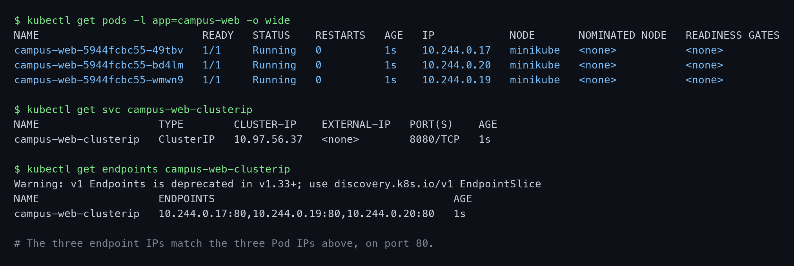

The `ENDPOINTS` column is the thing to check first on any Service. It holds `10.244.0.17`,
`.19` and `.20` — precisely the three Pod IPs listed above, on port 80. The Endpoints controller
watched for Pods matching `app: campus-web` and wrote that list; kube-proxy turns it into the node's
routing rules.

The deprecation warning is worth noting: since Kubernetes v1.33 the `v1 Endpoints` object is
superseded by `discovery.k8s.io/v1 EndpointSlice`, which scales better for Services with many Pods.
`kubectl get endpointslices` is the modern equivalent.

### Commands

```bash
kubectl exec campus-client -- curl -s http://campus-web-clusterip:8080
kubectl exec campus-client -- curl -s http://10.97.56.37:8080
kubectl exec campus-client -- curl -s http://campus-web-clusterip.default.svc.cluster.local:8080
curl -s --max-time 4 http://10.97.56.37:8080     # from macOS
```

### Output

```text
by name  -> HTTP 200
by IP    -> HTTP 200
by FQDN  -> HTTP 200

$ curl -s --max-time 4 -o /dev/null -w 'from host -> %{http_code}\n' http://10.97.56.37:8080
from host -> 000
from host -> no route (expected)
```

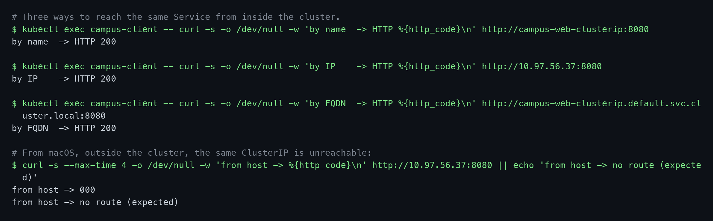

### Explanation

Port 8080 on the Service maps to `targetPort` 80 in the container — the Service port and the container
port do not have to agree, and keeping them distinct here makes the mapping visible.

The fourth call is the important one. `10.97.56.37` is a *virtual* IP: it belongs to no network
interface anywhere. It exists only as an iptables rule inside the cluster's nodes, so from macOS there
is nothing to route to and the request dies with code `000`. That is the defining property of
ClusterIP — internal-only. To reach it from a laptop you would need `kubectl port-forward`, which
tunnels through the API server rather than making the IP routable.

---

## Task 2: NodePort — Opening a Port on the Node

- Expose the same Deployment on a fixed port on the node.
- Reach it from outside the cluster.

### Commands

```bash
kubectl apply -f manifests/02-nodeport.yaml
kubectl get svc campus-web-nodeport
kubectl get nodes -o wide
minikube service campus-web-nodeport --url
```

### Output

```text
$ kubectl get svc campus-web-nodeport
NAME                  TYPE       CLUSTER-IP     EXTERNAL-IP   PORT(S)        AGE
campus-web-nodeport   NodePort   10.102.89.52   <none>        80:30080/TCP   2m46s

$ kubectl get nodes -o wide | awk '{print $1, $6}'
NAME INTERNAL-IP
minikube 192.168.49.2

$ echo http://127.0.0.1:51378
http://127.0.0.1:51378

$ curl -s -o /dev/null -w 'via node port -> HTTP %{http_code}\n' http://127.0.0.1:51378
via node port -> HTTP 200
```

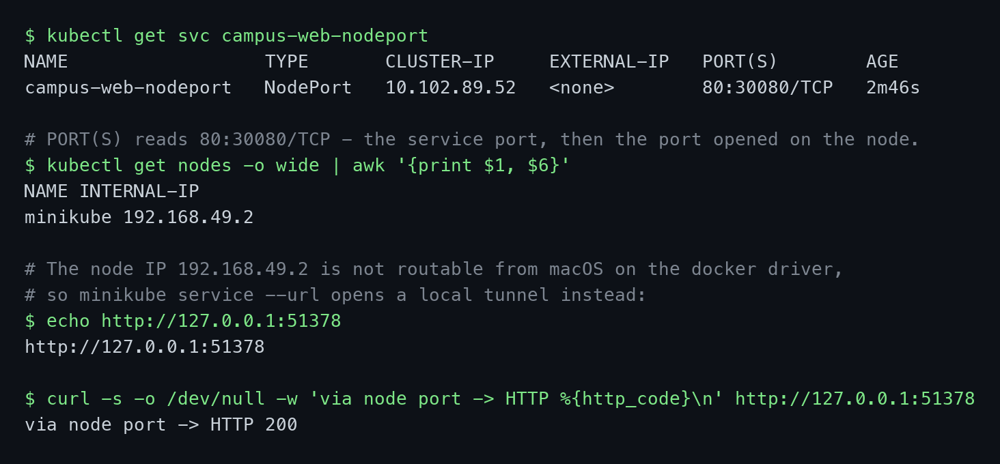

### Explanation

`PORT(S)` now reads `80:30080/TCP` — two ports, not one. Port 80 is the Service port used inside the
cluster; 30080 is opened on **every node** and forwarded to it. A NodePort Service is a ClusterIP
Service with that extra hop bolted on; it still has a ClusterIP (`10.102.89.52`) and still works by
name internally.

The limitations follow from the design. The port must fall in 30000–32767, so you cannot serve on 80
or 443 without extra machinery. Each port can back only one Service. Clients need a node's IP, and if
that node dies they need to know another one — there is no load balancing or DNS in front. And each
open port widens the surface exposed on every node in the cluster.

**Environment note.** The textbook command is `curl http://$(minikube ip):30080`. On the docker driver
on macOS the node runs inside a Docker network that the host cannot route to, so `192.168.49.2:30080`
does not answer. `minikube service <name> --url` opens a local tunnel and prints a `127.0.0.1` address
that does. The tunnel only lives as long as that command runs.

---

## Task 3: LoadBalancer — the Cloud-Native External Service

- Create a LoadBalancer Service.
- Observe what happens with no cloud provider behind the cluster.

### Commands

```bash
kubectl apply -f manifests/03-loadbalancer.yaml
kubectl get svc campus-web-loadbalancer
kubectl describe svc campus-web-loadbalancer
```

### Output

```text
$ kubectl get svc campus-web-loadbalancer
NAME                      TYPE           CLUSTER-IP     EXTERNAL-IP   PORT(S)        AGE
campus-web-loadbalancer   LoadBalancer   10.111.1.202   <pending>     80:30308/TCP   6s

$ kubectl describe svc campus-web-loadbalancer | grep -E 'Type:|NodePort:|Endpoints:'
Type:                     LoadBalancer
NodePort:                 <unset>  30308/TCP
Endpoints:                10.244.0.20:80,10.244.0.17:80,10.244.0.19:80
```

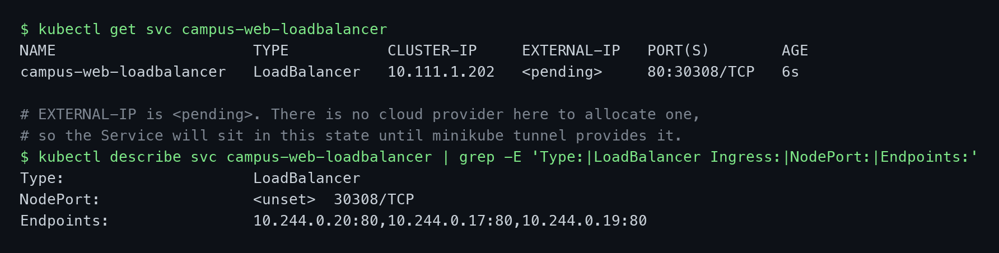

### Output

```text
$ echo http://127.0.0.1:51408
http://127.0.0.1:51408

$ curl -s -o /dev/null -w 'via loadbalancer -> HTTP %{http_code}\n' http://127.0.0.1:51408
via loadbalancer -> HTTP 200

$ kubectl get svc campus-web-loadbalancer -o jsonpath='{.spec.type} -> nodePort {...} -> targetPort {...}'
LoadBalancer -> nodePort 30308 -> targetPort 80
```

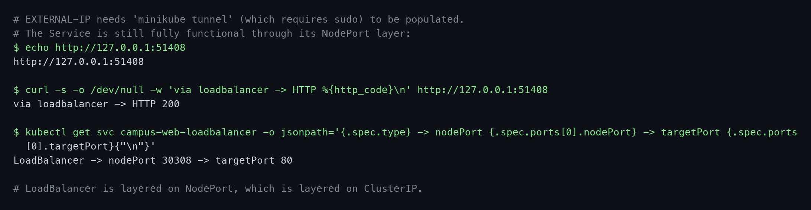

### Explanation

`EXTERNAL-IP` shows `<pending>`, and on this cluster it will stay that way. When a LoadBalancer Service
is created, the **cloud-controller-manager** is supposed to call the provider's API and provision a
real load balancer. Minikube has no cloud behind it, so nothing answers and the field is never filled.
On EKS, GKE or AKS the same manifest would produce a public address within a minute or two.

The `describe` output exposes how the types nest. A LoadBalancer Service *contains* a NodePort
(`30308`, auto-assigned since the manifest did not request one), which in turn contains a ClusterIP
(`10.111.1.202`). Traffic flows external LB → node port → cluster IP → Pod. Each type adds a layer
rather than replacing the one below, which is why the Service still resolves by name internally and
still serves through its node port even with `EXTERNAL-IP` unfilled.

`minikube tunnel` can fake the missing provider by allocating an address on the host, but it needs
`sudo` to bind privileged ports and hold routes open. That was not run here, so `EXTERNAL-IP` is
recorded honestly as `<pending>`; reachability is shown through the NodePort layer instead.

The cost argument matters in production: every LoadBalancer Service is a separate billed load balancer
with its own IP. Ten services means ten of them. That is the usual reason to put a single Ingress in
front instead — the subject of Session 12.

---

## Task 4: ExternalName — a DNS Alias Out of the Cluster

- Create an ExternalName Service pointing at a host outside the cluster.
- Show that it has no ClusterIP and no Endpoints.

### Commands

```bash
kubectl apply -f manifests/04-externalname.yaml
kubectl get svc campus-external-api
kubectl get endpoints campus-external-api
kubectl exec campus-client -- nslookup campus-external-api
```

### Output

```text
$ kubectl get svc campus-external-api
NAME                  TYPE           CLUSTER-IP   EXTERNAL-IP      PORT(S)   AGE
campus-external-api   ExternalName   <none>       api.github.com   <none>    3s

$ kubectl get endpoints campus-external-api
Error from server (NotFound): endpoints "campus-external-api" not found

$ kubectl exec campus-client -- nslookup campus-external-api
campus-external-api.default.svc.cluster.local	canonical name = api.github.com
Name:	api.github.com
Address: 20.207.73.85
```

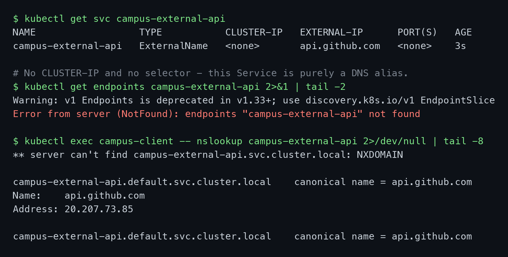

### Explanation

This type is unlike the other four. There is no `CLUSTER-IP`, no selector, no ports, and
`kubectl get endpoints` returns **NotFound** — not an empty list, but no object, because there is
nothing in the cluster to track. No proxying happens and kube-proxy is not involved at all.

All that exists is a CoreDNS record. `nslookup` shows it plainly: the in-cluster name resolves to
`canonical name = api.github.com`, which then resolves to the real public address `20.207.73.85`. It
is a CNAME and nothing more.

The value is indirection. Application code can be written against `campus-external-api` in every
environment, while the Service definition points at a staging database in one cluster and a production
one in another — no config change in the app, no redeploy. Migrating a dependency into the cluster
later means swapping this for a normal ClusterIP Service under the same name.

Two limits are worth knowing. It cannot remap ports, since DNS carries no port information. And
`externalName` must be a DNS name — an IP address will not work; that case needs a selector-less
Service with a hand-written Endpoints object.

---

## Task 5: Headless Service — Addressing Individual Pods

- Create a Service with `clusterIP: None` fronting a StatefulSet.
- Show that one DNS query returns every Pod IP.
- Reach individual Pods by their own stable names.

### Commands

```bash
kubectl apply -f manifests/05-headless.yaml
kubectl get svc campus-headless
kubectl get pods -l app=campus-stateful -o wide
```

### Output

```text
$ kubectl get svc campus-headless
NAME              TYPE        CLUSTER-IP   EXTERNAL-IP   PORT(S)   AGE
campus-headless   ClusterIP   None         <none>        80/TCP    2s

$ kubectl get pods -l app=campus-stateful -o wide
NAME            READY   STATUS    RESTARTS   AGE   IP            NODE
campus-node-0   1/1     Running   0          2s    10.244.0.22   minikube
campus-node-1   1/1     Running   0          1s    10.244.0.23   minikube
campus-node-2   1/1     Running   0          1s    10.244.0.24   minikube
```

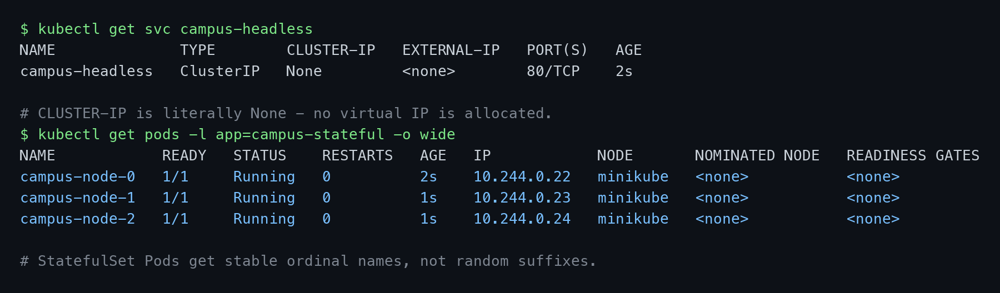

### Commands

```bash
kubectl exec campus-client -- nslookup campus-headless
kubectl exec campus-client -- nslookup campus-node-0.campus-headless.default.svc.cluster.local
kubectl exec campus-client -- curl -s http://campus-node-0.campus-headless
kubectl exec campus-client -- curl -s http://campus-node-2.campus-headless
```

### Output

```text
$ kubectl exec campus-client -- nslookup campus-headless
Name:	campus-headless.default.svc.cluster.local
Address: 10.244.0.24
Name:	campus-headless.default.svc.cluster.local
Address: 10.244.0.23
Name:	campus-headless.default.svc.cluster.local
Address: 10.244.0.22

$ kubectl exec campus-client -- nslookup campus-node-0.campus-headless.default.svc.cluster.local
Name:	campus-node-0.campus-headless.default.svc.cluster.local
Address: 10.244.0.22

campus-node-0 -> HTTP 200
campus-node-2 -> HTTP 200
```

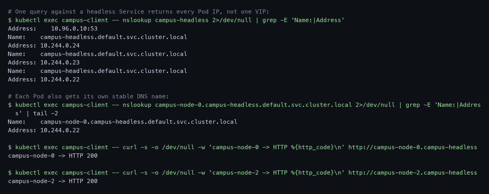

### Explanation

`CLUSTER-IP` is the literal string `None`. Setting `clusterIP: None` tells Kubernetes not to allocate a
virtual IP and not to load balance — it only maintains DNS.

The difference shows in the first lookup. A normal ClusterIP Service answers with one address, the
VIP, and kube-proxy silently picks a Pod behind it. The headless Service answers with **all three Pod
IPs**, and the client decides what to do with them. Comparing against Task 1: one name, one address
there; one name, three addresses here.

The second lookup is what StatefulSets are built on.
`campus-node-0.campus-headless.default.svc.cluster.local` resolves to `10.244.0.22` — the address of
that specific Pod, which matches the listing above. Every Pod gets a name of the form
`<pod>.<service>.<namespace>.svc.cluster.local`, and it survives rescheduling: if `campus-node-0` is
replaced, the name follows it to the new IP.

That is exactly what stateful systems need. A Postgres replica must connect to *the primary*, not to
"whichever database Pod the load balancer picked". Kafka brokers and Elasticsearch nodes address each
other individually for the same reason. The ordinal names also show that StatefulSet Pods are created
in order — `-0` before `-1` before `-2`, and terminated in reverse.

---

## Task 6: DNS and FQDNs Inside the Cluster

- Inspect a Pod's DNS configuration.
- Explain the search path and `ndots:5`.
- Reproduce a cross-namespace resolution failure and fix it.

### Commands

```bash
kubectl exec campus-client -- cat /etc/resolv.conf
kubectl exec campus-client -- nslookup campus-web-clusterip
```

### Output

```text
$ kubectl exec campus-client -- cat /etc/resolv.conf
search default.svc.cluster.local svc.cluster.local cluster.local
nameserver 10.96.0.10
options ndots:5

$ kubectl exec campus-client -- nslookup campus-web-clusterip
Name:	campus-web-clusterip.default.svc.cluster.local
Address: 10.97.56.37
```

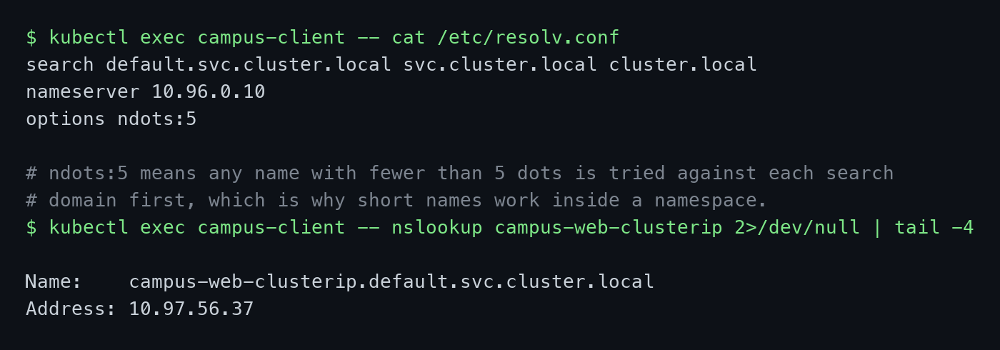

### Commands

```bash
kubectl exec -n campus-dev dev-client -- cat /etc/resolv.conf | head -1
kubectl exec -n campus-dev dev-client -- curl http://campus-web-clusterip:8080
kubectl exec -n campus-dev dev-client -- curl http://campus-web-clusterip.default:8080
kubectl exec -n campus-dev dev-client -- curl http://campus-web-clusterip.default.svc.cluster.local:8080
```

### Output

```text
$ kubectl exec -n campus-dev dev-client -- cat /etc/resolv.conf | head -1
search campus-dev.svc.cluster.local svc.cluster.local cluster.local

$ ... curl http://campus-web-clusterip:8080
short name -> 000
command terminated with exit code 6      <- could not resolve host
short name -> could not resolve

$ ... curl http://campus-web-clusterip.default:8080
svc.default -> HTTP 200

$ ... curl http://campus-web-clusterip.default.svc.cluster.local:8080
full FQDN   -> HTTP 200
```

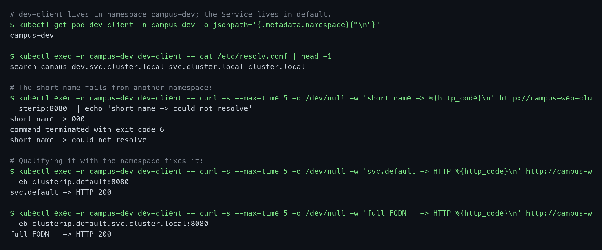

### Explanation

Every Pod is handed a `resolv.conf` pointing at CoreDNS (`10.96.0.10`, the `kube-dns` Service) with a
search path built from **its own** namespace.

That single difference explains the failure. The client in `default` searches
`default.svc.cluster.local` first, so the bare name `campus-web-clusterip` expands to the right FQDN
and resolves. The client in `campus-dev` searches `campus-dev.svc.cluster.local` first — where no such
Service exists — and none of the remaining suffixes produce a match either, so the lookup fails with
curl exit code 6. Adding `.default` supplies the missing namespace and it works immediately.

The rule: **short names only work within a namespace.** Anything crossing a namespace boundary needs
at least `<service>.<namespace>`.

`ndots:5` is the other half. Any name containing fewer than 5 dots is tried against every search
domain *before* being tried as-is. That is what makes short names work, but it costs extra queries for
external domains: `api.github.com` has 2 dots, so it is attempted as
`api.github.com.default.svc.cluster.local` and two more variants — three NXDOMAIN round trips — before
the real lookup. Appending a trailing dot (`api.github.com.`) marks it absolute and skips the search
path entirely.

---

## Task 7: Troubleshooting — a Service With No Endpoints

- Reproduce the most common Service failure.
- Diagnose it and fix it.

### Commands

```bash
kubectl apply -f manifests/06-broken-selector.yaml
kubectl exec campus-client -- curl http://campus-broken-service
kubectl get endpoints campus-broken-service
kubectl get svc campus-broken-service -o jsonpath='{.spec.selector}'
kubectl get pods -l app=campus-web --show-labels
```

### Output

```text
$ ... curl --max-time 4 http://campus-broken-service
request -> 000
command terminated with exit code 7      <- connection refused
request -> no backend answered

$ kubectl get endpoints campus-broken-service
NAME                    ENDPOINTS   AGE
campus-broken-service   <none>      4s

$ kubectl get svc campus-broken-service -o jsonpath='selector: {.spec.selector}'
selector: {"app":"campus-web-backend"}

$ kubectl get pods -l app=campus-web --show-labels --no-headers | head -1
campus-web-5944fcbc55-49tbv   1/1   Running   0   4m11s   app=campus-web,pod-template-hash=5944fcbc55
```

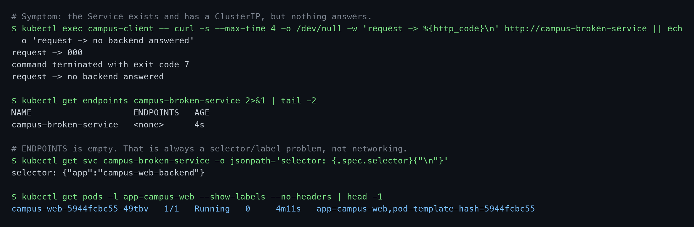

### Commands

```bash
kubectl patch svc campus-broken-service -p '{"spec":{"selector":{"app":"campus-web"}}}'
kubectl get endpoints campus-broken-service
kubectl exec campus-client -- curl http://campus-broken-service
```

### Output

```text
$ kubectl patch svc campus-broken-service -p '{"spec":{"selector":{"app":"campus-web"}}}'
service/campus-broken-service patched

$ kubectl get endpoints campus-broken-service
NAME                    ENDPOINTS                                      AGE
campus-broken-service   10.244.0.17:80,10.244.0.19:80,10.244.0.20:80   11s

$ kubectl exec campus-client -- curl http://campus-broken-service
request -> HTTP 200
```

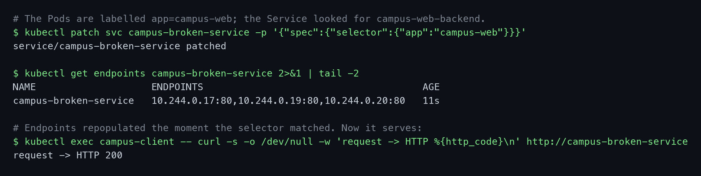

### Explanation

The Service was created successfully, has a ClusterIP, resolves in DNS, and answers nothing. Note the
failure mode: exit code **7**, connection refused — not code 6, "could not resolve". DNS was fine all
along. That distinction is the fastest way to tell a naming problem from a routing problem.

`ENDPOINTS: <none>` names the cause. The Endpoints controller looks for Pods whose labels match
`spec.selector`; the Service asked for `app=campus-web-backend` while the Pods carry `app=campus-web`,
so it found nothing and wrote an empty list. kube-proxy then has no destinations to route to.

An empty endpoint list has only two causes worth checking: the selector does not match any Pod's
labels, or it matches Pods that are not passing their readiness probe — a Pod is only added to
Endpoints once it is Ready. Both are label or health problems inside the cluster, never a network
fault, so `--show-labels` is the first command to reach for.

The fix takes effect immediately. The controller is watching, so patching the selector repopulated the
endpoints within seconds with no restart of anything.

---

## Summary

| Type | ClusterIP allocated | Reachable from | DNS returns | Endpoints |
|---|---|---|---|---|
| ClusterIP | Yes | Inside the cluster only | One virtual IP | Pod IPs |
| NodePort | Yes | Any node's IP, port 30000–32767 | One virtual IP | Pod IPs |
| LoadBalancer | Yes | External address from the cloud provider | One virtual IP | Pod IPs |
| ExternalName | No | N/A — DNS only | CNAME to an external host | None (no object) |
| Headless | No (`None`) | Inside the cluster only | Every Pod IP | Pod IPs |

Choosing between them: internal traffic between services is ClusterIP. Exposing HTTP to the outside
world in production is an Ingress in front of ClusterIP Services, not a LoadBalancer per service.
NodePort is mostly for local development and for sitting behind an external load balancer you manage
yourself. ExternalName is for pointing at a dependency outside the cluster. Headless is for stateful
systems whose members must address each other individually.

### Environment notes

Two deviations from the textbook commands, both caused by the docker driver on macOS:

- The node IP `192.168.49.2` is not routable from the host, so NodePort and LoadBalancer were reached
  through `minikube service <name> --url`, which opens a local tunnel on `127.0.0.1`. The tunnel lives
  only as long as that command runs.
- `EXTERNAL-IP` on the LoadBalancer Service remained `<pending>` because `minikube tunnel` requires
  `sudo`. The Service was verified through its NodePort layer instead.

`kubectl get endpoints` also prints a deprecation warning on Kubernetes v1.37 — `v1 Endpoints` gave way
to `discovery.k8s.io/v1 EndpointSlice` in v1.33. The old command still works and is kept here because
its output is more compact for a write-up.

### Cleanup

```bash
kubectl delete -f manifests/
kubectl delete namespace campus-dev
```
