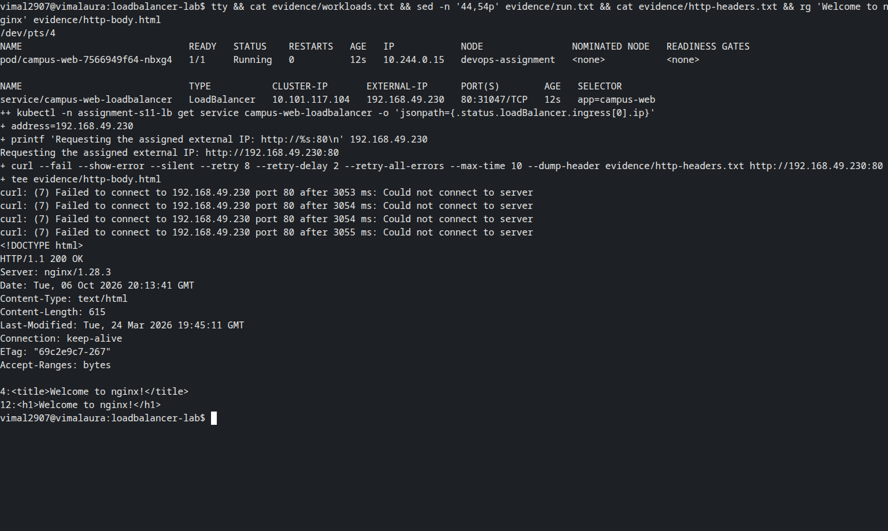
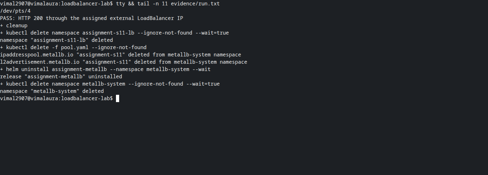

# LoadBalancer external-IP verification

**Vimal Kumar Yadav — 24BCS10273**

The original service had a pending external IP and was reached through its NodePort. This
follow-up uses MetalLB 0.16.1 on the dedicated Linux Minikube cluster to complete the external-IP
demonstration. MetalLB assigned **192.168.49.230**, and the host's direct request to
`http://192.168.49.230:80` returned **HTTP 200** and the Nginx welcome page.



The Docker bridge is `192.168.49.0/24`; the node uses `.2` and the selected unused pool is
`.230` through `.240`. `IPAddressPool` allocates an address, while `L2Advertisement` makes it
reachable on the local network. This is a local address, not a public internet address or an
AWS load balancer. The Service still has an automatically allocated NodePort, but the request
in this exercise uses its external IP and Service port 80.
The raw log retains four initial connection retries while the layer-2 advertisement became
reachable, followed by the successful response. Address assignment alone does not prove HTTP access.

## Run

```bash
bash -x run.sh > evidence/run.txt 2>&1
```

Use a dedicated Minikube Docker profile named `devops-assignment`, with Helm 3 and kubectl.
Check the Docker subnet and unused addresses before reusing `pool.yaml`. The script installs
the pinned official chart with its BGP backend disabled because this lab uses layer 2 only.
It applies the pool, deployment and service, waits for readiness and an allocated IP, and tests
that exact address. The optional `METALLB_CHART` variable accepts an already-downloaded chart.

## Evidence and cleanup

- [Complete command log](evidence/run.txt)
- [Service JSON with assigned ingress IP](evidence/service.json)
- [Running workload and external IP](evidence/workloads.txt)
- [HTTP response headers](evidence/http-headers.txt) and [body](evidence/http-body.html)
- [Applied pool](evidence/pool.yaml)

The exit trap deletes the workload namespace, address pool, advertisement, Helm release and
dedicated MetalLB namespace. No cloud resources were created. The screenshots contain only
real Bash terminals displaying these preserved records with visible read commands.



The Minikube bundled addon was initially found to be MetalLB 0.9.6 and was removed before this
exercise. The current official Helm chart supplies the CRDs used here.

Source: [MetalLB configuration](https://metallb.io/configuration/).
