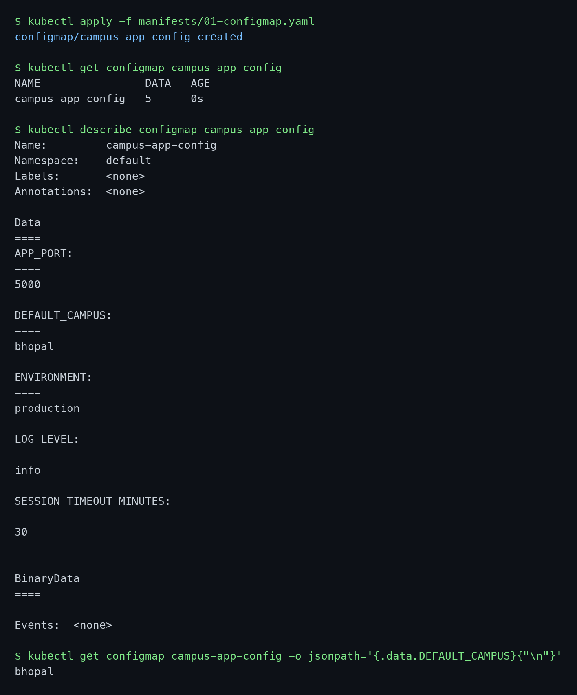
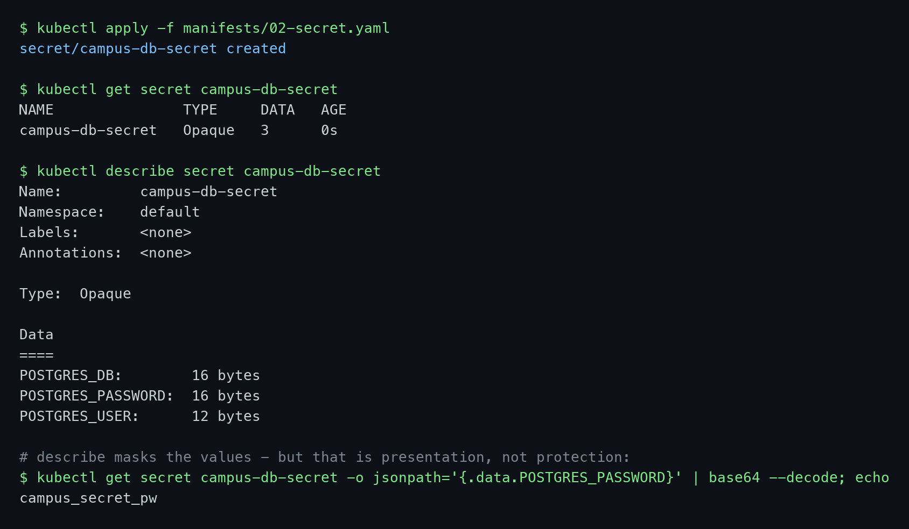
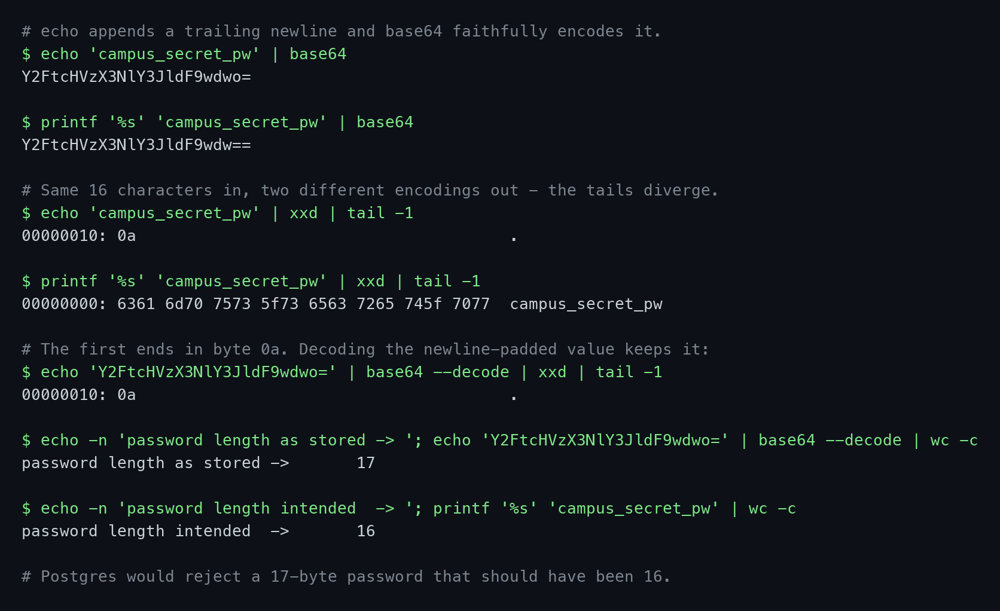
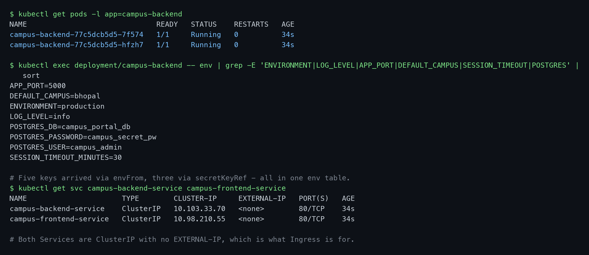
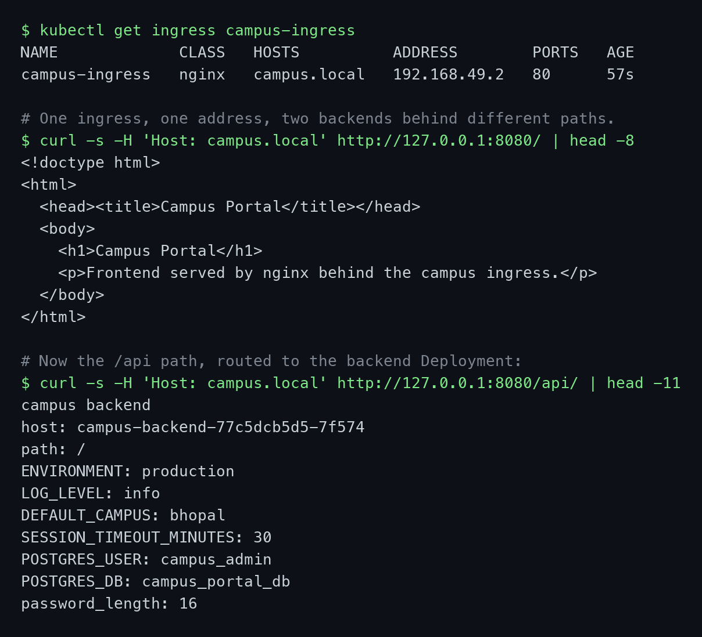
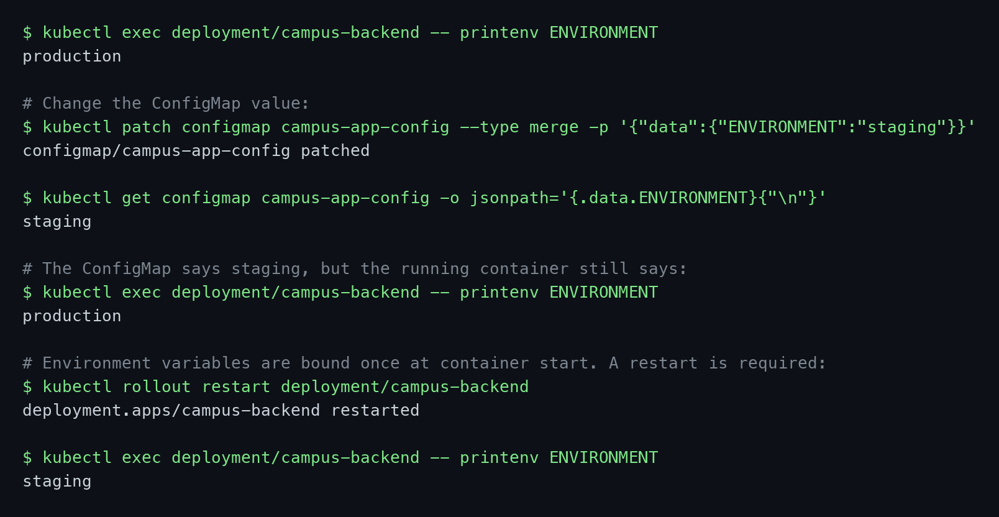
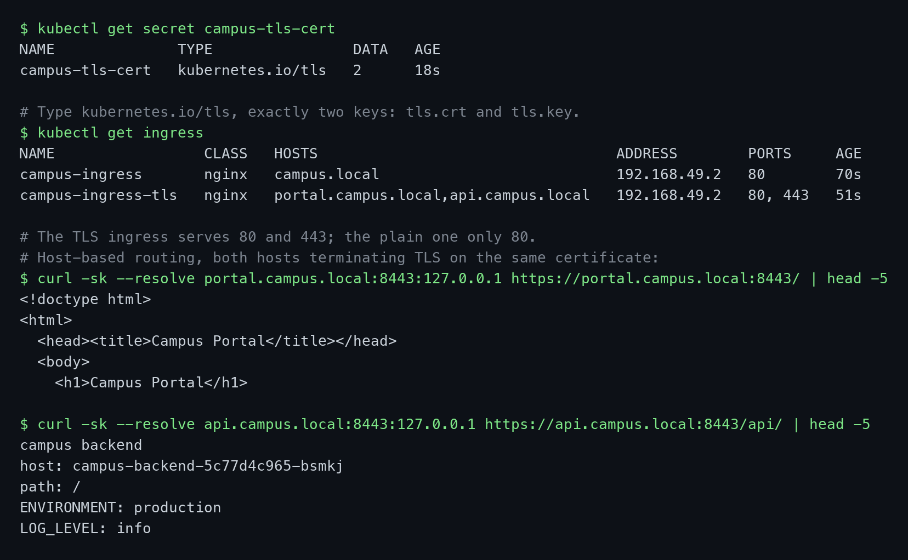
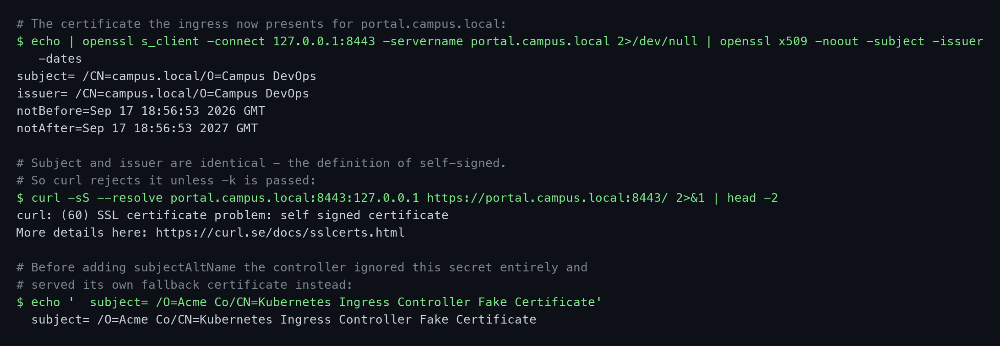

# Session 12 — Ingress, ConfigMaps and Secrets

**Name:** Vimal Kumar Yadav
**Enrollment Number:** 24BCS10273

Everything below was run on a local Minikube cluster — minikube v1.39.0, Kubernetes v1.37.0,
containerd 2.3.4, docker driver, ingress-nginx controller v1.15.1, on macOS (Apple silicon). Every
code block is the real output from that run, and the screenshots are of the same session.

The application is a two-tier campus portal: an nginx frontend and a Python backend, both reading
their configuration from a ConfigMap and their database credentials from a Secret, with a single
Ingress routing to both.

---

## Task 1: ConfigMap — Configuration Outside the Image

- Create a ConfigMap with several key-value pairs.
- Inspect it and read a single key back.

### Commands

```bash
kubectl apply -f manifests/01-configmap.yaml
kubectl get configmap campus-app-config
kubectl describe configmap campus-app-config
kubectl get configmap campus-app-config -o jsonpath='{.data.DEFAULT_CAMPUS}'
```

### Output

```text
$ kubectl get configmap campus-app-config
NAME                DATA   AGE
campus-app-config   5      0s

$ kubectl describe configmap campus-app-config
Data
====
APP_PORT:
----
5000
DEFAULT_CAMPUS:
----
bhopal
ENVIRONMENT:
----
production
LOG_LEVEL:
----
info
SESSION_TIMEOUT_MINUTES:
----
30

$ kubectl get configmap campus-app-config -o jsonpath='{.data.DEFAULT_CAMPUS}'
bhopal
```



### Explanation

The point of a ConfigMap is that the same container image runs in every environment and only the
ConfigMap changes. Baking `ENVIRONMENT: production` into an image means building a separate image per
environment, and it means a configuration change requires a rebuild.

Note that `describe` prints every value in full, in plain text. That is correct behaviour and it is
exactly why a ConfigMap is the wrong place for a password — anyone with read access to the namespace
can see the contents. Two other limits worth knowing: a ConfigMap is capped at roughly 1 MiB, and
values consumed as environment variables do not update in a running container (Task 6).

---

## Task 2: Secret — and Why base64 Is Not Security

- Create an Opaque Secret with database credentials.
- Show that `describe` hides the values but they remain trivially readable.

### Commands

```bash
kubectl apply -f manifests/02-secret.yaml
kubectl get secret campus-db-secret
kubectl describe secret campus-db-secret
kubectl get secret campus-db-secret -o jsonpath='{.data.POSTGRES_PASSWORD}' | base64 --decode
```

### Output

```text
$ kubectl get secret campus-db-secret
NAME               TYPE     DATA   AGE
campus-db-secret   Opaque   3      0s

$ kubectl describe secret campus-db-secret
Type:  Opaque

Data
====
POSTGRES_DB:        16 bytes
POSTGRES_PASSWORD:  16 bytes
POSTGRES_USER:      12 bytes

$ kubectl get secret campus-db-secret -o jsonpath='{.data.POSTGRES_PASSWORD}' | base64 --decode
campus_secret_pw
```



### Explanation

`describe` shows `16 bytes` instead of the value, which makes a Secret *look* protected. It is not.
The very next command decodes the password in full, and it needs no special privileges beyond read
access to the Secret.

**base64 is an encoding, not encryption.** It exists so that binary data — certificates, keystores —
can be stored in a JSON field, not to conceal anything. What actually protects a Secret is everything
around it: RBAC restricting who can read Secrets in the namespace, encryption at rest for etcd, and
not committing the manifest to git. For real deployments that means an external secret store
(Vault, AWS Secrets Manager, Sealed Secrets) rather than a YAML file with base64 in it.

The useful distinction against a ConfigMap is smaller than it looks: Secrets are held in tmpfs rather
than on disk when mounted, are omitted from some logs, and can be RBAC-restricted separately. The data
itself is no harder to read.

---

## Task 3: The `echo` versus `echo -n` Trap

- Show how a trailing newline silently corrupts a Secret value.

### Commands

```bash
echo 'campus_secret_pw' | base64
printf '%s' 'campus_secret_pw' | base64
echo 'campus_secret_pw' | xxd | tail -1
printf '%s' 'campus_secret_pw' | xxd | tail -1
echo 'Y2FtcHVzX3NlY3JldF9wdwo=' | base64 --decode | xxd | tail -1
```

### Output

```text
$ echo 'campus_secret_pw' | base64
Y2FtcHVzX3NlY3JldF9wdwo=

$ printf '%s' 'campus_secret_pw' | base64
Y2FtcHVzX3NlY3JldF9wdw==

$ echo 'campus_secret_pw' | xxd | tail -1
00000010: 0a                                       .

$ printf '%s' 'campus_secret_pw' | xxd | tail -1
00000000: 6361 6d70 7573 5f73 6563 7265 745f 7077  campus_secret_pw

$ echo -n 'password length as stored -> '; echo 'Y2FtcHVzX3NlY3JldF9wdwo=' | base64 --decode | wc -c
password length as stored ->       17

$ echo -n 'password length intended  -> '; printf '%s' 'campus_secret_pw' | wc -c
password length intended  ->       16
```



### Explanation

`echo` appends a newline. `base64` faithfully encodes it, so the same password produces two different
strings — `...cHdwdwo=` carries a trailing `0a` that `...cHdwdw==` does not.

Nothing warns you about this. The Secret is created successfully, the Pod starts, and the application
fails to authenticate with an error that points at the database rather than at the manifest. The
byte count is the proof: 17 bytes stored where 16 were intended.

The fixes are `printf '%s'` or `echo -n` when encoding by hand, or better, let Kubernetes do the
encoding — `kubectl create secret generic ... --from-literal=KEY=value` handles it correctly, as does
the `stringData` field in a manifest. The Secret in this assignment was built with `printf '%s'`, which
is why Task 4 reports `password_length: 16`.

---

## Task 4: Injecting ConfigMap and Secret Into a Deployment

- Consume the whole ConfigMap with `envFrom`.
- Consume individual Secret keys with `secretKeyRef`.
- Verify the variables inside the running container.

### Commands

```bash
kubectl apply -f manifests/03-backend.yaml
kubectl apply -f manifests/04-frontend.yaml
kubectl exec deployment/campus-backend -- env | grep -E 'ENVIRONMENT|LOG_LEVEL|POSTGRES|...'
kubectl get svc campus-backend-service campus-frontend-service
```

### Output

```text
$ kubectl exec deployment/campus-backend -- env | grep -E '...' | sort
APP_PORT=5000
DEFAULT_CAMPUS=bhopal
ENVIRONMENT=production
LOG_LEVEL=info
POSTGRES_DB=campus_portal_db
POSTGRES_PASSWORD=campus_secret_pw
POSTGRES_USER=campus_admin
SESSION_TIMEOUT_MINUTES=30

$ kubectl get svc campus-backend-service campus-frontend-service
NAME                      TYPE        CLUSTER-IP     EXTERNAL-IP   PORT(S)   AGE
campus-backend-service    ClusterIP   10.103.33.70   <none>        80/TCP    34s
campus-frontend-service   ClusterIP   10.98.210.55   <none>        80/TCP    34s
```



### Explanation

Two injection styles are in use, and the difference matters.

`envFrom.configMapRef` pulls in **every** key as an environment variable named after the key. It is
concise, but adding a key to the ConfigMap silently adds a variable to the container, and there is no
renaming.

`env[].valueFrom.secretKeyRef` names one key at a time. It is more verbose and deliberately so — you
can rename a key on the way in, and you only expose what the container actually needs.

`POSTGRES_PASSWORD=campus_secret_pw` appears in plain text in the container's environment. Anyone who
can `kubectl exec` into the Pod can read it. That is inherent to environment variables; mounting a
Secret as a volume is slightly better because file permissions apply and the value does not appear in
`/proc/<pid>/environ`.

A failure mode worth recognising: if a referenced ConfigMap or Secret does not exist, the Pod is
scheduled but sticks in `CreateContainerConfigError` — the kubelet cannot build the container's
environment.

Both Services are `ClusterIP` with no `EXTERNAL-IP`. Nothing outside the cluster can reach either one,
which is precisely the problem Ingress solves.

---

## Task 5: Ingress — Path-Based Routing

- Enable the ingress controller.
- Route `/` to the frontend and `/api/` to the backend through one address.

### Commands

```bash
minikube addons enable ingress
kubectl wait --namespace ingress-nginx --for=condition=ready pod \
  --selector=app.kubernetes.io/component=controller --timeout=120s

kubectl apply -f manifests/05-ingress.yaml
kubectl get ingress campus-ingress

curl -H 'Host: campus.local' http://127.0.0.1:8080/
curl -H 'Host: campus.local' http://127.0.0.1:8080/api/
```

### Output

```text
$ kubectl get ingress campus-ingress
NAME             CLASS   HOSTS          ADDRESS        PORTS   AGE
campus-ingress   nginx   campus.local   192.168.49.2   80      57s

$ curl -s -H 'Host: campus.local' http://127.0.0.1:8080/
<!doctype html>
<html>
  <head><title>Campus Portal</title></head>
  <body>
    <h1>Campus Portal</h1>
    <p>Frontend served by nginx behind the campus ingress.</p>
  </body>
</html>

$ curl -s -H 'Host: campus.local' http://127.0.0.1:8080/api/
campus backend
host: campus-backend-77c5dcb5d5-7f574
path: /
ENVIRONMENT: production
LOG_LEVEL: info
DEFAULT_CAMPUS: bhopal
SESSION_TIMEOUT_MINUTES: 30
POSTGRES_USER: campus_admin
POSTGRES_DB: campus_portal_db
password_length: 16
```



### Explanation

Two different applications, reached through **one** address on **one** port, distinguished only by
path. Replacing this with LoadBalancer Services would mean two cloud load balancers, two external IPs
and two bills.

The backend response reads `path: /`, not `path: /api/`. That is
`nginx.ingress.kubernetes.io/rewrite-target: /$2` at work: the path pattern `/api(/|$)(.*)` captures
the remainder in group 2, and the backend receives only that. The application never needs to know it
is mounted under `/api`.

`password_length: 16` confirms the Secret from Task 2 survived intact — no stray newline.

Three things that silently break an Ingress:

- **No controller.** An Ingress object on its own does nothing; it is a rule with no engine. Without
  `minikube addons enable ingress`, `ADDRESS` stays blank forever and no routing happens.
- **Missing `ingressClassName: nginx`.** The controller ignores Ingresses it does not own, with no
  error — the object exists and simply never takes effect.
- **Path ordering.** `/` declared as `Prefix` would swallow `/api` if the more specific rule were not
  matched first.

**Environment note.** The textbook command is `curl -H "Host: campus.local" http://$(minikube ip)/`.
On the docker driver the node IP `192.168.49.2` is not routable from macOS, so the controller was
reached with `kubectl port-forward -n ingress-nginx svc/ingress-nginx-controller 8080:80` instead. The
`Host:` header is what selects the rule; the IP only has to reach the controller.

---

## Task 6: ConfigMap Updates Do Not Reach Running Containers

- Change a ConfigMap value and observe the running Pod.
- Restart and observe again.

### Commands

```bash
kubectl exec deployment/campus-backend -- printenv ENVIRONMENT
kubectl patch configmap campus-app-config --type merge -p '{"data":{"ENVIRONMENT":"staging"}}'
kubectl get configmap campus-app-config -o jsonpath='{.data.ENVIRONMENT}'
kubectl exec deployment/campus-backend -- printenv ENVIRONMENT
kubectl rollout restart deployment/campus-backend
kubectl exec deployment/campus-backend -- printenv ENVIRONMENT
```

### Output

```text
$ kubectl exec deployment/campus-backend -- printenv ENVIRONMENT
production

$ kubectl patch configmap campus-app-config --type merge -p '{"data":{"ENVIRONMENT":"staging"}}'
configmap/campus-app-config patched

$ kubectl get configmap campus-app-config -o jsonpath='{.data.ENVIRONMENT}'
staging

$ kubectl exec deployment/campus-backend -- printenv ENVIRONMENT
production                                  <- still the old value

$ kubectl rollout restart deployment/campus-backend
deployment.apps/campus-backend restarted

$ kubectl exec deployment/campus-backend -- printenv ENVIRONMENT
staging
```



### Explanation

The cluster and the container disagreed for as long as the Pod kept running, and nothing reported a
problem. This is the failure that catches people out: the ConfigMap was edited, the change looked
applied, and the application carried on with stale configuration.

Environment variables are resolved **once**, by the kubelet, when the container is created. After that
they are ordinary process environment — there is no channel by which Kubernetes could change them in
place, because there is no such mechanism in Linux.

Two ways around it. A `rollout restart` recreates the Pods, which re-reads the ConfigMap — simple, and
what was done here. Alternatively, mount the ConfigMap as a **volume** instead: mounted files *are*
updated in place (within a minute or so), though the application must then re-read the file rather
than caching it at startup.

A common production pattern is to hash the ConfigMap contents into a Pod template annotation, so any
change to the ConfigMap alters the template and triggers a rollout automatically.

---

## Task 7: Ingress With TLS and Host-Based Routing

- Generate a self-signed certificate and store it as a TLS Secret.
- Route two hostnames over HTTPS through the same controller.

### Commands

```bash
openssl req -x509 -nodes -days 365 -newkey rsa:2048 \
  -keyout campus-tls.key -out campus-tls.crt \
  -subj "/CN=campus.local/O=Campus DevOps" \
  -addext "subjectAltName=DNS:campus.local,DNS:portal.campus.local,DNS:api.campus.local"

kubectl create secret tls campus-tls-cert --cert=campus-tls.crt --key=campus-tls.key
kubectl apply -f manifests/06-ingress-tls.yaml
kubectl get ingress

curl -k --resolve portal.campus.local:8443:127.0.0.1 https://portal.campus.local:8443/
curl -k --resolve api.campus.local:8443:127.0.0.1 https://api.campus.local:8443/api/
```

### Output

```text
$ kubectl get secret campus-tls-cert
NAME              TYPE                DATA   AGE
campus-tls-cert   kubernetes.io/tls   2      18s

$ kubectl get ingress
NAME                 CLASS   HOSTS                                  ADDRESS        PORTS     AGE
campus-ingress       nginx   campus.local                           192.168.49.2   80        70s
campus-ingress-tls   nginx   portal.campus.local,api.campus.local   192.168.49.2   80, 443   51s

$ curl -sk --resolve portal.campus.local:8443:127.0.0.1 https://portal.campus.local:8443/
<!doctype html>
<html>
  <head><title>Campus Portal</title></head>

$ curl -sk --resolve api.campus.local:8443:127.0.0.1 https://api.campus.local:8443/api/
campus backend
host: campus-backend-5c77d4c965-bsmkj
path: /
ENVIRONMENT: production
```



### Output

```text
$ echo | openssl s_client -connect 127.0.0.1:8443 -servername portal.campus.local \
    | openssl x509 -noout -subject -issuer -dates
subject= /CN=campus.local/O=Campus DevOps
issuer= /CN=campus.local/O=Campus DevOps
notBefore=Sep 17 18:56:53 2026 GMT
notAfter=Sep 17 18:56:53 2027 GMT

$ curl -sS --resolve portal.campus.local:8443:127.0.0.1 https://portal.campus.local:8443/
curl: (60) SSL certificate problem: self signed certificate
```



### Explanation

`PORTS` changes from `80` to `80, 443` once a `tls:` block is present — the visible sign that the
controller is terminating TLS for those hosts.

Routing here is by **hostname** rather than path. `portal.campus.local` and `api.campus.local` resolve
to the same controller and are separated by the `Host` header, with SNI selecting the certificate
during the TLS handshake.

TLS terminates *at the controller*. Traffic between the controller and the backend Pods is ordinary
HTTP inside the cluster, which is why neither the frontend nor the backend needed any TLS
configuration. Certificate rotation happens in one place.

`subject` and `issuer` being identical is the definition of self-signed: the certificate vouches for
itself, with no chain to a trusted authority. That is why `curl` fails with error 60 unless `-k` is
passed. In production this Secret would be produced by cert-manager from Let's Encrypt, and the
`kubernetes.io/tls` type would be unchanged — only the issuer would differ.

### A problem worth recording

The first certificate used `-subj "/CN=campus.local"` and carried **no** `subjectAltName`. The
Secret was created successfully, the Ingress accepted it, and HTTPS worked — but the controller was
serving its own fallback certificate:

```text
subject= /O=Acme Co/CN=Kubernetes Ingress Controller Fake Certificate
```

ingress-nginx checks that the certificate actually covers the requested hostname and silently falls
back to its built-in default when it does not. Modern TLS clients ignore `CN` entirely and match only
against `subjectAltName`, so a certificate with no SAN covers nothing. There is no error event on the
Ingress; the only symptom is the wrong certificate on the wire. Adding
`-addext "subjectAltName=DNS:campus.local,DNS:portal.campus.local,DNS:api.campus.local"` fixed it, and
`openssl s_client` is the way to confirm which certificate is really being served.

---

## Summary

| Concept | Demonstrated by |
|---|---|
| ConfigMap holds non-secret config | Task 1 — five keys, values visible in `describe` |
| Secrets are encoded, not encrypted | Task 2 — password decoded in one command |
| Trailing-newline corruption | Task 3 — 17 bytes stored where 16 were intended |
| `envFrom` versus `secretKeyRef` | Task 4 — bulk import against per-key selection |
| ClusterIP needs Ingress for external access | Task 4 — no `EXTERNAL-IP` on either Service |
| Path-based routing and rewrite | Task 5 — `/` and `/api/`, backend sees `path: /` |
| Env vars bind at container start | Task 6 — stale value until `rollout restart` |
| TLS termination at the ingress | Task 7 — `PORTS 80, 443`, backends stay plain HTTP |
| Host-based routing and SNI | Task 7 — two hostnames, one controller |
| Certificates need a SAN | Task 7 — silent fallback to the controller's default |

### Environment notes

- The node IP `192.168.49.2` is not routable from macOS on the docker driver, so the ingress
  controller was reached via `kubectl port-forward` on `8080` (HTTP) and `8443` (HTTPS). The `Host`
  header and `--resolve` select the rule; the IP only has to reach the controller.
- macOS ships LibreSSL, whose `openssl x509` has no `-ext` flag. Certificate generation with
  `-addext` works; verifying the extension needs `openssl x509 -text | grep -A1 'Alternative'`.

### Cleanup

```bash
kubectl delete -f manifests/
kubectl delete secret campus-tls-cert
rm -f campus-tls.key campus-tls.crt
```
