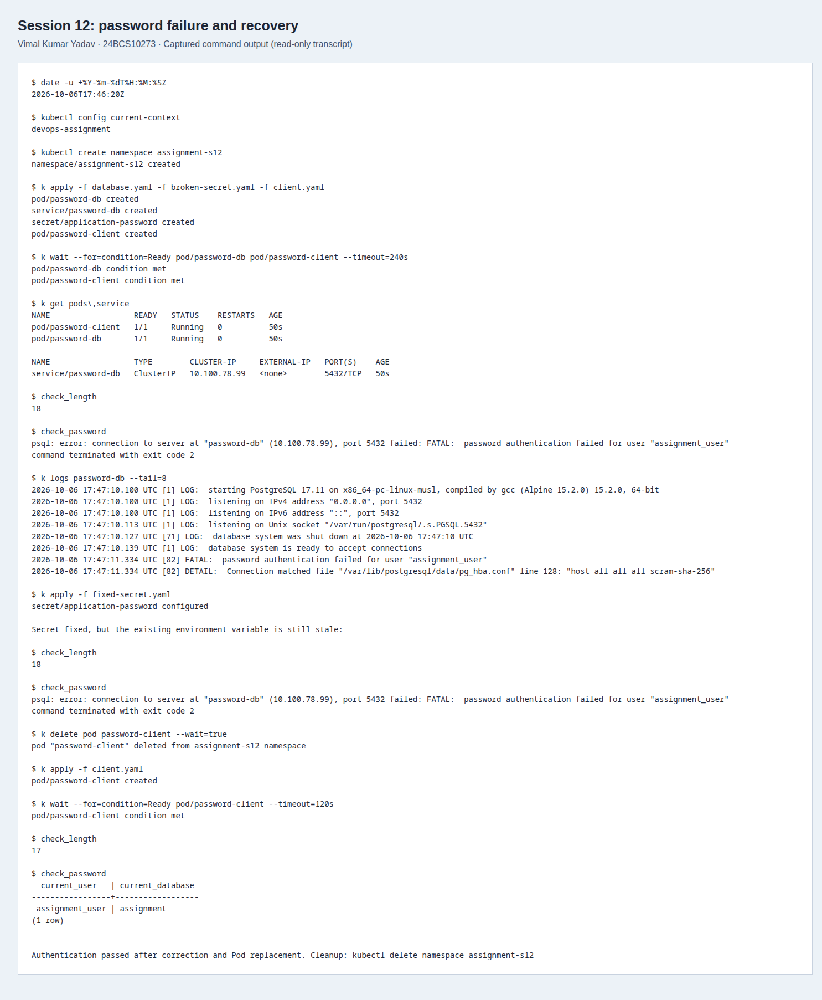

# Trailing-newline Secret: PostgreSQL authentication

This reproduces the failure in the course's
[secret-base64-gotcha.md](../../troubleshooting/secret-base64-gotcha.md), using an
isolated namespace and a disposable PostgreSQL database. All password values in
these files are deliberately public classroom data.

The database expects `lab-password-only` (17 bytes). The broken Secret contains
that value followed by a newline (18 bytes). The client receives the exact decoded
bytes through `secretKeyRef`, so PostgreSQL rejects its connection.

## Reproduce and diagnose

With `kubectl` pointed at a disposable local cluster, run:

```bash
bash run.sh
```

The script creates `assignment-s12`, applies the database, broken Secret and client,
then checks both Pod readiness and a real TCP/password-authenticated SQL query.
`pg_isready` alone would not prove that the application's password works. The
connection uses `-h password-db` so local Unix-socket authentication cannot hide
the password bug.

The useful diagnostics are:

```bash
kubectl -n assignment-s12 get pods,service
kubectl -n assignment-s12 exec password-client -- sh -c 'printf %s "$PGPASSWORD" | wc -c'
kubectl -n assignment-s12 exec password-client -- psql -h password-db -U assignment_user -d assignment -c 'SELECT current_user, current_database();'
kubectl -n assignment-s12 logs password-db --tail=8
```

Length inspection avoids printing the password. This exercise uses fake values;
do not decode or print real Secrets into logs or screenshots.

## Fix and verify

[fixed-secret.yaml](fixed-secret.yaml) uses `stringData` with a single-line value.
For manual encoding, use `printf %s 'lab-password-only' | base64`; ordinary `echo`
adds a newline. Base64 is encoding, not encryption. `stringData` also provides no
encryption and must not be used to commit production credentials.

Updating a Secret does not rewrite existing process environment variables. The
script first demonstrates that the old client still fails after the Secret is
fixed. It then recreates the client Pod, verifies the new length, and requires a
successful SQL query. A Deployment would normally use `kubectl rollout restart`
instead of manually recreating a bare Pod.

The raw [before/after transcript](evidence/secret-fix.txt) contains the actual
commands and results. The screenshot below is a browser rendering of that saved
transcript, captured with Playwright/CDP; it is not a reconstructed terminal.



## Cleanup

```bash
kubectl delete namespace assignment-s12
```

The database uses `emptyDir`; deleting its Pod or namespace removes the lab data.
It is unsuitable for persistent application data.

References: [Secrets](https://kubernetes.io/docs/concepts/configuration/secret/),
[Secret environment variables](https://kubernetes.io/docs/tasks/inject-data-application/distribute-credentials-secure/).
