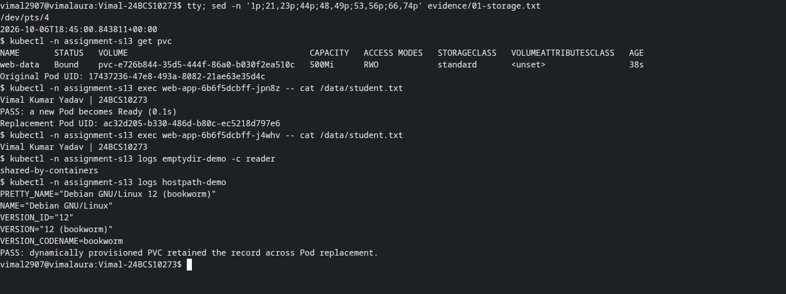
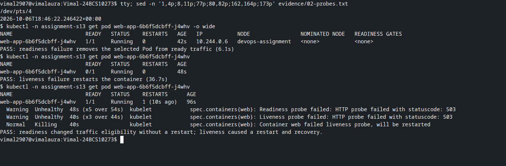
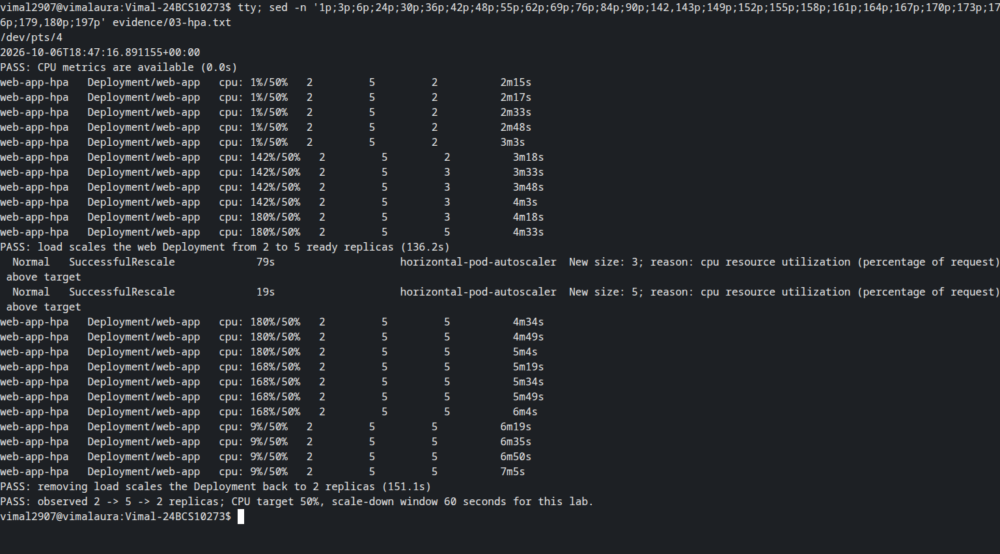
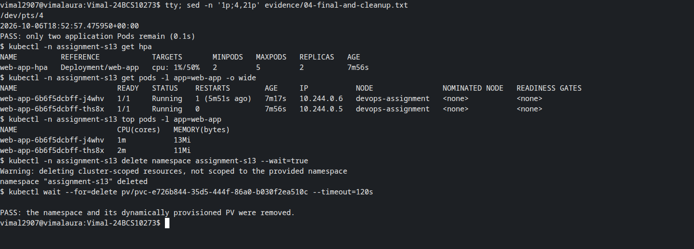

# Session 13: Storage, HPA and probes

**Vimal Kumar Yadav · 24BCS10273**

This submission includes the volume notes, an executable persistence/probe/HPA mini project, a load generator and evidence from a real Minikube run. Verification used Minikube 1.39.0, Kubernetes/kubectl 1.37.1 and containerd 2.3.4 on 7 October 2026 (IST). The cluster had one node, four CPUs and 4096MiB memory.

## Requirements and evidence

| Requirement | Implementation | Observed result |
| --- | --- | --- |
| Volume concepts and examples | [Volume notes](01-kubernetes-volumes/README.md), emptyDir and read-only hostPath manifests | An init-container message was read by another container; node OS information was read through hostPath. |
| Persistent storage | [500Mi RWO claim](mini-project/pvc.yaml), mounted at `/data` | A replacement Pod with a different UID read the original student record. |
| Deploy and verify HPA | [hpa.yml](mini-project/hpa.yml) | Target 50% CPU, minimum two and maximum five replicas. |
| Generate traffic and observe CPU | [Four-client load generator](load-generator.yaml) | HPA utilization rose from 1% to 142%, then 180% of the CPU request. |
| Observe scaling | [HPA transcript](evidence/03-hpa.txt) | The Deployment scaled 2 → 3 → 5, then returned to 2 after load removal. |
| All three health probes | [Deployment](mini-project/deployment.yaml) | Startup delay tolerated; readiness failure changed endpoint eligibility without a restart; liveness failure caused one restart and recovery. |
| Mini project | [Application, manifests and explanation](mini-project/README.md) | Persistence, Service HTTP, health checks and autoscaling all passed. |

## Run it

Use a disposable Minikube cluster with its kubeconfig active. The default `standard` StorageClass and Minikube storage provisioner must be enabled. Python 3 uses only its standard library.

```bash
minikube addons enable metrics-server -p devops-assignment
python3 run.py
```

Run from this student directory with a fresh `assignment-s13` namespace. The runner records the actual command output in `evidence/` and fails if a verification condition is not met. Use `--stage storage`, `--stage probes` or `--stage hpa` to run a stage after its prerequisites have been created.

Useful commands executed by the lab include:

```bash
kubectl -n assignment-s13 get hpa
kubectl -n assignment-s13 get pods -o wide
kubectl -n assignment-s13 top pods
kubectl -n assignment-s13 describe hpa web-app-hpa
kubectl -n assignment-s13 get pvc
kubectl get storageclass standard -o yaml
```

## What happened during the run

The storage check wrote `Vimal Kumar Yadav | 24BCS10273` to `/data/student.txt`, recorded the original Pod UID, deleted that Pod and selected a replacement that was absent from the original Pod list. Reading the same contents from the replacement proves the check did not accidentally use the other surviving replica. See [storage output](evidence/01-storage.txt).

The readiness marker changed one Pod to `0/1 Running`, with `ready: false` in its EndpointSlice and no change in restart count. Removing the marker restored readiness. The liveness marker produced HTTP 503 events, a kubelet restart and recovery to `1/1 Running` with restart count 1. See [probe output](evidence/02-probes.txt).

Metrics were initially unavailable while the metrics server and newly started containers collected samples. Those warnings remain in the HPA transcript. After traffic started, five ready replicas were observed after 136 seconds. Removing the load returned the Deployment to two replicas after another 151 seconds. The deliberately shortened sixty-second stabilization window is only part of that delay: collection windows, control loops and Pod startup/termination also take time.

At the instant scale-down completed, three surplus Pods were still terminating and `kubectl top` retained their recent samples. The [final check](evidence/04-final-and-cleanup.txt) confirms only two Pods remained afterward, HPA showed two replicas at 1% CPU utilization, and measured CPU was 1m/2m. The runner now also waits for surplus Pods to disappear before its final snapshot.






These terminal-only screenshots were captured with Playwright/CDP from real Bash pseudo-terminal sessions. The visible `tty` and `sed` commands inspect the preserved lab transcripts; they do not rerun the completed lab. The full text logs retain the original commands, timestamps and results.

## Cleanup

```bash
kubectl delete namespace assignment-s13 --wait=true
```

The [cleanup evidence](evidence/04-final-and-cleanup.txt) also waits for deletion of this claim's generated PV. Removing the namespace deletes the claim and this lab's saved record. The local claim's `Delete` policy makes that expected.

The mini project follows the [instructor's session 13 brief](https://github.com/Nency-Ravaliya/devops-heros/blob/main/session-13-storage-hpa-probes/mini-project/README.md). Aryen's [assignment](https://github.com/aryen1101/Learn_DEVOPS/tree/main/Class_Assignments/Kubernetes_Storage_HPA_Probes) was a coverage reference. This implementation and all execution evidence were produced for this submission.
