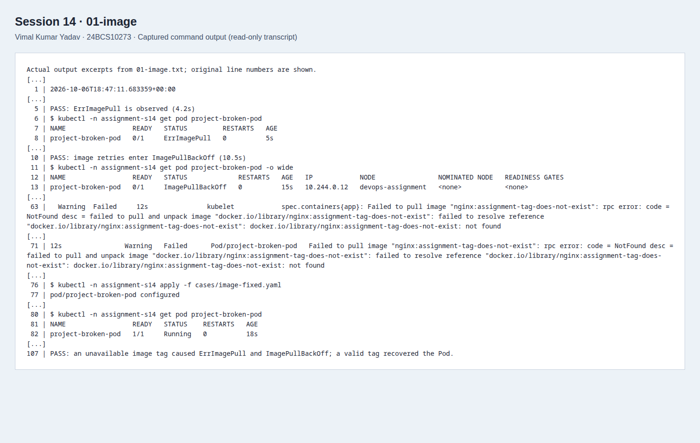
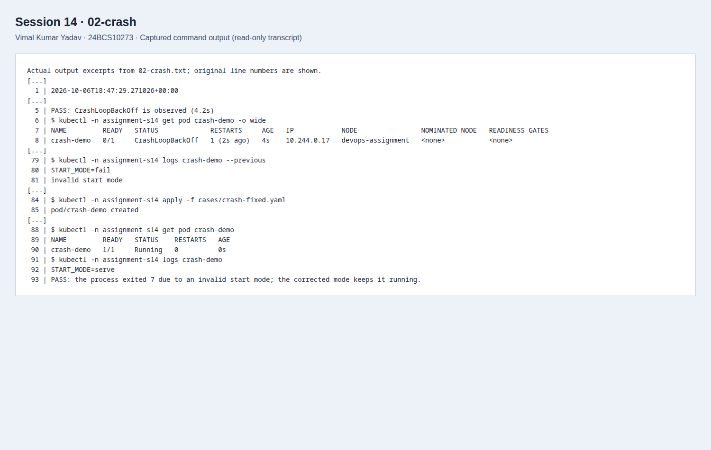
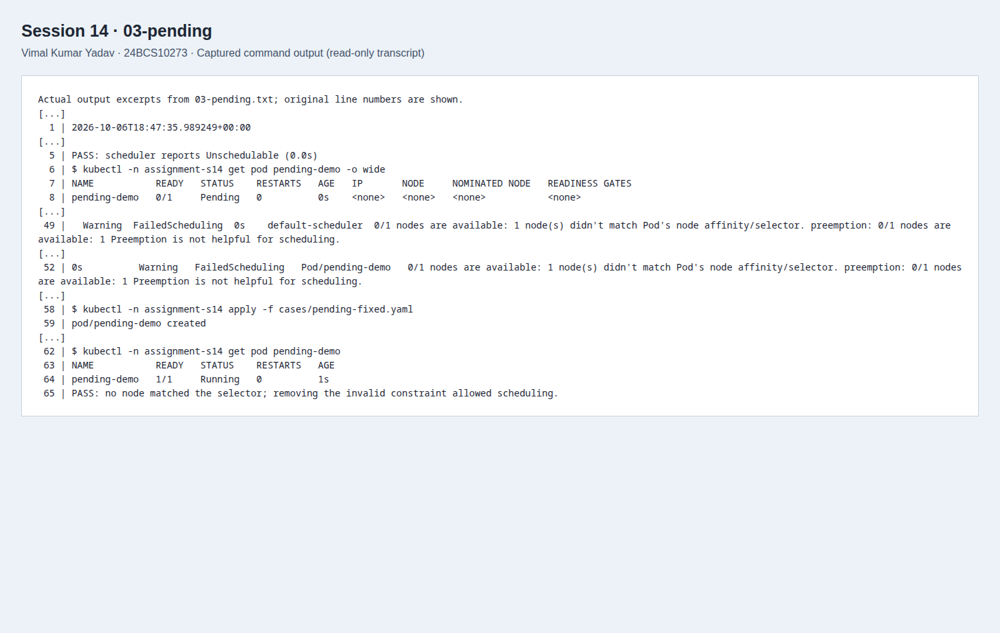
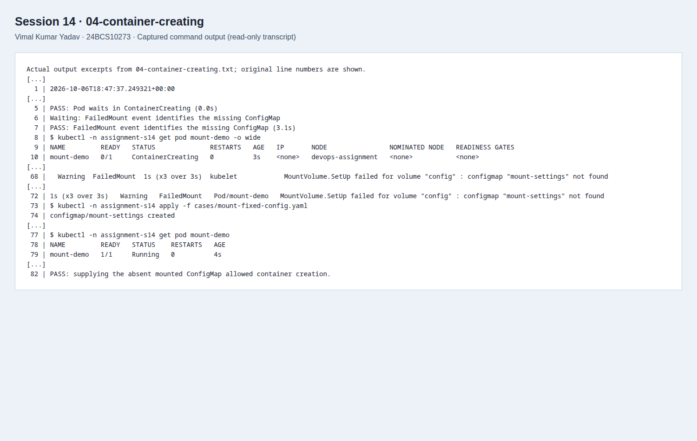
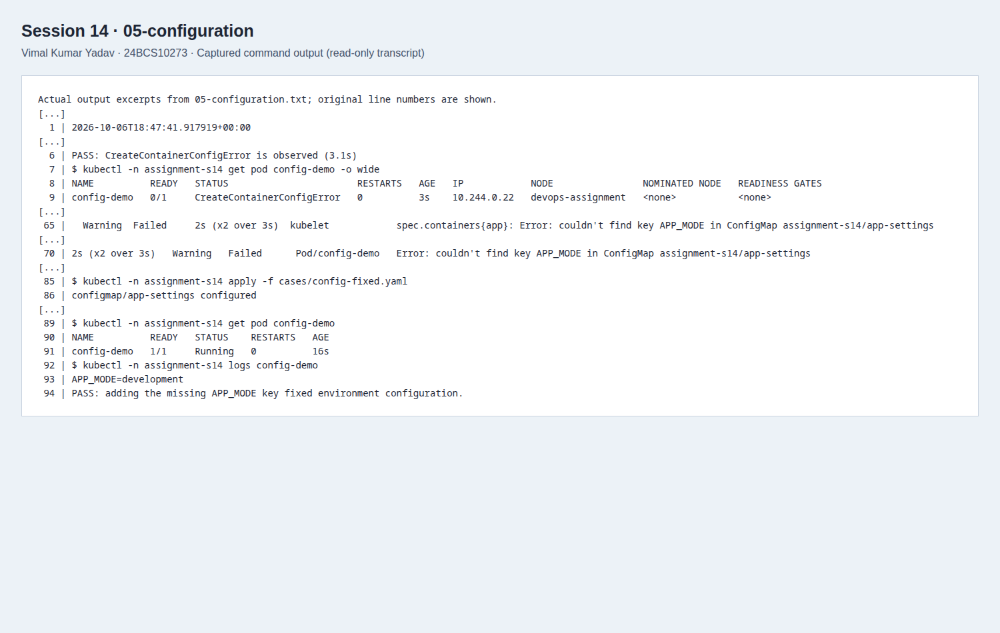
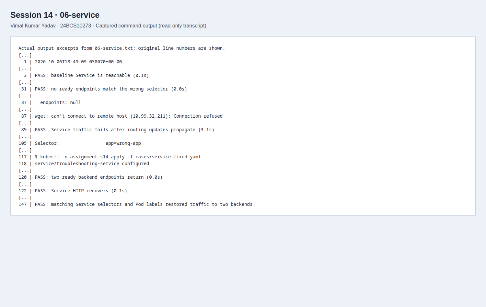
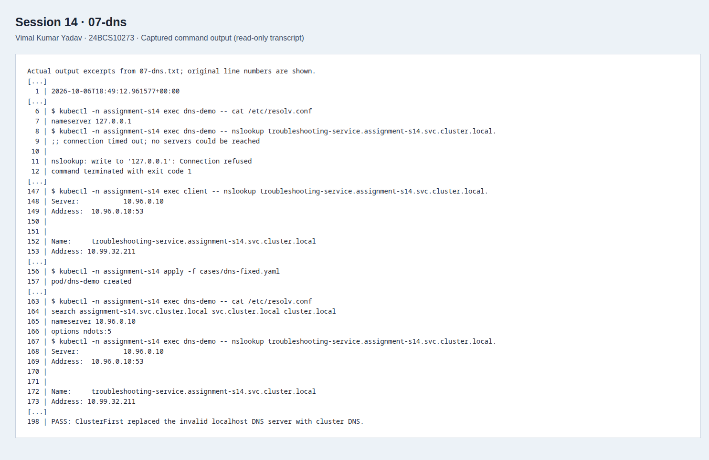
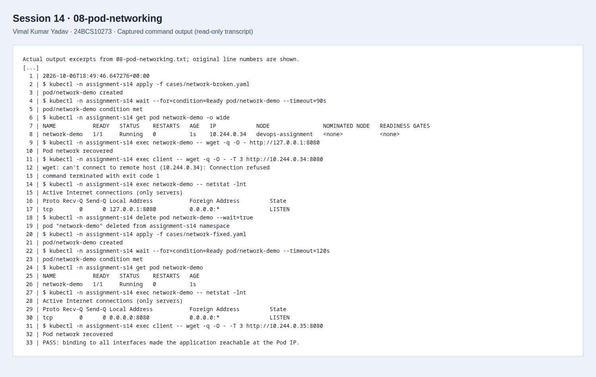

# Session 14: Kubernetes troubleshooting

**Vimal Kumar Yadav · 24BCS10273**

These exercises intentionally break workloads in `assignment-s14`, collect the reason before changing the configuration, and verify each repair. The run used Minikube 1.39.0, Kubernetes/kubectl 1.37.1 and containerd 2.3.4 on 7 October 2026 (IST). Transcript timestamps also include UTC.

## Repeat the exercises

Use a disposable cluster with a working metrics server and the intended kubeconfig. Python 3 uses only its standard library.

```bash
minikube addons enable metrics-server -p devops-assignment
python3 run.py
```

The namespace should not already contain a previous run. To repeat everything, remove **only this lab's namespace** first:

```bash
kubectl delete namespace assignment-s14 --ignore-not-found --wait=true
python3 run.py
```

`--stage` runs one exercise; `--start-at` resumes the sequence. Every command, output, condition check and repair is recorded in `evidence/`. The script raises an error if the expected fault or recovery does not occur.

## Commands practiced

All commands below were executed; see [command transcript](evidence/00-commands.txt).

| Command | What I use it to learn |
| --- | --- |
| `kubectl get pods` | Readiness, container status and restart count at a glance. |
| `kubectl get pods -o wide` | Pod IP and assigned node for connectivity or placement problems. |
| `kubectl describe pod <name>` | Conditions, configured resources, container state and recent events. |
| `kubectl logs <name>` | What the application wrote to stdout/stderr. `--previous` retrieves the previous container attempt. |
| `kubectl exec <name> -- <command>` | Inspect configuration or make a request from inside a running container. |
| `kubectl events --for pod/<name>` | Scheduling, pull, mount and health events for one Pod. |
| `kubectl explain pod.spec.containers.resources` | Read the server API schema and field meanings. |
| `kubectl top pods` | Compare measured CPU and memory usage once metrics are available. |

## Faults, investigation and recovery

| Issue | Observed fault and root cause | Investigation | Repair and verification |
| --- | --- | --- | --- |
| ErrImagePull / ImagePullBackOff | The tag `nginx:assignment-tag-does-not-exist` was unavailable. Both waiting reasons were observed. | [Image transcript](evidence/01-image.txt): `get`, `describe` and events showed the registry's `not found` error. | Applied [valid image](cases/image-fixed.yaml), waited for readiness and received the Nginx page over localhost HTTP. |
| CrashLoopBackOff | The process repeatedly exited 7 because `START_MODE=fail`. | [Crash transcript](evidence/02-crash.txt): waiting reason, termination status and `logs --previous`. | Recreated the Pod with [START_MODE=serve](cases/crash-fixed.yaml); it became Ready and logged the corrected mode. |
| Pending | No node had the required `assignment-node=missing` label. | [Scheduling transcript](evidence/03-pending.txt): `FailedScheduling`, `Unschedulable` and actual node labels. | [Removed the invalid selector](cases/pending-fixed.yaml), recreated the Pod and verified readiness. |
| ContainerCreating | The `mount-settings` ConfigMap did not exist, so volume setup failed. | [Mount transcript](evidence/04-container-creating.txt): waiting state and `FailedMount` event. | Created the [missing ConfigMap](cases/mount-fixed-config.yaml). The same Pod became Ready; [file verification](evidence/09-data-verification.txt) read the expected contents. |
| Configuration | `APP_MODE` was absent from an existing ConfigMap, producing `CreateContainerConfigError`. | [Configuration transcript](evidence/05-configuration.txt): events identified the missing key; inspected the ConfigMap. | [Added APP_MODE](cases/config-fixed.yaml). The Pod started and `printenv` returned `development`. |
| Service connectivity | The Service selector used `app=wrong-app`; its EndpointSlice had `endpoints: null`. | [Service transcript](evidence/06-service.txt): compared Pod labels with the Service selector and attempted HTTP. | [Restored the selector](cases/service-fixed.yaml); two ready endpoints and the Nginx response returned. |
| DNS | A Pod used `dnsPolicy: None` and localhost as its DNS server. | [DNS transcript](evidence/07-dns.txt): inspected `/etc/resolv.conf`, tried lookup, then proved an unaffected client could resolve the same absolute name. | Recreated the Pod with [ClusterFirst](cases/dns-fixed.yaml); DNS and Service HTTP both succeeded. |
| Pod networking | A web process listened on `127.0.0.1:8080` only. Local HTTP worked while a second Pod could not connect to its Pod IP. | [Network transcript](evidence/08-pod-networking.txt): tested both request paths and inspected `netstat -lnt`. | [Bound to 0.0.0.0](cases/network-fixed.yaml), recreated the Pod and verified HTTP from the second Pod. |

The Pod-networking example diagnoses an application listening-address problem. It does not claim a CNI or NetworkPolicy failure was reproduced.

The Service exercise needed two runner corrections: empty EndpointSlices may contain JSON `null`, and removing endpoints does not instantly change the node's routing rules. The final transcript retains an HTTP success immediately after the selector change, followed by connection failure once routing caught up. The runner now polls for both the API state and the observed network behavior before declaring a result.

Screenshots are readable renderings of excerpts from these actual transcripts, captured through Playwright/CDP. They are labelled as transcripts and are accompanied by the full text files.










## Mini project

The Nginx Deployment/Service, broken image and selector mismatch fulfill the provided challenge. See the [mini-project answers and checklist](mini-project/README.md). Manifests and repaired versions are in [manifests](manifests/) and [cases](cases/).

## Cleanup

```bash
kubectl delete namespace assignment-s14 --wait=true
```

The [cleanup transcript](evidence/10-cleanup.txt) records removal of the namespace. No other namespaces or applications are part of this exercise.

Sources: the [instructor's troubleshooting challenge](https://github.com/Nency-Ravaliya/devops-heros/blob/main/session-14-kubernetes-troubleshooting/mini-project/README.md) and [Kubernetes application troubleshooting](https://kubernetes.io/docs/tasks/debug/debug-application/). Aryen's [assignment organization](https://github.com/aryen1101/Learn_DEVOPS/tree/main/Class_Assignments/Kubernetes_Commands) was used as a reference; these manifests, explanations and run evidence belong to this submission.
