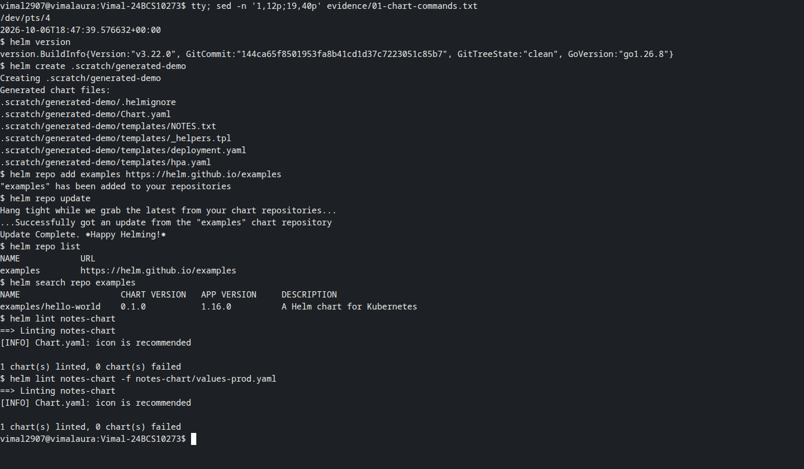
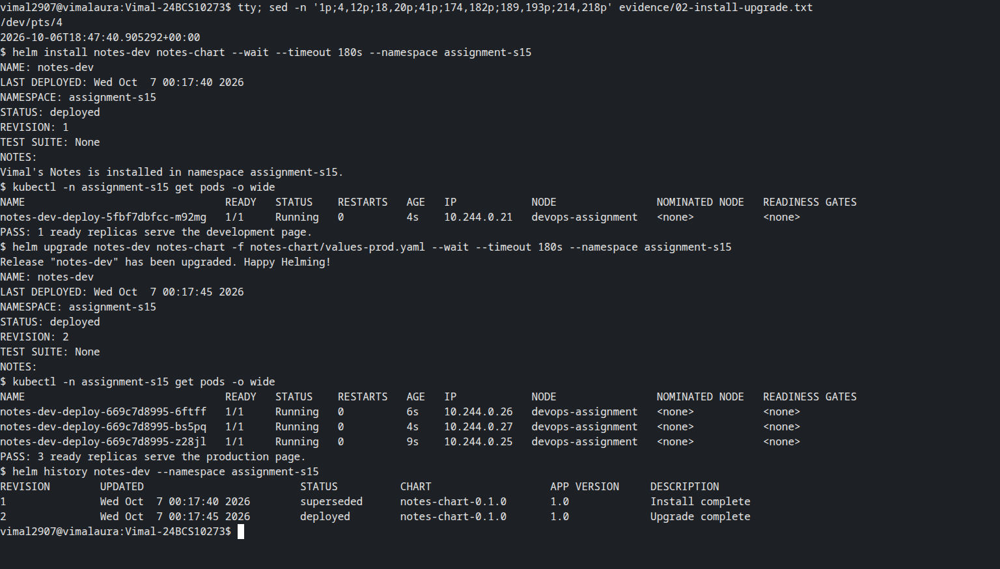
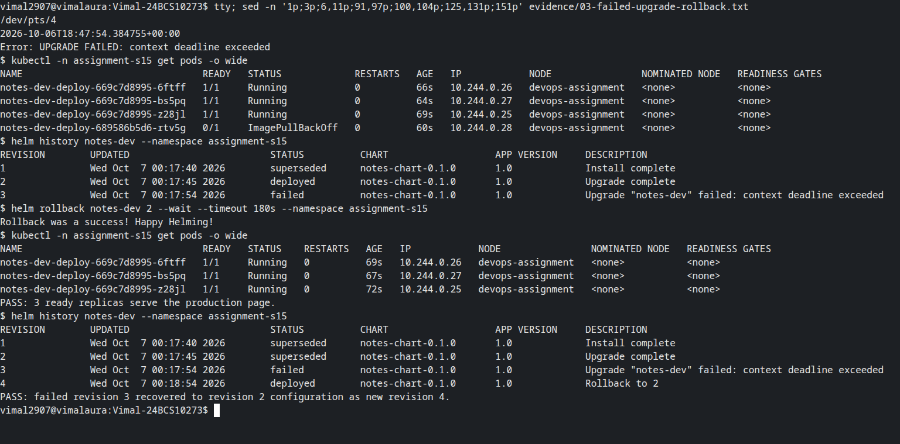
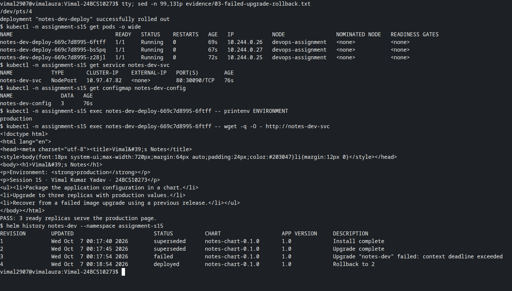

# Session 15: Helm

**Vimal Kumar Yadav · 24BCS10273**

The Notes mini project packages an Nginx landing page, configuration and Service into a chart. The verified release sequence was **install → upgrade to three replicas → failed image upgrade → rollback**, with the page and configuration checked after each successful release.

This is the small Nginx-based Notes representation specified by the course, not a database-backed note editor. Verification used Helm 3.22.0, Minikube 1.39.0 and Kubernetes 1.37.1 on 7 October 2026 (IST).

## Chart

| File | Purpose |
| --- | --- |
| [Chart.yaml](notes-chart/Chart.yaml) | Chart name, version and application metadata. |
| [values.yaml](notes-chart/values.yaml) | Development defaults: one replica, Nginx 1.27 Alpine, NodePort 30090 and resource settings. |
| [values-prod.yaml](notes-chart/values-prod.yaml) | Overrides: three replicas, Nginx 1.28 Alpine and production environment. |
| [deployment.yaml](notes-chart/templates/deployment.yaml) | Container, environment, probes, resources and mounted page. |
| [service.yaml](notes-chart/templates/service.yaml) | NodePort Service targeting the named container port. |
| [configmap.yaml](notes-chart/templates/configmap.yaml) | Application name, environment and HTML page. |

The release name identifies each resource and its selector. A checksum of the rendered ConfigMap is placed in the Pod template so configuration changes trigger a rollout. This also refreshes the `subPath` file mount and environment variables, which would otherwise keep their old values in existing containers.

## Repeat the run

Activate a kubeconfig for a disposable local cluster. Make Helm 3, kubectl and Python 3 available. The runner uses only Python's standard library and keeps Helm repository/cache files in an ignored `.helm/` directory.

```bash
python3 run.py
# Inspect the production page before cleanup:
minikube ip -p devops-assignment
# Open http://<that-node-ip>:30090 on a host with direct node access.
python3 run.py --stage cleanup
```

Use a fresh `assignment-s15` namespace and an unused node port. The runner records actual output in `evidence/`, checks successful revisions, and expects the deliberate bad upgrade to fail. `--stage commands`, `--stage lifecycle` and `--stage recovery` can be used separately when their prerequisites are present. After a completed run, use the cleanup stage before reinstalling.

## Commands executed

| Command | Meaning | Evidence |
| --- | --- | --- |
| `helm create .scratch/generated-demo` | Generate and inspect the standard chart scaffold. The exercise scaffold is separate from the authored Notes chart. | [Chart commands](evidence/01-chart-commands.txt) |
| `helm repo add`, `update`, `list`, `remove` | Register, refresh, inspect and later remove the official Helm examples repository in the lab's private Helm configuration. | [Chart commands](evidence/01-chart-commands.txt), [cleanup](evidence/04-cleanup.txt) |
| `helm search repo examples` | Find charts in the downloaded repository index. No example chart was installed. | [Chart commands](evidence/01-chart-commands.txt) |
| `helm lint` | Check the authored chart with development and production values. | [Chart commands](evidence/01-chart-commands.txt) |
| `helm template` | Render the manifests locally before installation. | [Chart commands](evidence/01-chart-commands.txt) |
| `helm install notes-dev notes-chart --wait` | Create release revision 1 and wait for readiness. | [Install/upgrade](evidence/02-install-upgrade.txt) |
| `helm list`, `helm status` | Inspect releases and their current state. | [Install/upgrade](evidence/02-install-upgrade.txt) |
| `helm get values --all`, `helm get manifest` | Read Helm's recorded values and manifests. | [Install/upgrade](evidence/02-install-upgrade.txt) |
| `helm upgrade ... -f values-prod.yaml --wait` | Apply production overrides as revision 2. | [Install/upgrade](evidence/02-install-upgrade.txt) |
| `helm history` | Inspect revisions, including the failed upgrade and later rollback. | [Recovery](evidence/03-failed-upgrade-rollback.txt) |
| `helm rollback notes-dev 2 --wait` | Restore revision 2's configuration as a new revision. | [Recovery](evidence/03-failed-upgrade-rollback.txt) |
| `helm uninstall notes-dev --wait` | Remove the release's Kubernetes objects. | [Cleanup](evidence/04-cleanup.txt) |

All release commands use `--namespace assignment-s15`; complete arguments and outputs are in the linked transcripts.

## Observed release history

| Revision | Operation | Result |
| --- | --- | --- |
| 1 | Install development defaults | One ready Pod; HTTP page and `ENVIRONMENT` both showed development. |
| 2 | Upgrade with production values | Three ready Pods; HTTP page and environment both showed production. |
| 3 | Upgrade using an unavailable image tag | `--wait --timeout 60s` returned `UPGRADE FAILED: context deadline exceeded`; Helm recorded `failed`. The new Pod entered ImagePullBackOff. |
| 4 | Roll back to revision 2 | Three healthy production replicas; Helm recorded `deployed`, with description `Rollback to 2`. |

The three existing healthy replicas continued running during the failed rolling update. The new image never became ready. We verified that condition from the Pod events before rolling back. The rollback produced revision 4; it did not erase the failed revision. This matches Helm's [rollback semantics](https://helm.sh/docs/helm/helm_rollback/).





These terminal-only screenshots were captured with Playwright/CDP from real Bash pseudo-terminal sessions. The visible `tty` and `sed` commands inspect the preserved lab transcripts; they do not rerun the completed lab. The full text logs retain the original commands, timestamps and results. The final screenshot shows the recorded HTTP response and healthy replicas after rollback.



## Cleanup and references

The cleanup stage uninstalls the release, waits until no labelled release Pods remain, deletes the assignment namespace and removes the examples repository from the isolated Helm configuration. The first [cleanup transcript](evidence/04-cleanup.txt) showed Pods still terminating immediately after uninstall. The initial immediate assertion was too strict; the runner now polls for their deletion. The [follow-up confirmation](evidence/05-cleanup-confirmation.txt) verifies that all release resources and the namespace were removed.

The scope follows the instructor's [Notes chart mini project](https://github.com/Nency-Ravaliya/devops-heros/blob/main/session-15-helm/mini-project/README.md). Aryen's [Helm assignment](https://github.com/aryen1101/Learn_DEVOPS/tree/main/Class_Assignments/Helm) was a reference for coverage; this chart, page, commands and evidence are this submission's own work.
