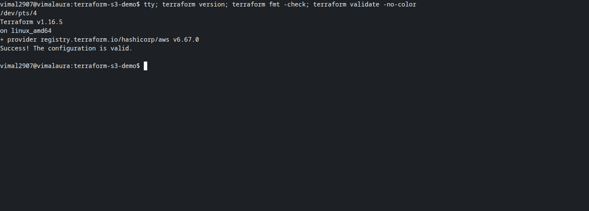
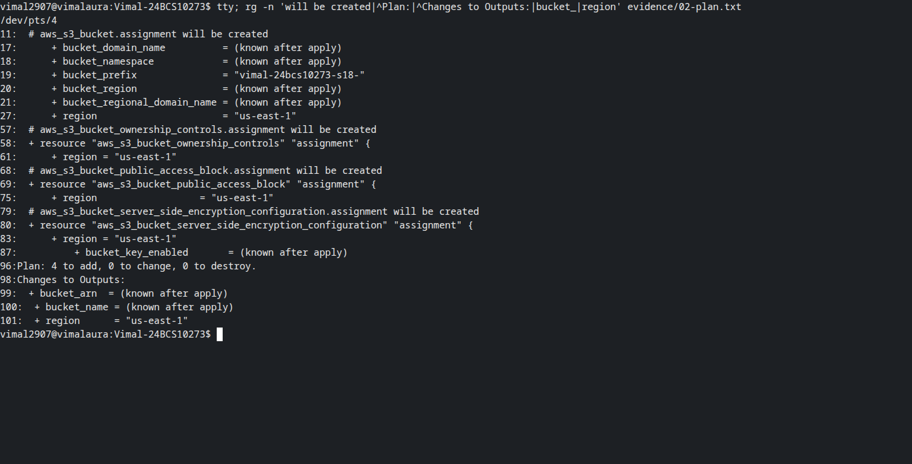
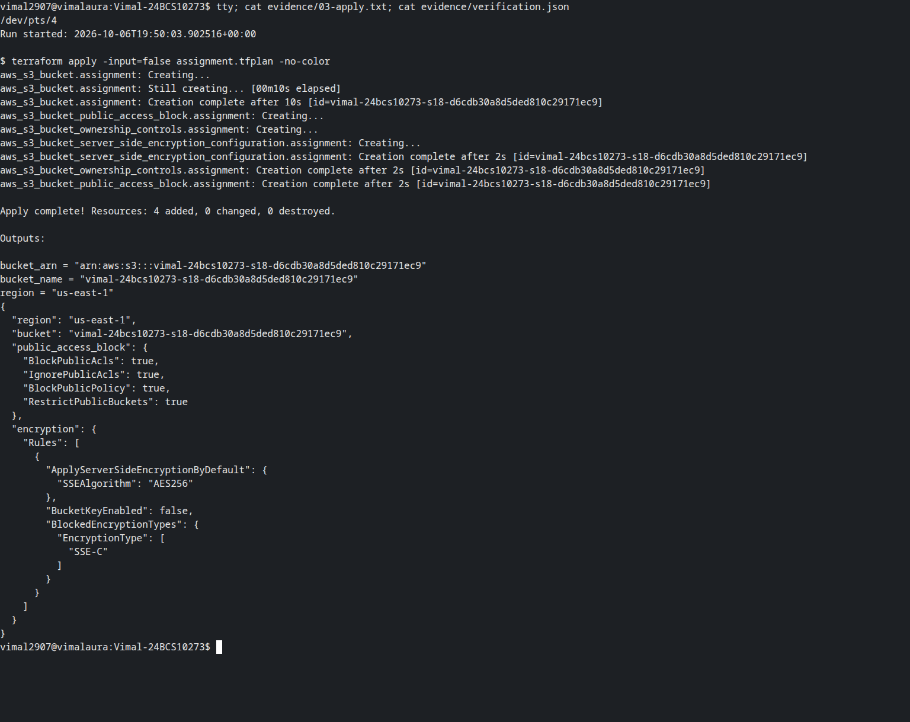
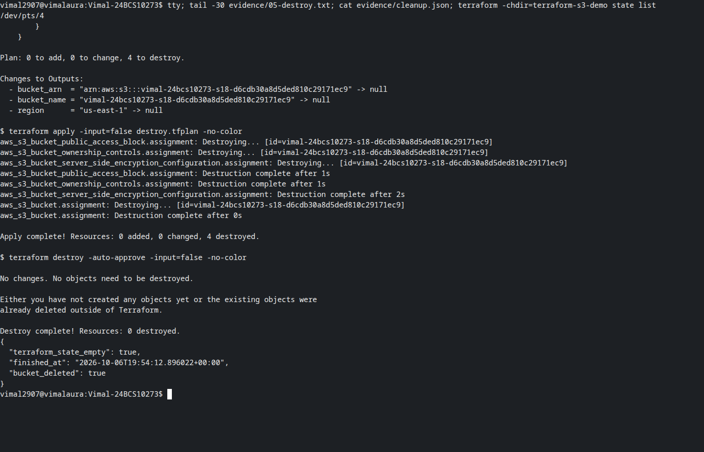

# Session 18: Terraform and AWS

Vimal Kumar Yadav · 24BCS10273

The [Terraform S3 project](terraform-s3-demo/README.md) creates a temporary private bucket, records the plan and observed configuration, then destroys the resources. Credentials come from an external AWS profile and are never Terraform inputs.

The research task is split into the requested five folders:

1. [IAM: users, groups, roles, policies and least privilege](aws-services/01-iam/README.md)
2. [EC2: images, instance types, networking and lifecycle](aws-services/02-ec2/README.md)
3. [S3: objects, storage classes, versioning and encryption](aws-services/03-s3/README.md)
4. [VPC: subnets, routing and security](aws-services/04-vpc/README.md)
5. [DynamoDB and RDS](aws-services/05-dynamodb-rds/README.md)

Only S3 is provisioned for this session. The other services are researched, as requested by the homework.

## Observed AWS execution

On 7 October 2026 (India time), Terraform 1.16.5 and AWS provider 6.67.0 created four managed S3 resources in `us-east-1`: the bucket, its public-access block, ownership controls and encryption configuration. AWS API checks confirmed that the bucket existed, all four public-access settings were enabled and SSE-S3 used AES256. The destroy plan removed all four resources. A repeated `terraform destroy` made no changes; state was empty and AWS returned 404 for the bucket.

- [Initialization, formatting and validation](evidence/01-validation.txt)
- [Creation plan](evidence/02-plan.txt) and [apply](evidence/03-apply.txt)
- [Show, outputs and state](evidence/04-verification.txt)
- [Independent AWS configuration checks](evidence/verification.json)
- [Destroy plan and deletion](evidence/05-destroy.txt)
- [Empty state and confirmed bucket deletion](evidence/cleanup.json)

All screenshots show a real Bash pseudo-terminal captured with Playwright/CDP. Validation/state commands execute directly; visible `cat`, `rg` and `tail` commands inspect the preserved AWS run logs. Historical output is not presented as a fresh deployment. Raw command output remains available above. No resources were retained for screenshots.
