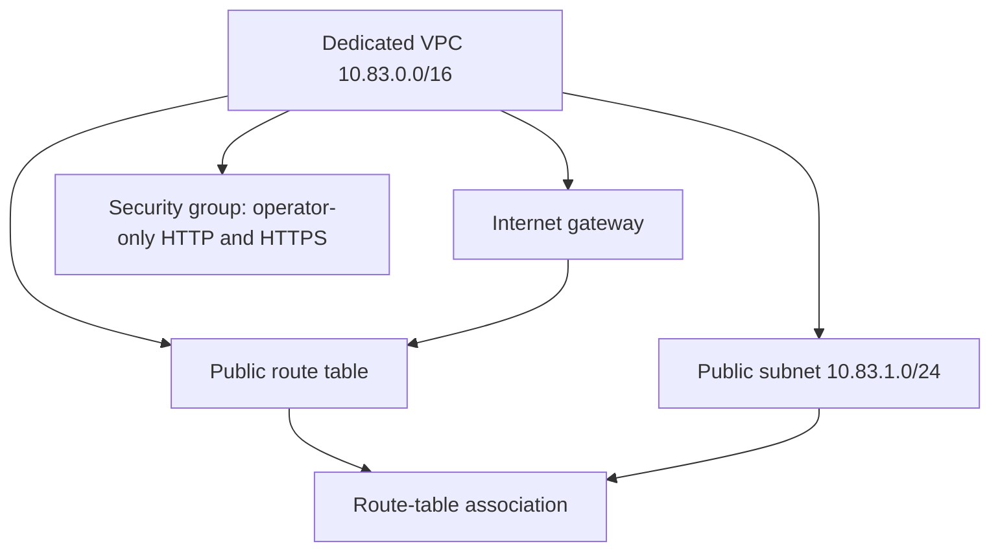
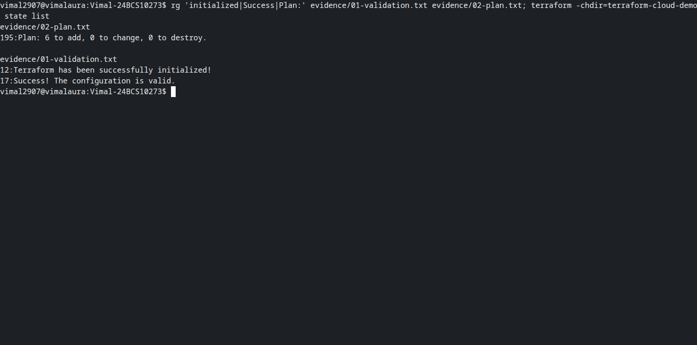
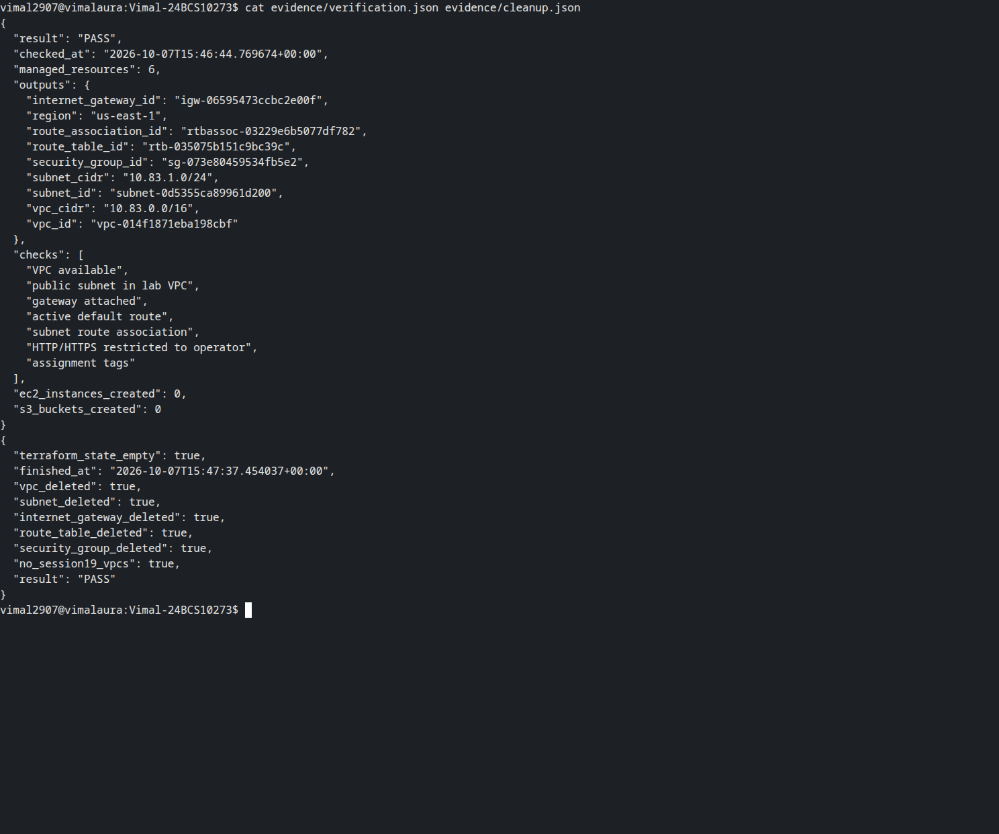
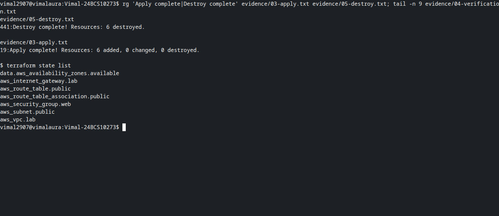

# Session 19: cloud networking with Terraform

Vimal Kumar Yadav · 24BCS10273

The six-resource AWS lab completed on 7 October 2026: **6 created, verified, and destroyed**.
Independent AWS reads confirmed the VPC, subnet, internet gateway, route table and security group
were gone, and Terraform state was empty. No EC2 instance or S3 bucket is part of this final lab.

The scope follows [Aryen’s network lab](https://github.com/aryen1101/Learn_DEVOPS/tree/bc73ce6b8663b92b8ac7310418fa5ac7f4c39afd/Class_Assignments/Cloud_and_Terraform_in_Action).
The homework lists EC2 and S3 under **Suggested Architecture**; its required concepts are providers,
variables, resources, outputs, dependencies, AWS infrastructure, state, plan, apply and destroy.
This implementation covers those concepts with a dedicated network in `us-east-1`, our own names
and CIDR, and web ingress restricted to the operator’s IPv4 `/32`.

## Architecture and dependencies



References between Terraform resources determine the creation and reverse destruction order.
The route table has a default route to the internet gateway. The subnet enables automatic public
IPv4 assignment for potential instances; this run does not launch an instance or allocate its IP.
The security group permits TCP 80/443 from the operator address and outbound IPv4 traffic.

## Requirement mapping

| Requirement | Implementation/evidence |
|---|---|
| Provider | Terraform 1.16.x; locked AWS provider 6.67.0 in `terraform-cloud-demo/provider.tf` |
| Variables | Region, VPC CIDR and operator IPv4 CIDR |
| Resources | VPC, subnet, gateway, route table, association, security group |
| Outputs | Region, network CIDRs and actual resource IDs |
| Dependencies | Terraform references shown in the architecture diagram |
| AWS infrastructure | Actual AWS apply plus independent API assertions |
| State | Six managed resource addresses; empty state after destruction |
| Plan/apply/destroy | Preserved real command logs linked below |
| Screenshots | Real Bash PTYs captured with Playwright/CDP |

## Run

Follow the [project instructions](terraform-cloud-demo/README.md). Configure AWS credentials through
an external profile and export `TF_VAR_operator_cidr` with your current public IPv4 `/32`.
The example address in `terraform.tfvars.example` must be replaced.

```bash
export AWS_PROFILE=YOUR_EXISTING_PROFILE
export AWS_REGION=us-east-1
export TF_VAR_operator_cidr=YOUR_PUBLIC_IPV4/32
python3 scripts/run-lab.py
```

The runner validates and plans exactly six resources, applies them, checks AWS relationships and
tags, records state/outputs, and destroys the lab in a `finally` block. It refuses a nonempty
initial state. If teardown fails, preserve the private state and run `terraform destroy` from
this exact project directory before removing any local files.

## Actual results

- [Initialization and validation](evidence/01-validation.txt)
- [Six-resource plan](evidence/02-plan.txt)
- [Successful AWS apply](evidence/03-apply.txt)
- [State and outputs](evidence/04-verification.txt), [AWS assertions](evidence/verification.json)
- [Destroy plan and successful teardown](evidence/05-destroy.txt)
- [Independent absence checks](evidence/cleanup.json)





The screenshots contain only real terminals. Visible `cat`, `tail` and `rg` commands identify
when preserved execution records are being inspected. They do not reuse another student's output.

Earlier experiments with a larger EC2/S3 design are retained under [attempts](evidence/attempts).
Both partial attempts were cleaned up; their old EC2 access restrictions do not block this
completed network-only submission. Those historical records are not the current lab result.
