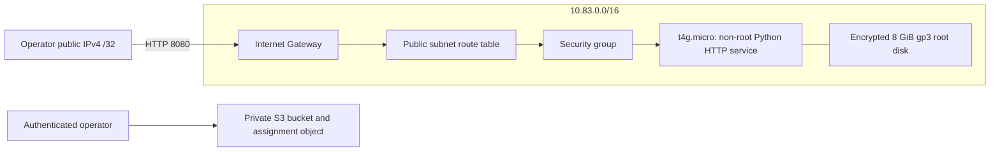

# Session 19: cloud infrastructure with Terraform

Vimal Kumar Yadav · 24BCS10273

Current status: initialization, validation and the 14-resource plan passed on 7 October 2026.
After the [first permission failure](evidence/attempts/01-instance-permissions/README.md) was
resolved, AWS rejected t4g.nano under the account's Free Tier restriction. Both attempts created
and then destroyed 13 networking/storage resources; no instance was launched. Independent AWS
checks confirmed deletion. The [second attempt](evidence/attempts/02-free-tier-restriction/README.md)
is retained. The default now uses the eligible ARM t4g.micro; its IAM launch condition must allow
that type before retrying. Successful EC2/HTTP verification and final submission remain pending.

The [Terraform project](terraform-cloud-demo/README.md) defines a VPC, public subnet, Internet Gateway, routes, security group, small Linux EC2 server and private S3 bucket. EC2 serves an original assignment page; S3 stores a small private assignment record. This covers compute and storage as well as networking.

## Run and verify

Set `TF_VAR_operator_cidr` to your current public IPv4 followed by `/32`. The example `203.0.113.10/32` is documentation space, not an address to deploy unchanged. Then follow the project's commands or run `python scripts/run-lab.py` with Terraform on PATH and an external AWS profile configured.

The runner verifies HTTP 200 and the student identifier, reads the S3 record, checks the running instance and records the subnet/VPC IDs. It then destroys the managed resources and verifies an empty Terraform state, bucket deletion, instance termination and VPC deletion.

## Dependencies and state

The subnet, gateway, security group and route table reference the VPC. The route-table association references both the subnet and route table. EC2 references its subnet/security group and explicitly waits for the route association. The S3 object references its bucket. These dependencies determine ordering without shell sleeps between Terraform resources.

Outputs expose resource IDs and the HTTP URL. The private state records Terraform's ownership mapping; `terraform state list` shows addresses, while `terraform show` explains their attributes. Editing state manually is not the workflow for changing infrastructure.

## Cost and access choices

One small ARM instance serves a static page. CPU credits use Standard mode to avoid surplus-credit charges. HTTP access is restricted to the operator address; SSH is not exposed. The instance requires IMDSv2, encrypts its root disk and deletes that disk on termination. A boot-time shutdown scheduled for twenty minutes terminates the instance as a fallback; normal teardown happens immediately after verification. S3 uses SSE-S3 and blocks public access. No NAT Gateway, load balancer, KMS customer key or managed database is needed for this lab.

Region `us-east-1` is a low-cost demonstration choice. Actual charges depend on runtime, EBS, IPv4 and S3 requests; no free-tier credit is assumed. The self-termination fallback does not remove the VPC or bucket, so Terraform cleanup remains mandatory.

Sources: [EC2 pricing](https://aws.amazon.com/ec2/pricing/on-demand/), [public IPv4 pricing](https://aws.amazon.com/vpc/pricing/), [EBS pricing](https://aws.amazon.com/ebs/pricing/), [S3 pricing](https://aws.amazon.com/s3/pricing/).

## Current terminal evidence

- [Validation and empty state](screenshots/01-validation-and-empty-state.png) — commands executed in a real PTY.
- [Latest blocker and verified cleanup](screenshots/02-blocker-and-cleanup.png) — a real PTY displaying the saved AWS attempt logs with visible `cat` and `tail` commands.
- [Current t4g.micro plan](evidence/current-plan.txt) — fresh read-only plan after updating the default type.

Screenshots were captured using Playwright connected to Chromium through CDP. They contain only the terminal; saved attempt output is not presented as a new apply.
