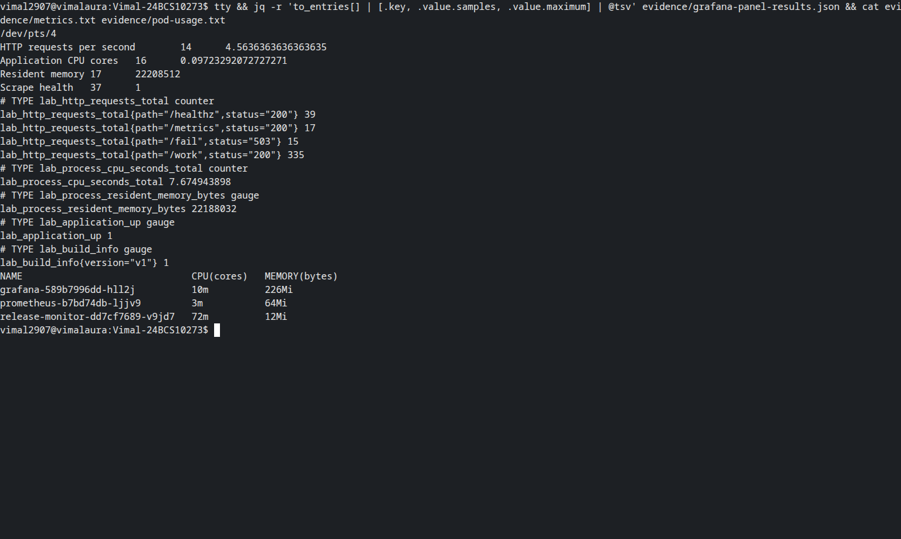
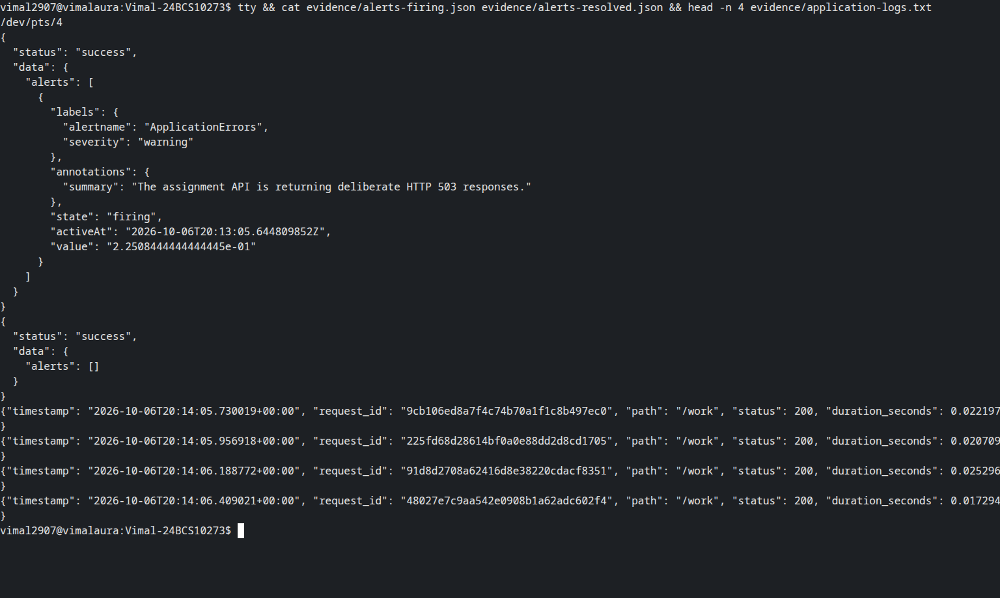
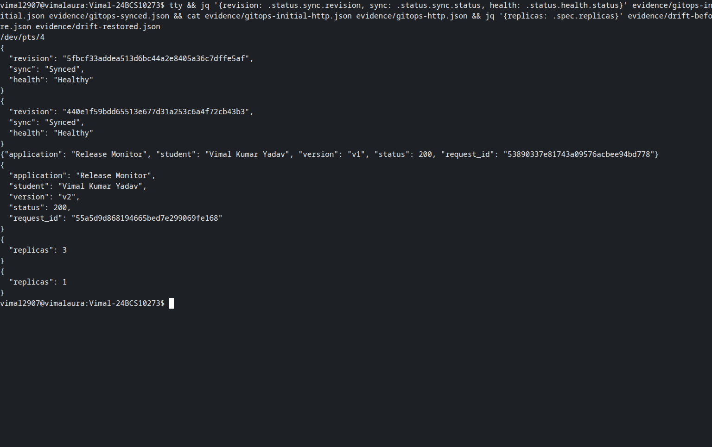
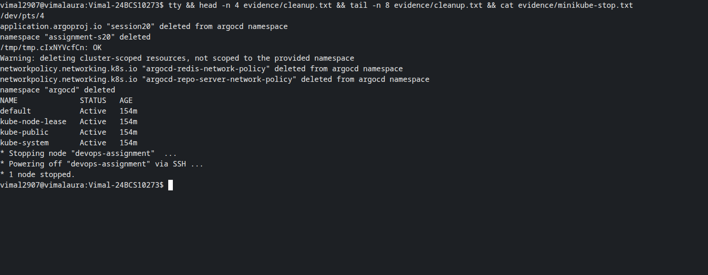

# Session 20 — Monitoring, observability and GitOps

**Vimal Kumar Yadav — 24BCS10273**

Release Monitor is a small Python HTTP service running on a dedicated local Minikube cluster.
Prometheus collects its real request counters, process CPU time and resident memory; Grafana
queries those samples. Argo CD Core deploys the application from Git and repairs configuration
drift. All resources in this exercise are local.

## Requirement map

| Requirement | Implementation and evidence |
| --- | --- |
| Metrics, CPU and memory | `/metrics`, Prometheus scrape target and four Grafana panels |
| Logs and health | Structured request logs, `/healthz`, readiness/liveness probes and `up` |
| Alerts | Deliberate HTTP 503 traffic triggers `ApplicationErrors`; it clears after traffic recovers |
| Observability pillars | Notes below distinguish metrics, logs and distributed traces |
| GitOps | Git-managed `v1` → `v2` configuration, automatic synchronization and replica drift repair |
| Screenshots | Terminal-only captures of commands reading the preserved execution records |

## Run the lab

Use an isolated Linux Minikube cluster with 4 CPUs, 4096 MiB, metrics-server, kubectl and Helm.
Set `KUBECONFIG` to that cluster before running commands. The manifests pin application,
Prometheus and Grafana images by digest. Argo CD Core 3.5.3 is installed from a fixed upstream
commit whose manifest checksum is verified by the script.

```bash
bash scripts/install-argocd.sh
python3 scripts/install-monitoring.py
kubectl -n assignment-s20 get pods
python3 scripts/verify.py monitor
```

First image pulls can take several minutes. Grafana has an ephemeral random administrator
password in a Kubernetes Secret; it is never written to Git or printed. Anonymous access has
the Viewer role for this isolated demo, and access is through a loopback-only port forward.
Prometheus retains two hours of samples in `emptyDir`; this is disposable lab storage.

```bash
kubectl -n assignment-s20 port-forward service/grafana 13000:3000 --address=127.0.0.1
kubectl -n assignment-s20 port-forward service/prometheus 19090:9090 --address=127.0.0.1
kubectl -n assignment-s20 port-forward service/release-monitor 18020:8000 --address=127.0.0.1
```

Run those forwards in separate terminals. Grafana is at `http://127.0.0.1:13000`, dashboard
UID `session20`. The verification script creates and closes its own forwards and queries the
same Grafana datasource API used by the panels. Saved panel responses contain timestamped
samples, not invented chart values.

## Monitoring and alert behavior

The service exposes a monotonic HTTP request counter with bounded path/status labels. Process
CPU time comes from `time.process_time()`; the rate measures CPU cores used, so multiplying by
100 gives the percentage of one CPU core. Resident memory comes from Linux `/proc/self/statm`
and is converted from pages to bytes. `kubectl top pods` separately reports container usage.

| Grafana panel | PromQL meaning |
| --- | --- |
| HTTP requests per second | Rate of the application request counter |
| Application CPU cores | Rate of accumulated process CPU seconds |
| Resident memory | Current process resident bytes |
| Scrape health | Prometheus `up` for the application target |

`/work` performs actual PBKDF2 computation to produce measurable CPU activity. `/fail` deliberately
returns HTTP 503. With five-second scraping/evaluation and a ten-second alert hold, an error rate
above zero activates `ApplicationErrors`. After the one-minute rate window no longer contains
errors, the alert resolves. The lab verifies both states through the Prometheus API. A second
rule detects a failed scrape after 15 seconds. Alertmanager notification delivery is outside this
demo; these are Prometheus rule states.

## Observability: metrics, logs and traces

Metrics are numeric measurements over time. They identify trends and trigger alerts; Prometheus
stores the samples and Grafana presents them. Logs record individual events. Here, each JSON
log includes timestamp, path, status, duration and request ID, which can be matched to the
HTTP response. `kubectl logs` retrieves the container's standard output; a larger deployment
could collect it with Fluent Bit and query it in Loki or Elasticsearch.

Traces show the sequence and timing of spans across services. OpenTelemetry can instrument
requests and export spans to Jaeger or Tempo. This single-service exercise has request IDs for
log correlation; it does not implement a distributed tracing backend. A request ID alone is not
a distributed trace. Combining the pillars helps move from a symptom (rising error rate), to a
specific failed request (log), to the dependency responsible for latency (trace).

In Kubernetes, check application metrics alongside Pod readiness, events, restarts, resource
limits and node pressure. `kubectl top`, `describe` and `logs` help distinguish a service failure
from scheduling, networking or resource problems. Metrics-server supports resource views and
autoscaling; it does not replace a historical monitoring system.

## GitOps demonstration

Git holds the intended Deployment, Service and ConfigMap. The Argo CD Application watches
`assignment/session20-observability-gitops` in `vimalyad/devops-heros`, restricted by an
AppProject to the assignment namespace and repository. Reconciliation runs every 30 seconds;
automated sync, pruning and self-healing are enabled. The controller compares Git with the
cluster and applies differences. This avoids storing cluster credentials in a push pipeline.

The application reads its mounted ConfigMap for each response. Change `data.version` in
`gitops/application/workload.yaml` from `v1` to `v2`, commit and push, then verify the actual SHA:

```bash
git add gitops/application/workload.yaml
git commit -m "Update the monitored release to v2"
git push
python3 scripts/verify.py gitops --revision "$(git rev-parse HEAD)"
python3 scripts/verify.py drift
```

The verifier waits for that exact revision to be `Synced` and `Healthy`, then for HTTP to report
`v2`. ConfigMap volume updates may take another minute. For drift, it scales the Deployment to
three replicas and records the change before waiting for Argo CD to restore Git's one replica.
Do not treat a successful push alone as deployment evidence.

## Cleanup

```bash
bash scripts/cleanup.sh
minikube stop -p devops-assignment
```

The script deletes the Application while its controller can still process the pruning finalizer,
then removes the workload namespace and the dedicated Argo CD installation. Port forwards are
closed by the verifier. The install and cleanup scripts are intended for this isolated cluster.

## Observed results

The run on 7 October 2026 (UTC logs dated 6 October) passed all three verification phases.
Grafana returned real data for every panel: request rate reached 4.56/s, application CPU reached
0.097 cores, resident memory reached 22,208,512 bytes, and scrape health was 1. The deliberate
503 alert fired and subsequently cleared.

| Check | Preserved record |
| --- | --- |
| Monitoring, alert and dashboard checks | [monitor-run.txt](evidence/monitor-run.txt) |
| Grafana datasource samples | [grafana-panel-results.json](evidence/grafana-panel-results.json) |
| Application metrics and logs | [metrics.txt](evidence/metrics.txt), [application-logs.txt](evidence/application-logs.txt) |
| Initial Git-managed v1 | [gitops-initial.json](evidence/gitops-initial.json), [HTTP response](evidence/gitops-initial-http.json) |
| Pushed v2 commit synchronized and healthy | [gitops-synced.json](evidence/gitops-synced.json), [gitops-run.txt](evidence/gitops-run.txt) |
| Replica drift from 3 back to 1 | [drift-before.json](evidence/drift-before.json), [drift-restored.json](evidence/drift-restored.json) |
| Resource deletion and cluster stop | [cleanup.txt](evidence/cleanup.txt), [minikube-stop.txt](evidence/minikube-stop.txt) |

The demonstrated application update is commit
[`440e1f59bdd65513e677d31a253c6a4f72cb43b3`](https://github.com/vimalyad/devops-heros/commit/440e1f59bdd65513e677d31a253c6a4f72cb43b3).
Later commits add documentation and evidence. The final manifest already contains `v2`; to
repeat the version-change exercise, first commit and synchronize `v1` on your own watched branch.

These screenshots contain real Bash PTYs captured with Playwright/CDP. Visible `cat` and `jq`
commands inspect the preserved execution records; they do not imply a second live run.









## Sources

- [Prometheus metric types](https://prometheus.io/docs/concepts/metric_types/)
- [Prometheus alerting rules](https://prometheus.io/docs/prometheus/latest/configuration/alerting_rules/)
- [Grafana provisioning](https://grafana.com/docs/grafana/latest/administration/provisioning/)
- [Argo CD Core](https://argo-cd.readthedocs.io/en/stable/operator-manual/core/)
- [Argo CD automated sync and self-healing](https://argo-cd.readthedocs.io/en/stable/user-guide/auto_sync/)
- [OpenTelemetry signals](https://opentelemetry.io/docs/concepts/signals/)
