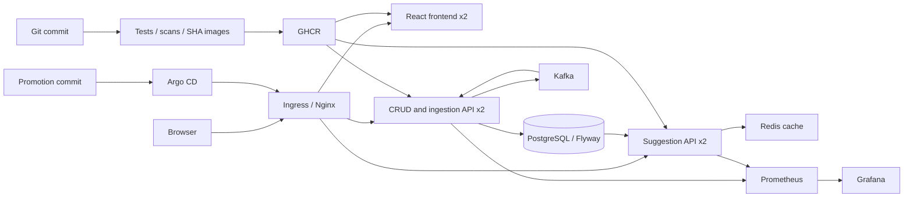
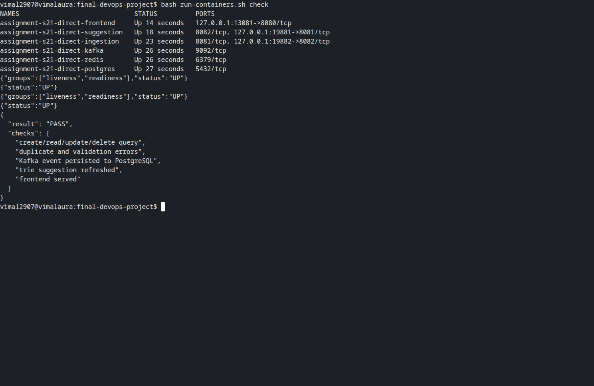
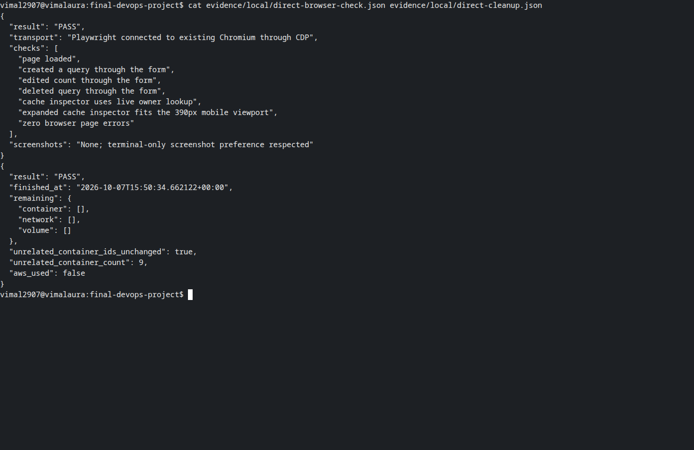

# Typeahead capstone — Vimal Kumar Yadav, 24BCS10273

Typeahead is a searchable query catalog. The interface can create, edit and delete queries; submitting a search publishes an event to Kafka, updates its PostgreSQL count, and refreshes the ranked suggestions. This capstone adapts my existing [Typeahead application](https://github.com/vimalyad/typeahead); [SOURCE.md](SOURCE.md) records the starting commit and changes.

The approved Java equivalent uses Spring Boot, JUnit/MockMvc and Flyway in place of FastAPI, pytest and Alembic. PostgreSQL, React, Docker, GitHub Actions, Terraform, EKS, Helm, Prometheus, Grafana and Argo CD cover the remaining modules.

Current submission: both container deployment methods shown in [Aryen's final deployment](https://github.com/aryen1101/Learn_DEVOPS/blob/bc73ce6b8663b92b8ac7310418fa5ac7f4c39afd/Class_Assignments/Final_Deploy/Readme.md) have been reproduced with this application: individual `docker run` commands and Docker Compose. The full CI, local Kubernetes, monitoring and GitOps evidence is also included. Actual EKS deployment remains unverified because the required AWS calls still return AccessDenied; the reference's local screenshots do not establish an EKS deployment either.



## Run locally

Prerequisites: Docker with Compose, Python 3, and a free local port 3000. Start in this directory. Generate a temporary password in the shell; do not put it in Git.

```bash
export DATABASE_PASSWORD="$(python3 -c 'import secrets; print(secrets.token_urlsafe(32))')"
docker compose up --build -d
docker compose ps
python3 scripts/smoke.py --url http://127.0.0.1:3000
```

Open `http://localhost:3000`. The Query catalog supports all four CRUD methods. Backends are available only on loopback ports 18782 and 18781 for `/health`, `/health/readiness`, `/info`, and `/metrics` checks. Kafka and PostgreSQL use named volumes. Keep the same password when restarting an existing PostgreSQL volume.

```bash
docker compose logs --tail=60 ingestion-service suggestion-service
docker compose down --volumes --remove-orphans
unset DATABASE_PASSWORD
```

The Compose teardown removes this demo's data. Container images are built from source in separate build stages. Runtime users are 65532 for Java and 101 for Nginx; application containers have read-only roots, dropped capabilities and temporary `/tmp` mounts.

## Run with individual Docker containers

The [direct-container script](run-containers.sh) uses individual `docker run` commands for PostgreSQL, Redis, Kafka, both Java services and the frontend. It uses the same published release already tested and scanned by CI. Passwords are generated into a private temporary environment file, and ports bind only to loopback.

```bash
bash run-containers.sh up
bash run-containers.sh check
# Open http://localhost:13081 while the lab is running.
bash run-containers.sh down
```

The actual run passed frontend CRUD/mobile checks through Playwright/CDP, both backend health/readiness endpoints, and the PostgreSQL/Kafka/search integration smoke check. Application containers used non-root users and read-only filesystems. Their published image digests and filesystem layers matched the release artifacts. The six containers, network and two volumes were then removed; nine unrelated containers retained their IDs.




The first image contains actual live command output. The second displays saved browser assertions and cleanup results through a real terminal. Both follow the terminal-only screenshot instruction. See [direct-run verification](evidence/local/direct-verification.json) and [cleanup](evidence/local/direct-cleanup.json).

## API and tests

| Method | Route | Behavior |
|---|---|---|
| GET | `/api/queries` | List up to 100 catalog entries |
| GET | `/api/queries/{id}` | Read an entry; 404 when absent |
| POST | `/api/queries` | Create a query; 201 with Location |
| PUT | `/api/queries/{id}` | Update text and search count |
| DELETE | `/api/queries/{id}` | Delete an entry; 204 |
| POST | `/api/search` | Publish a normalized search event |
| GET | `/api/suggest?q=...` | Read ranked prefix suggestions |

Create/update JSON is `{"query":"kubernetes deployment","allTimeCount":4}`. Blank or oversized text and invalid counts return 400; duplicate text returns 409. SQL uses prepared parameters. The schema migrations are in `application/db/migration/` and run from the ingestion service.

```bash
cd application
./gradlew --no-daemon test
cd frontend
npm ci
npm run build
```

There are 15 tests: 12 controller cases with mocked database and Kafka collaborators, two hash-ring tests, and one concurrency test. `scripts/smoke.py` separately checks the actual PostgreSQL, Kafka and trie path over HTTP and removes its generated data.

## CI and security

The repository workflow `.github/workflows/session21.yml` runs on relevant pushes to `main` and this assignment branch, and on pull requests. Tests and the frontend build run first, then Semgrep, dependency scanning and a scoped Git-history secret scan. Docker builds ingestion, suggestion and frontend images; Trivy rejects HIGH or CRITICAL findings in every image before any publish. No vulnerabilities are suppressed.

Push runs publish full-commit-SHA tags to GHCR and retrieve them again. The final job loads those images into a temporary kind cluster, installs Helm with two replicas per application service, exercises the real stack, saves logs and deletes the cluster even after failure. CI needs no AWS credentials. Ingress and HPA are exercised in the separate local/EKS deployment because the CI cluster intentionally has no ingress controller or metrics server.

The initial dependency scan identified vulnerable Spring MVC, Tomcat and Jackson versions. Spring Boot was migrated to 4.1.1, with Tomcat 11.0.25 and Jackson 3.1.7 overrides. The corrected Gradle locks and npm lock pass the HIGH/CRITICAL dependency gate. A clean result means no matching vulnerabilities in the scanner's current database, not that the application has no possible security defects. [SECURITY.md](SECURITY.md) explains the gates and evidence.

## Kubernetes, monitoring and GitOps

Use a dedicated cluster context. Install an Nginx ingress controller and metrics-server before enabling the default ingress and autoscaling settings. Bootstrap creates a random database Secret only if one does not already exist.

```bash
bash scripts/bootstrap.sh
helm upgrade --install typeahead helm -n assignment-s21 \
  --set imageTag=FULL_SUCCESSFUL_COMMIT_SHA,version=FULL_SUCCESSFUL_COMMIT_SHA \
  --wait --timeout 10m
bash scripts/monitoring.sh
kubectl -n assignment-s21 get pods,svc,ingress,hpa,pvc
```

Use published images or load the three matching images into the local cluster first. A private registry requires an externally created pull Secret named in `imagePullSecrets`; credentials are never chart values. The services use ClusterIP. Ingress sends `/api/search` and `/api/queries` to ingestion, `/api` to suggestions, and `/` to the frontend. PostgreSQL and Kafka have persistent volumes; the rebuildable Redis cache is ephemeral. Backends have startup, readiness and liveness probes and CPU autoscaling from two to three replicas.

For local access, forward the ingress controller's HTTP service to loopback port 18080 and send the `Host: typeahead.local` header:

```bash
kubectl -n ingress-nginx port-forward svc/ingress-nginx-controller 18080:80
# In another terminal:
python3 scripts/smoke.py --url http://127.0.0.1:18080 --host typeahead.local
```

Forward Prometheus port 9090 and Grafana port 3000 to unused loopback ports. Grafana provisions a read-only anonymous dashboard at `/d/typeahead-capstone`; its administrator password is generated into an external Secret. Prometheus discovers each backend replica through headless metrics services. The dashboard shows request rate, latency, JVM memory and scrape health.

`scripts/install-argocd.sh` installs a checksum-verified Argo CD Core manifest. Update `gitops/values.yaml` to a successful image SHA, commit and push it, then apply `gitops/application.yaml`. The AppProject limits deployment to `assignment-s21` and this source repository. Automated synchronization, pruning and self-healing apply promotions from Git. The chart leaves replica counts to HPA.

For teardown, remove the Argo application before Helm so reconciliation cannot recreate deleted resources:

```bash
kubectl -n argocd delete application typeahead-capstone
kubectl -n argocd delete appproject typeahead-capstone
helm uninstall typeahead monitoring -n assignment-s21 --wait
kubectl delete namespace assignment-s21 --wait
kubectl get pv
```

Verify that no PersistentVolume still refers to `assignment-s21`. On a dedicated lab cluster, also remove the installed Argo CD Core resources and ingress controller before stopping the cluster. Do not remove shared controllers from a cluster used by other applications.

## AWS lab

The Terraform plan defines a VPC, two public subnets, one EKS 1.36 cluster, one managed worker, and EBS storage through Pod Identity. There is no NAT gateway or external load balancer. The Kubernetes API accepts the operator's IPv4 `/32`; application access uses authenticated port forwarding. Node storage is encrypted and uses gp3. AWS permissions and account-plan compatibility must be verified before apply.

```bash
cd terraform
cp terraform.tfvars.example terraform.auto.tfvars
# Set the operator's current public IPv4 /32 in that ignored file.
terraform init
terraform fmt -check
terraform validate
terraform plan -out=lab.tfplan
# Apply only once the scoped permissions and teardown access are confirmed.
terraform apply lab.tfplan
aws eks update-kubeconfig --region us-east-1 --name vimal-typeahead-capstone
```

Apply `kubernetes/storageclass-eks.yaml` and use `-f helm/values-eks.yaml` for EBS-backed volumes. Inspect the node's available memory before deploying all services. The cloud run is temporary: collect evidence, delete the Argo application without cascading into unrelated namespaces, uninstall the application/monitoring charts, remove their PVCs, wait for EBS deletion, then run `terraform destroy`. Retain state until AWS confirms the cluster, worker instances, EBS volumes and VPC are absent.

**Cloud status:** Terraform validation and a plan of 21 additions passed. The [latest AWS permission checks](evidence/local/aws-access-latest.json), repeated on 7 October 2026, still deny EKS and IAM reads and launch-template creation. No capstone AWS resources have been created. Successful apply and destroy evidence is still pending.

## Evidence and presentation

See the [requirement map](REQUIREMENTS.md), [failure exercises](FAULTS.md), [evidence provenance](evidence/README.md), and [presentation walkthrough](DEMO.md). The first complete green release is [run 37586435056](https://github.com/vimalyad/devops-heros/actions/runs/37586435056); the recorded interface release is [run 37588149332](https://github.com/vimalyad/devops-heros/actions/runs/37588149332), also fully green. [Release evidence](evidence/release-summary.json) ties the source SHA, promotion SHA and live application version together.


Evidence is recorded from actual commands. Published screenshots contain only real terminals captured from spawned PTYs through Playwright/CDP. Any display of a saved log is identified by the visible `cat`/`jq` command. Browser, AWS Console and Grafana screenshots requested by the rubric are not included under the terminal-only instruction; actual browser assertions and dashboard API records are supplied as terminal evidence.

The local lab has been cleaned up: assignment containers, volumes and Kubernetes resources are gone, the dedicated Minikube cluster is stopped, and unrelated applications are unchanged. [Cleanup assertions](evidence/local/cleanup.json) and the CI cluster-deletion log are retained with the evidence.

The presentation should explain the original application, CRUD validation, isolated tests, non-root images, a real CVE correction, a SHA-tagged pipeline run, two-replica Helm deployment, PostgreSQL persistence, an intentional failure and recovery, live metrics, and a Git promotion reconciled by Argo CD. The real commit-to-deployment walkthrough is recorded; the AWS apply/destroy run and final presentation remain pending.
