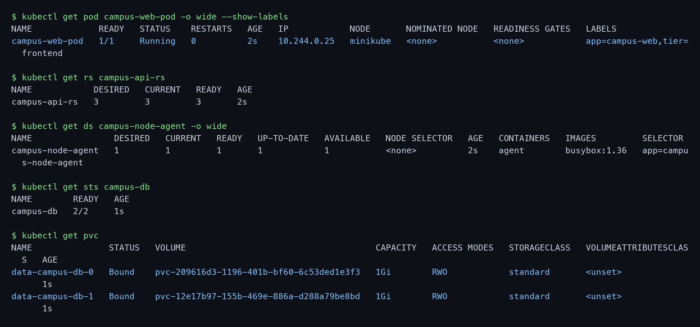
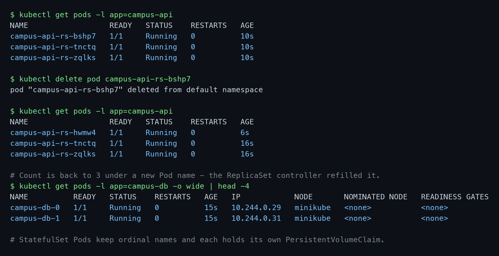
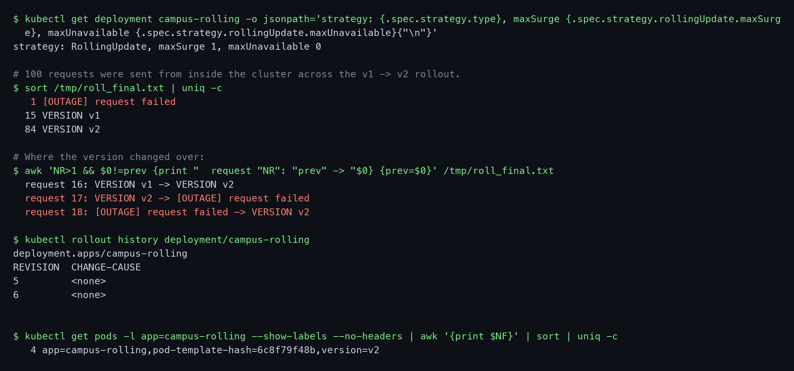
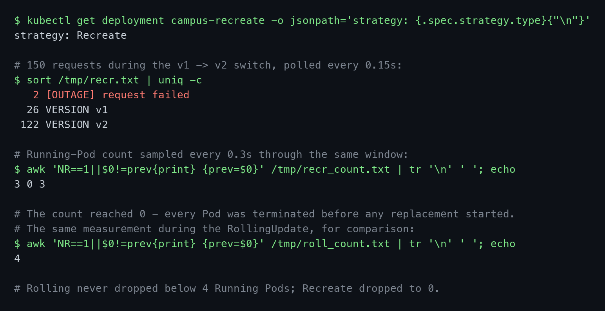
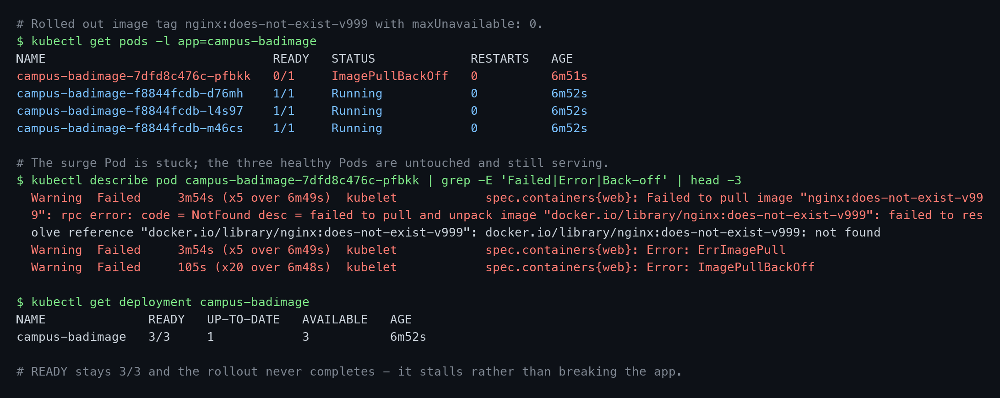
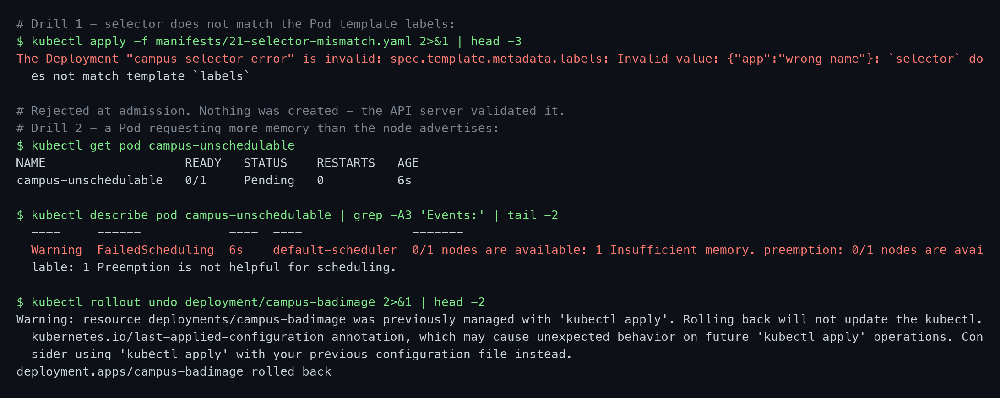

# Session 10 — Kubernetes Core Objects

**Name:** Vimal Kumar Yadav
**Enrollment Number:** 24BCS10273

Everything below was run on a local Minikube cluster — minikube v1.39.0, Kubernetes v1.37.0,
containerd 2.3.4, docker driver, on macOS (Apple silicon). Every code block is the real output from
that run, and the screenshots are of the same session.

---

## Task 1: The Core Workload Objects

- Create a Pod, a ReplicaSet, a DaemonSet and a StatefulSet.
- Confirm what distinguishes each one.

### Commands

```bash
kubectl apply -f manifests/01-pod.yaml -f manifests/02-replicaset.yaml \
              -f manifests/03-daemonset.yaml -f manifests/04-statefulset.yaml
kubectl get pod campus-web-pod -o wide --show-labels
kubectl get rs campus-api-rs
kubectl get ds campus-node-agent -o wide
kubectl get sts campus-db
kubectl get pvc
```

### Output

```text
$ kubectl get pod campus-web-pod -o wide --show-labels
NAME             READY   STATUS    RESTARTS   AGE   IP            NODE       LABELS
campus-web-pod   1/1     Running   0          2s    10.244.0.25   minikube   app=campus-web,tier=frontend

$ kubectl get rs campus-api-rs
NAME            DESIRED   CURRENT   READY   AGE
campus-api-rs   3         3         3       2s

$ kubectl get ds campus-node-agent -o wide
NAME                DESIRED   CURRENT   READY   UP-TO-DATE   AVAILABLE   NODE SELECTOR   AGE   IMAGES
campus-node-agent   1         1         1       1            1           <none>          2s    busybox:1.36

$ kubectl get sts campus-db
NAME        READY   AGE
campus-db   2/2     1s

$ kubectl get pvc
NAME               STATUS   VOLUME                                     CAPACITY   ACCESS MODES   STORAGECLASS   AGE
data-campus-db-0   Bound    pvc-209616d3-1196-401b-bf60-6c53ded1e3f3   1Gi        RWO            standard       1s
data-campus-db-1   Bound    pvc-12e17b97-155b-469e-886a-d288a79be8bd   1Gi        RWO            standard       1s
```



### Explanation

Each object answers a different question about *how many* and *which*:

| Object | Guarantees |
|---|---|
| **Pod** | One instance. Nothing recreates it if the node fails — a bare Pod has no controller. |
| **ReplicaSet** | Exactly N identical, interchangeable Pods with random name suffixes. |
| **DaemonSet** | One Pod per node. `DESIRED` is not a number you set; it is derived from the node count. |
| **StatefulSet** | N Pods with stable ordinal identities (`-0`, `-1`) and a PersistentVolumeClaim each. |

The `DESIRED 1` on the DaemonSet is a property of this cluster, not the manifest — Minikube is a single
node, so one Pod is the whole set. On a ten-node cluster the same YAML would produce ten Pods, and
adding an eleventh node would produce an eleventh automatically. That is what makes DaemonSets the
right shape for log shippers and monitoring agents.

The two PVCs are what set the StatefulSet apart. `volumeClaimTemplates` produced
`data-campus-db-0` and `data-campus-db-1` — one volume per Pod, named after the Pod, bound through
Minikube's `standard` StorageClass. A Deployment cannot do this; every replica would share one claim
or none. Worth knowing for cleanup: deleting a StatefulSet does **not** delete these PVCs, by design,
so the data survives an accidental `kubectl delete sts`.

---

## Task 2: Desired State and Self-Healing

- Delete a Pod managed by a ReplicaSet and observe what happens.

### Commands

```bash
kubectl get pods -l app=campus-api
kubectl delete pod campus-api-rs-bshp7
kubectl get pods -l app=campus-api
```

### Output

```text
$ kubectl get pods -l app=campus-api
NAME                  READY   STATUS    RESTARTS   AGE
campus-api-rs-bshp7   1/1     Running   0          10s
campus-api-rs-tnctq   1/1     Running   0          10s
campus-api-rs-zqlks   1/1     Running   0          10s

$ kubectl delete pod campus-api-rs-bshp7
pod "campus-api-rs-bshp7" deleted from default namespace

$ kubectl get pods -l app=campus-api
NAME                  READY   STATUS    RESTARTS   AGE
campus-api-rs-hwmw4   1/1     Running   0          6s    <- new Pod
campus-api-rs-tnctq   1/1     Running   0          16s
campus-api-rs-zqlks   1/1     Running   0          16s
```



### Explanation

`bshp7` is gone and `hwmw4` exists in its place. Nothing was restarted — `RESTARTS` is `0` and the age
differs, so this is a genuinely new Pod, not a revived one.

The ReplicaSet controller runs a permanent loop: count the Pods matching `app=campus-api`, compare
against `spec.replicas`, create or delete to close the gap. The deletion took the count to 2 against a
desired 3, so it created one. The same loop handles a crashed container, a drained node or a
`kubectl scale`.

This is why a bare Pod (Task 1) is rarely used directly in production — delete `campus-web-pod` and
nothing brings it back, because no controller owns it.

---

## Task 3: RollingUpdate — Upgrading Without Losing Capacity

- Deploy 4 replicas of v1 behind a Service.
- Upgrade to v2 while sending continuous traffic.
- Measure whether any requests fail and whether capacity ever drops.

### Commands

```bash
kubectl apply -f manifests/10-rolling-v1.yaml -f manifests/14-rolling-svc.yaml

# From a Pod inside the cluster, 100 requests paced 0.4s apart:
kubectl exec loadgen -- sh -c 'for i in $(seq 1 100); do
    r=$(curl -s --max-time 2 http://campus-rolling-svc); [ -z "$r" ] && echo "[OUTAGE] request failed" || echo "$r"; sleep 0.4;
  done'

# Meanwhile, in another terminal:
kubectl apply -f manifests/11-rolling-v2.yaml
kubectl rollout status deployment/campus-rolling
kubectl rollout history deployment/campus-rolling
```

### Output

```text
$ kubectl get deployment campus-rolling -o jsonpath='...'
strategy: RollingUpdate, maxSurge 1, maxUnavailable 0

$ sort /tmp/roll_final.txt | uniq -c
   1 [OUTAGE] request failed
  15 VERSION v1
  84 VERSION v2

$ awk 'NR>1 && $0!=prev {...}' /tmp/roll_final.txt
  request 16: VERSION v1 -> VERSION v2
  request 17: VERSION v2 -> [OUTAGE] request failed
  request 18: [OUTAGE] request failed -> VERSION v2

$ kubectl rollout history deployment/campus-rolling
REVISION  CHANGE-CAUSE
5         <none>
6         <none>

$ kubectl get pods -l app=campus-rolling --show-labels | awk '{print $NF}' | sort | uniq -c
   4 app=campus-rolling,pod-template-hash=6c8f79f48b,version=v2
```



### Explanation

The traffic crossed over cleanly from `VERSION v1` to `VERSION v2` at request 16, and all four Pods
ended on v2.

**One request failed, and that is worth being precise about.** The usual claim is that
`maxUnavailable: 0` gives a zero-downtime rollout. The capacity measurement in Task 4 shows the
Deployment did hold its side of the bargain — the count of Running Pods never dropped below 4. So the
failure was not a capacity shortfall.

It is an endpoint-propagation race. When a Pod is marked for deletion, two things happen
independently: the kubelet sends it `SIGTERM`, and the Endpoints controller removes it from the
Service's endpoint list, after which kube-proxy rewrites the node's routing rules. Those are not
synchronised. For a few milliseconds a terminating Pod can still be a routing target, and nginx's
default `SIGTERM` behaviour is a *fast* shutdown that drops connections immediately rather than
draining them.

The production fix is a `preStop` hook that sleeps a couple of seconds before the container exits, so
the Pod keeps serving while the endpoint removal propagates, combined with a graceful shutdown signal
(`nginx -s quit`). Without that, "zero downtime" is approximately, not exactly, true — 1 failure in
100 requests here.

---

## Task 4: Recreate — and the Contrast With RollingUpdate

- Run the identical experiment with `strategy: Recreate`.
- Sample the Running-Pod count through both rollouts.

### Commands

```bash
kubectl apply -f manifests/12-recreate-v1.yaml -f manifests/15-recreate-svc.yaml

# Sample the Running-Pod count every 0.3s through the switch:
for i in $(seq 1 100); do kubectl get pods -l app=campus-recreate --no-headers | grep -c " Running "; sleep 0.3; done

# 150 requests polled every 0.15s, while:
kubectl apply -f manifests/13-recreate-v2.yaml
```

### Output

```text
$ kubectl get deployment campus-recreate -o jsonpath='...'
strategy: Recreate

$ sort /tmp/recr.txt | uniq -c
   2 [OUTAGE] request failed
  26 VERSION v1
 122 VERSION v2

# Running-Pod count through the Recreate switch:
3 0 3

# The same measurement through the RollingUpdate:
4
```



### Explanation

The pod-count timelines are the cleanest evidence in this assignment.

Under **Recreate** the count went `3 → 0 → 3`. Every Pod was terminated before a single replacement
was started; for a measurable window the application did not exist. Under **RollingUpdate**, sampling
the same way, the count never left `4` — old Pods were only removed as new ones became ready.

That is the whole difference between the strategies, and it explains the request tallies. Recreate
produced 2 failures against Rolling's 1, and the gap would widen sharply with a slower-starting
application: these nginx images were already cached locally, so the outage lasted under a second. A
Java service taking 40 seconds to boot would be down for 40 seconds.

So why would anyone choose Recreate? Because sometimes two versions must never run at once — a
database schema migration that v1 cannot read, or an application holding an exclusive lock on a
`ReadWriteOnce` volume. Recreate trades availability for the guarantee that versions never overlap.

| | RollingUpdate | Recreate |
|---|---|---|
| Pods down at once | Never (held at 4) | All of them (hit 0) |
| Downtime | Near zero (1/100 failed) | Real (2/150 failed, longer for slow apps) |
| Versions coexist | Yes, briefly | Never |
| Extra capacity needed | Yes (`maxSurge`) | No |
| Use when | Default for stateless services | Schema changes, exclusive locks |

---

## Task 5: Troubleshooting Drill — a Stalled Rollout

- Roll out an image tag that does not exist.
- Show what `maxUnavailable: 0` protects.

### Commands

```bash
kubectl apply -f manifests/20-broken-image.yaml     # deploys healthily on nginx:1.25-alpine first
kubectl set image deployment/campus-badimage web=nginx:does-not-exist-v999
kubectl get pods -l app=campus-badimage
kubectl describe pod <stuck-pod>
kubectl get deployment campus-badimage
kubectl rollout undo deployment/campus-badimage
```

### Output

```text
$ kubectl get pods -l app=campus-badimage
NAME                               READY   STATUS             RESTARTS   AGE
campus-badimage-7dfd8c476c-pfbkk   0/1     ImagePullBackOff   0          6m51s
campus-badimage-f8844fcdb-d76mh    1/1     Running            0          6m52s
campus-badimage-f8844fcdb-l4s97    1/1     Running            0          6m52s
campus-badimage-f8844fcdb-m46cs    1/1     Running            0          6m52s

$ kubectl describe pod campus-badimage-7dfd8c476c-pfbkk | grep -E 'Failed|Error|Back-off'
  Warning  Failed  kubelet  Failed to pull image "nginx:does-not-exist-v999": ... not found
  Warning  Failed  kubelet  Error: ErrImagePull
  Warning  Failed  kubelet  Error: ImagePullBackOff

$ kubectl get deployment campus-badimage
NAME              READY   UP-TO-DATE   AVAILABLE   AGE
campus-badimage   3/3     1            3           6m52s
```



### Explanation

This is the failure mode worth internalising, because the application never went down.

`maxUnavailable: 0` means the Deployment may not remove a healthy Pod until a replacement is Ready.
The replacement can never become Ready — the tag does not exist — so the controller simply stops. The
three original Pods are untouched and still serving. `READY 3/3` and `AVAILABLE 3` confirm it; only
`UP-TO-DATE 1` reveals that anything is wrong.

The progression in the events is the diagnostic trail: `ErrImagePull` on the first attempt, then
`ImagePullBackOff` once the kubelet starts backing off exponentially between retries. Seeing
`ImagePullBackOff` means the kubelet has already tried several times.

`kubectl rollout status` is the honest way to detect this in a pipeline — it blocks rather than
returning success, so a deploy job hangs instead of falsely reporting a green build. The fix is
`kubectl rollout undo`, which restores the previous ReplicaSet.

---

## Task 6: Troubleshooting Drills — Selector Mismatch and Unschedulable Pod

### Commands

```bash
kubectl apply -f manifests/21-selector-mismatch.yaml
kubectl apply -f manifests/22-pending.yaml
kubectl get pod campus-unschedulable
kubectl describe pod campus-unschedulable
```

### Output

```text
$ kubectl apply -f manifests/21-selector-mismatch.yaml
The Deployment "campus-selector-error" is invalid: spec.template.metadata.labels:
Invalid value: {"app":"wrong-name"}: `selector` does not match template `labels`

$ kubectl get pod campus-unschedulable
NAME                   READY   STATUS    RESTARTS   AGE
campus-unschedulable   0/1     Pending   0          6s

$ kubectl describe pod campus-unschedulable | grep -A3 'Events:'
  Warning  FailedScheduling  6s  default-scheduler  0/1 nodes are available: 1 Insufficient memory.
  preemption: 0/1 nodes are available: 1 Preemption is not helpful for scheduling.
```



### Explanation

These two fail at different stages, which is the point of running them together.

The **selector mismatch** never reaches the cluster at all. A Deployment finds its Pods by label
selector, so a selector that does not match its own template would create Pods it could never manage.
The API server validates this at admission and rejects it — nothing is created, there is no object to
debug. Selectors are also immutable after creation, for the same reason.

The **unschedulable Pod** is the opposite: the object was accepted and stored in etcd, and it is
failing at the *scheduling* stage. `Pending` with a `FailedScheduling` event always means the
scheduler could not find a node meeting the Pod's requirements — here, a memory request larger than
any node's capacity. The Pod will wait indefinitely; if a big enough node joins the cluster it will
schedule with no intervention.

The general rule: `Pending` is a scheduler problem (resources, taints, affinity, unbound volumes),
whereas `ImagePullBackOff` and `CrashLoopBackOff` are kubelet problems that only occur *after* a node
was chosen.

**Environment note.** The usual way to force this state is a request of around 9Gi. That does not work
here. On the docker driver the kubelet reports the **host's** capacity rather than the container's
cgroup limit — this cluster was started with `--memory=6144`, yet the node advertises
`memory: 24571164Ki` (about 23.4 GiB). Scheduling is decided against the advertised figure, so the
request had to be raised to `64Gi` to exceed it.

---

## Summary

| Concept | Demonstrated by |
|---|---|
| Pod vs ReplicaSet vs DaemonSet vs StatefulSet | Task 1 — DaemonSet count derived from nodes; PVC per StatefulSet Pod |
| Self-healing through reconciliation | Task 2 — deleted Pod replaced under a new name, `RESTARTS 0` |
| RollingUpdate | Task 3 — clean v1→v2 crossover, capacity held at 4 |
| Endpoint-propagation race | Task 3 — 1 failed request despite `maxUnavailable: 0` |
| Recreate | Task 4 — pod count `3 → 0 → 3`, a real outage window |
| Strategy trade-off | Task 4 — availability versus never running two versions at once |
| Stalled rollout | Task 5 — `ImagePullBackOff` with the app still fully available |
| Admission-time validation | Task 6 — selector mismatch rejected before creation |
| Scheduling failure | Task 6 — `Pending` with `FailedScheduling`, distinct from kubelet errors |

### Scope note

Blue-green and canary deployments, and the full twelve-scenario Pod lifecycle lab, are not covered
here. The four lifecycle states that appear above were captured as they occurred — `Running`,
`Pending`, `ImagePullBackOff` and `Terminating` — but probes, init containers and graceful termination
are not demonstrated. Those are the outstanding items for this session.

### Cleanup

```bash
kubectl delete -f manifests/
kubectl delete pod loadgen
kubectl delete pvc -l app=campus-db     # StatefulSet PVCs are not deleted automatically
```
