# Blue-green, canary and Pod lifecycle completion

**Vimal Kumar Yadav · 24BCS10273**

This extends the [original submission](../README.md), which already demonstrates
rolling updates and recreate. These additions were run on Linux, Minikube 1.39.0,
Kubernetes 1.37.1 and containerd 2.3.4 on 6 October 2026.

## Deployment strategies

Run `bash run-strategies.sh` with kubectl pointed at the local lab cluster. It
creates `assignment-s10-strategies` and applies [workloads.yaml](strategies/workloads.yaml).
Each BusyBox HTTP server returns a version name so requests identify their backend.

Blue and green each have two replicas. The public-facing lab Service initially
selects `version: blue-v1`. Patching only its selector switches to `green-v2`;
patching it back rolls traffic back to blue. The inactive Deployment remains
available for rollback. A selector change takes time to propagate through
EndpointSlices and the Service data path, so the script waits for the observed
HTTP response to match the requested version. Existing connections may outlive
that switch; this experiment does not claim an atomic cutover for every client.

The canary Service selects the common `app: portal-canary` label across two
Deployments: four stable replicas and one canary replica. The recorded 100 fresh
HTTP requests returned **86 stable responses and 14 canary responses**. Both
versions therefore received traffic, with a smaller share reaching the canary.
Five equal endpoints suggest roughly 20% over many requests, not an exact 20%
quota. Connection reuse, topology and finite sampling affect the result. A
weighted ingress or service mesh is needed when an explicit traffic weight must
be controlled independently of replica counts.

[Complete command output](evidence/strategies.txt)

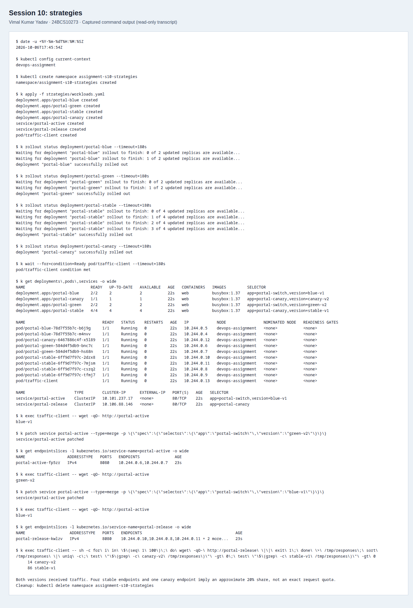

## Twelve Pod lifecycle cases

Run `python3 run-lifecycle.py` against a fresh lab namespace. The runner applies
each YAML, waits for its relevant condition, records `get` and `describe`, and
captures logs or an explicit action where needed. Python 3 and kubectl are the
only runner dependencies. If a run stops, `--start-case N` resumes at that case in
the existing namespace; old per-case recordings retain their own timestamps.

The official Pod phases are Pending, Running, Succeeded, Failed and Unknown.
`CrashLoopBackOff`, `ImagePullBackOff` and `Terminating` are displayed conditions
or reasons, not additional phases. Readiness and container restart counts answer
different questions from the Pod phase. Each transcript includes the phase and
container statuses as well as the human-readable listing.

| Case | Manifest | Recorded output | Observation |
| --- | --- | --- | --- |
| 01. Running | [YAML](lifecycle/01-running.yaml) | [Transcript](evidence/01-lc-running.txt) | A long-lived process reaches Running and Ready; the node and Pod IP are visible. |
| 02. Pending | [YAML](lifecycle/02-pending.yaml) | [Transcript](evidence/02-lc-pending.txt) | The 1000-CPU/1-TiB request exceeds this node. FailedScheduling identifies resources as the cause; the container never starts. |
| 03. Succeeded | [YAML](lifecycle/03-succeeded.yaml) | [Transcript](evidence/03-lc-succeeded.txt) | A one-shot task exits 0 with restartPolicy Never. The table says Completed while the API phase says Succeeded. |
| 04. Failed | [YAML](lifecycle/04-failed.yaml) | [Transcript](evidence/04-lc-failed.txt) | The task exits 7 with restartPolicy Never. The table says Error and the API phase is Failed; it does not restart. |
| 05. Crash/restart back-off | [YAML](lifecycle/05-crashloop.yaml) | [Transcript](evidence/05-lc-crashloop.txt) | The same exit-7 process has restartPolicy Always. Restarts accumulate and BackOff events identify the loop. This run displays Error while the API phase remains Running; do not infer the phase from that table cell. |
| 06. ImagePullBackOff | [YAML](lifecycle/06-imagepull.yaml) | [Transcript](evidence/06-lc-image-error.txt) | A nonexistent tag fails image resolution. The container stays Waiting, the Pod phase is Pending, and describe records the pull error. |
| 07. Readiness | [YAML](lifecycle/07-readiness.yaml) | [Transcript](evidence/07-lc-readiness.txt) | The running process begins unready because /tmp/ready is absent. Creating it makes the probe pass without restarting the container. |
| 08. Liveness | [YAML](lifecycle/08-liveness.yaml) | [Transcript](evidence/08-lc-liveness.txt) | Removing /tmp/healthy makes the probe fail. Kubelet restarts the container, the startup command recreates the file, and the restart count increases. |
| 09. Startup probe | [YAML](lifecycle/09-startup.yaml) | [Transcript](evidence/09-lc-startup.txt) | A 20-second initialization delay leaves the container unready. The startup probe allows that delay before liveness begins; it eventually becomes ready with zero restarts. |
| 10. Init container | [YAML](lifecycle/10-init.yaml) | [Transcript](evidence/10-lc-init.txt) | The seed container writes a file into emptyDir before the application starts. Init and application logs demonstrate that ordering. |
| 11. Multiple containers | [YAML](lifecycle/11-multi.yaml) | [Transcript](evidence/11-lc-multi.txt) | The client container reaches the web container at 127.0.0.1:8080. Both share the same Pod network namespace. |
| 12. Graceful termination | [YAML](lifecycle/12-termination.yaml) | [Transcript](evidence/12-lc-termination.txt) | Deletion sends SIGTERM. The application logs receipt and finishes cleanup within its 12-second grace period; the follower records both messages before removal. |

## Screenshots

These images render the saved command transcripts in a browser and were captured
with Playwright/CDP. They preserve observed output; the linked text files remain
available for inspection and searching.

### 01. Running

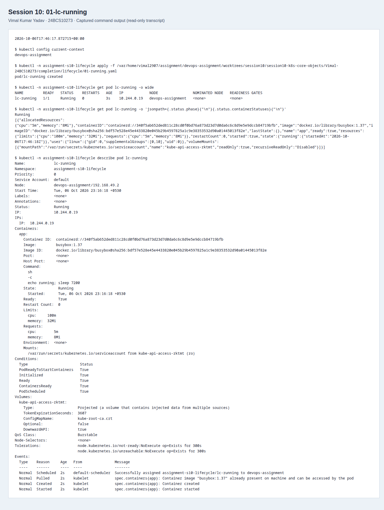

### 02. Pending

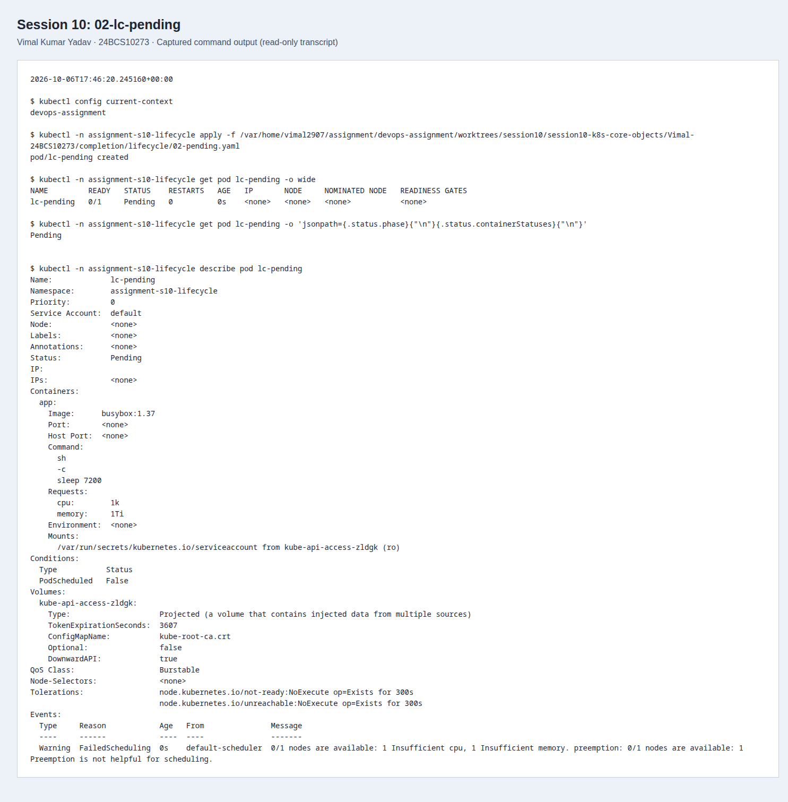

### 03. Succeeded

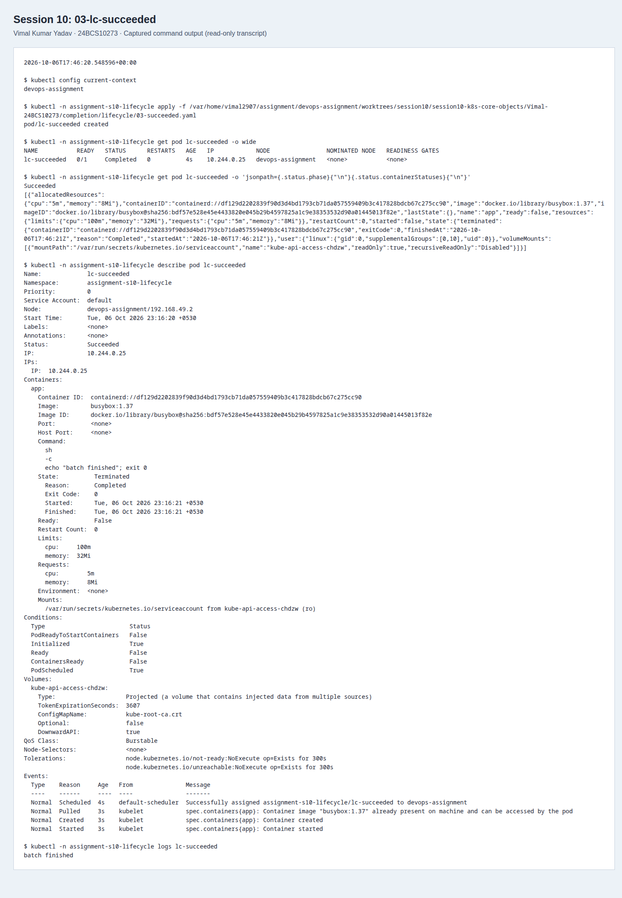

### 04. Failed

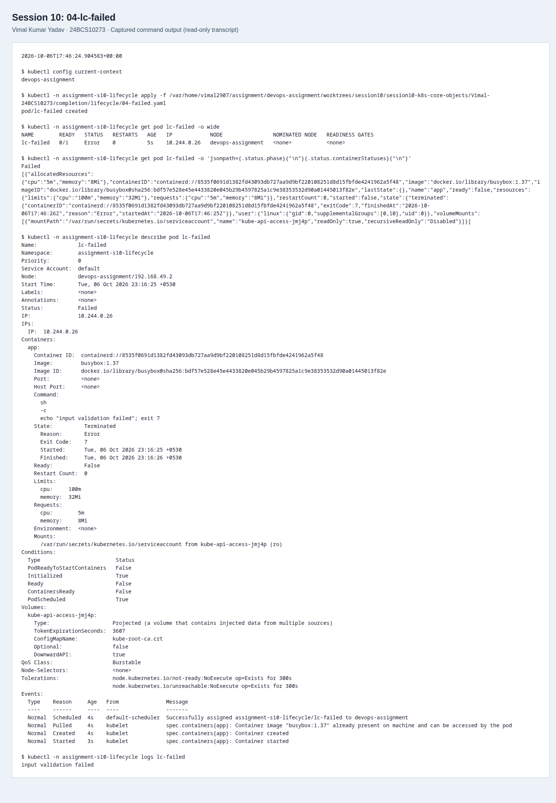

### 05. Crash/restart back-off

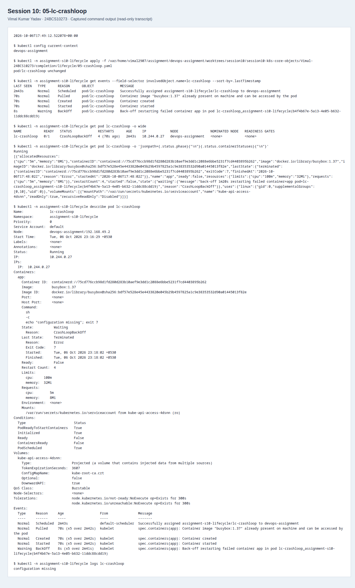

### 06. ImagePullBackOff

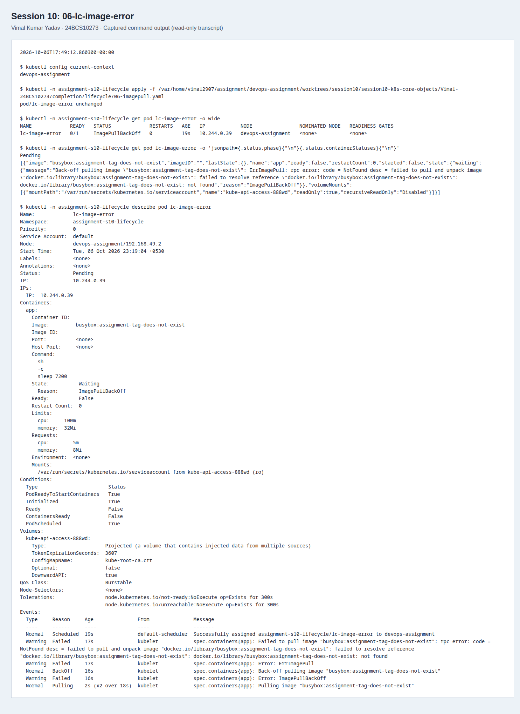

### 07. Readiness

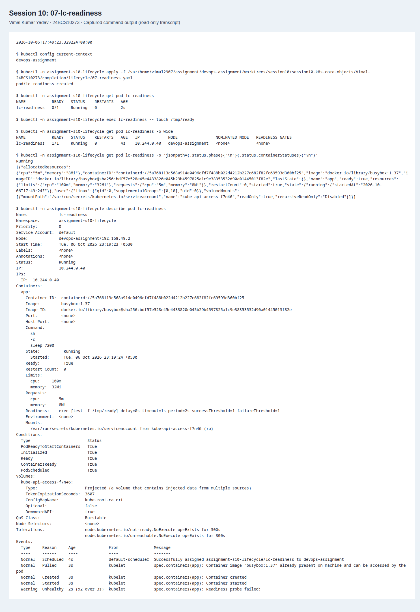

### 08. Liveness

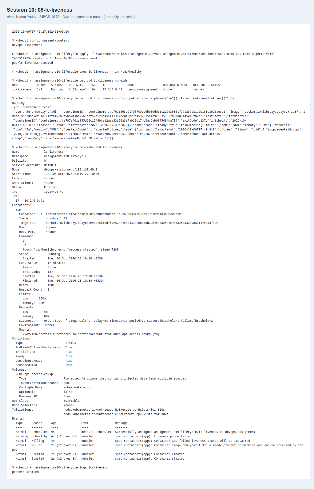

### 09. Startup probe

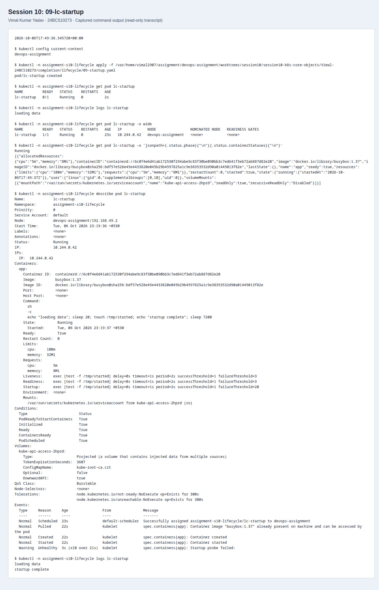

### 10. Init container

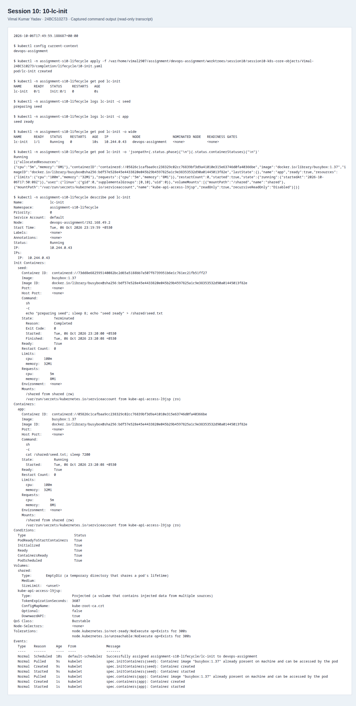

### 11. Multiple containers

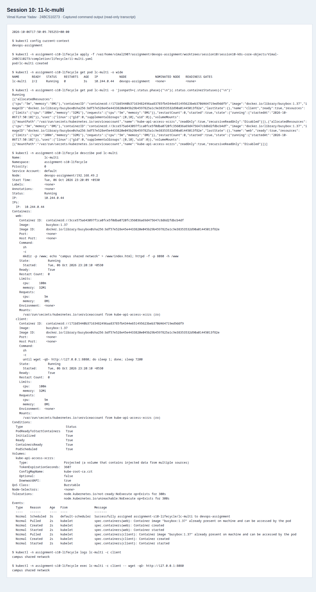

### 12. Graceful termination

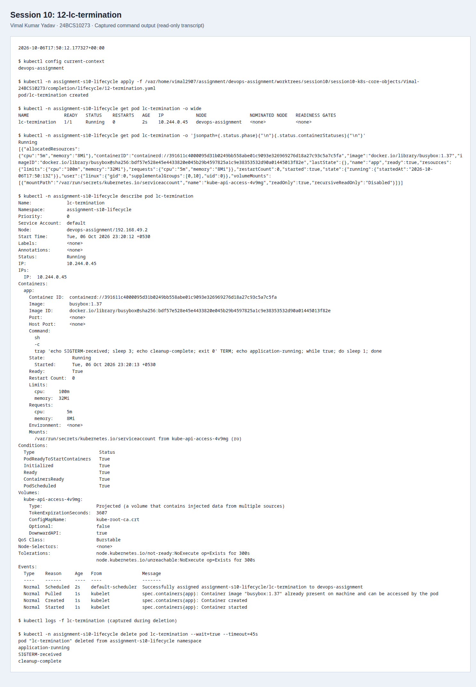

## Cleanup

```bash
kubectl delete namespace assignment-s10-strategies assignment-s10-lifecycle
```

The failed-image and crash-loop Pods are intentional exercises. Delete them when
the observations are captured so retries do not continue in the background.

References: [Pod lifecycle](https://kubernetes.io/docs/concepts/workloads/pods/pod-lifecycle/),
[probes](https://kubernetes.io/docs/concepts/configuration/liveness-readiness-startup-probes/),
[Deployments](https://kubernetes.io/docs/concepts/workloads/controllers/deployment/).
