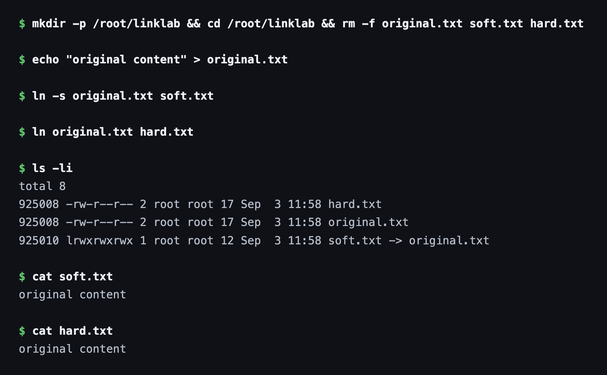
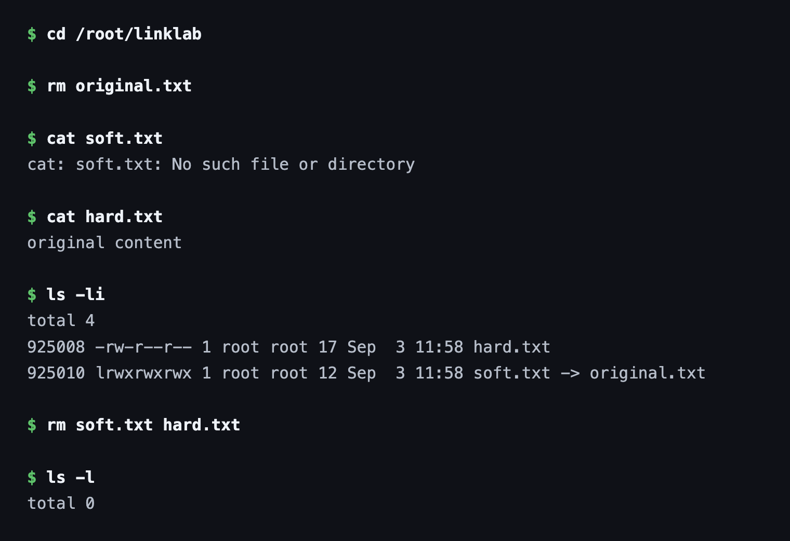
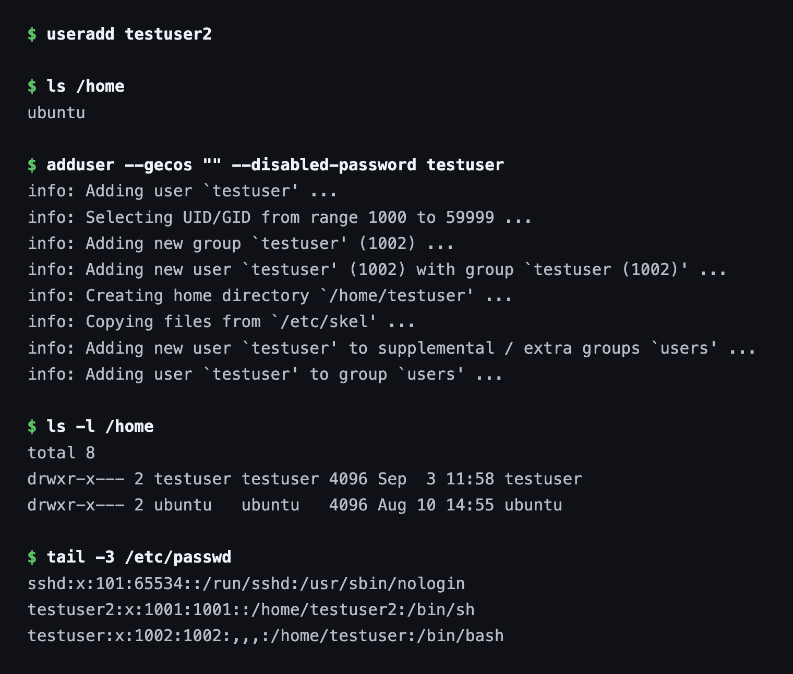
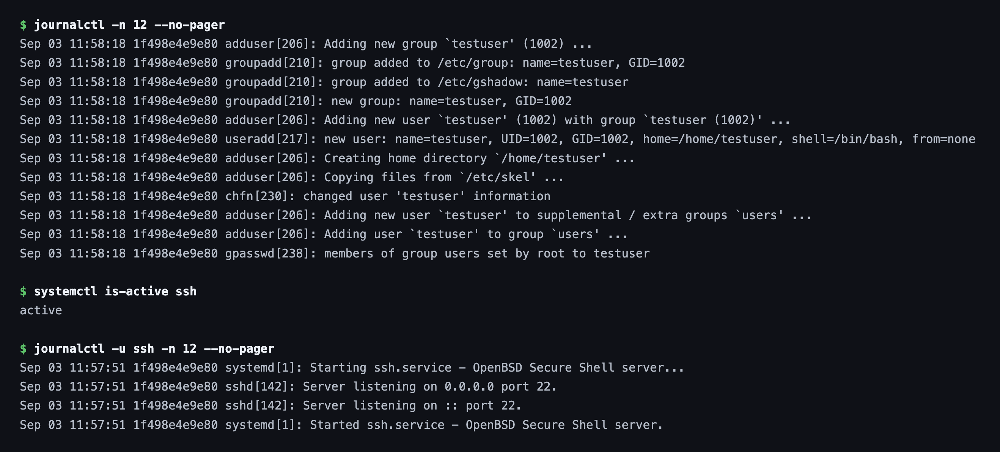
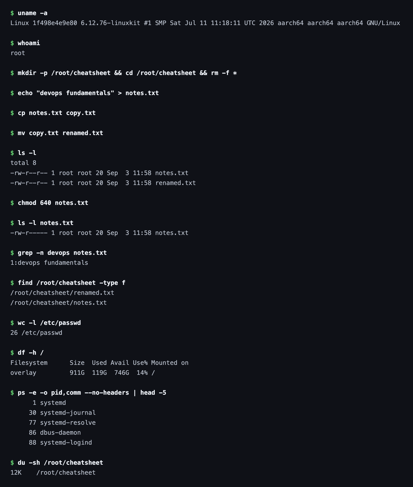

# Session 2 — Linux Fundamentals

**Name:** Vimal Kumar Yadav
**Enrollment Number:** 24BCS10273

Everything below was run on Ubuntu 24.04 with a full `systemd` init, so `journalctl` and
`systemctl` behave exactly as they would on a normal Linux server. Each code block is the real
output from that session.

---

## Task 1: Soft Link & Hard Link

- Learn the difference between soft links and hard links.
- Learn the commands to create both.
- Practise creating and deleting soft and hard links.
- Prepare this as an interview answer.

### What is a link?

A link is a second name for a file. Linux offers two kinds, and they differ in *what* they
point at — a path, or the data itself.

### Commands

**Syntax**

```bash
ln -s <source_file> <link_name>    # soft (symbolic) link
ln    <source_file> <link_name>    # hard link
```

**Example**

```bash
echo "original content" > original.txt
ln -s original.txt soft.txt
ln original.txt hard.txt
ls -li
```

### Output

```text
$ ls -li
total 8
925008 -rw-r--r-- 2 root root 17 Sep  3 11:58 hard.txt
925008 -rw-r--r-- 2 root root 17 Sep  3 11:58 original.txt
925010 lrwxrwxrwx 1 root root 12 Sep  3 11:58 soft.txt -> original.txt

$ cat soft.txt
original content

$ cat hard.txt
original content
```

The first column is the inode number, and it is the whole story:

- `hard.txt` and `original.txt` both show inode **925008**. They are not two files — they are
  two names for one file. The `2` after the permissions is the link count, i.e. how many names
  currently point at that inode.
- `soft.txt` has its own inode **925010**, a size of 12 bytes (the length of the string
  `original.txt`), and `ls` displays it as `soft.txt -> original.txt`. It stores a *path*, not
  the data.



### Commands

Now delete the original and see which link survives, then remove the links themselves:

```bash
rm original.txt
cat soft.txt
cat hard.txt
ls -li
rm soft.txt hard.txt
ls -l
```

### Output

```text
$ rm original.txt

$ cat soft.txt
cat: soft.txt: No such file or directory

$ cat hard.txt
original content

$ ls -li
total 4
925008 -rw-r--r-- 1 root root 17 Sep  3 11:58 hard.txt
925010 lrwxrwxrwx 1 root root 12 Sep  3 11:58 soft.txt -> original.txt

$ rm soft.txt hard.txt
$ ls -l
total 0
```



### Explanation

Deleting `original.txt` removed one *name*, not the file. The hard link still points at inode
925008, so the data is untouched and `cat hard.txt` still works — note the link count has
dropped from `2` to `1`. The data is only freed once the last name is removed.

The soft link broke immediately, because it only ever held the text `original.txt` and that path
no longer resolves. `ls` still lists it happily — a dangling symlink is a perfectly valid file.

**As an interview answer:** a hard link is another directory entry pointing at the same inode,
so it cannot cross filesystems and cannot point at a directory, and the file survives until every
hard link is gone. A soft link is a small file containing a path, so it can cross filesystems and
point at directories, but it breaks if the target moves or is deleted.

---

## Task 2: adduser vs useradd

- Learn the difference between `adduser` and `useradd`.
- Understand which is preferred on Ubuntu/Linux and why.
- Create a test user with the recommended command.

### Commands

```bash
useradd testuser2
ls /home

adduser testuser

ls -l /home
tail -3 /etc/passwd
```

### Output

```text
$ useradd testuser2
$ ls /home
ubuntu
```

`useradd` created the account silently — and note `/home` does not contain `testuser2` at all.

```text
$ adduser testuser
info: Adding user `testuser' ...
info: Selecting UID/GID from range 1000 to 59999 ...
info: Adding new group `testuser' (1002) ...
info: Adding new user `testuser' (1002) with group `testuser (1002)' ...
info: Creating home directory `/home/testuser' ...
info: Copying files from `/etc/skel' ...
info: Adding new user `testuser' to supplemental / extra groups `users' ...

$ ls -l /home
drwxr-x--- 2 testuser testuser 4096 Sep  3 11:58 testuser
drwxr-x--- 2 ubuntu   ubuntu   4096 Aug 10 14:55 ubuntu

$ tail -3 /etc/passwd
testuser2:x:1001:1001::/home/testuser2:/bin/sh
testuser:x:1002:1002:,,,:/home/testuser:/bin/bash
```



### Which command is preferred on Ubuntu/Linux?

**`adduser`** is the one to use on Ubuntu/Debian.

- `useradd` is the low-level binary. It does exactly what it is told and nothing more — no home
  directory unless you pass `-m`, no password prompt, and a default shell of `/bin/sh`.
- `adduser` is a higher-level Perl script that wraps `useradd`. It creates the home directory,
  copies the skeleton files from `/etc/skel`, creates a matching user group, adds the user to
  the sensible supplemental groups, prompts for a password, and sets `/bin/bash` as the shell.
- The `/etc/passwd` entries show the difference directly: `testuser2` was given `/bin/sh` and a
  home directory that does not exist on disk, while `testuser` got `/bin/bash` and a real
  `/home/testuser`.
- `useradd` is the better choice inside scripts and Dockerfiles, precisely because it is
  non-interactive and predictable.

---

## Task 3: journalctl

- Learn what `journalctl` is used for.
- Learn how to view system and service logs.
- Practise checking the logs for a specific service.

### What is journalctl?

`systemd` collects the logs of every service it manages into one binary journal, and
`journalctl` is how that journal is read. Rather than hunting through separate files in
`/var/log`, every unit's output is queryable from a single place with consistent filters.

### Commands

**Example**

```bash
journalctl -n 12 --no-pager
```

### Output

```text
Sep 03 11:58:18 adduser[206]: Adding new group `testuser' (1002) ...
Sep 03 11:58:18 groupadd[210]: group added to /etc/group: name=testuser, GID=1002
Sep 03 11:58:18 adduser[206]: Adding new user `testuser' (1002) with group `testuser (1002)' ...
Sep 03 11:58:18 useradd[217]: new user: name=testuser, UID=1002, GID=1002, home=/home/testuser, shell=/bin/bash, from=none
Sep 03 11:58:18 adduser[206]: Creating home directory `/home/testuser' ...
Sep 03 11:58:18 adduser[206]: Copying files from `/etc/skel' ...
Sep 03 11:58:18 gpasswd[238]: members of group users set by root to testuser
```

These are the last 12 entries, and they happen to be Task 2 recorded from the system's side —
useful confirmation that `adduser` really did delegate the account creation to `useradd`.

`-n 12` limits the output to the most recent 12 lines. `--no-pager` prints straight to stdout
instead of opening `less`, which is what you want in a script or when capturing output.

### Check Logs for a Specific Service

```bash
journalctl -u ssh -n 12 --no-pager
```

```text
Sep 03 11:57:51 systemd[1]: Starting ssh.service - OpenBSD Secure Shell server...
Sep 03 11:57:51 sshd[142]: Server listening on 0.0.0.0 port 22.
Sep 03 11:57:51 sshd[142]: Server listening on :: port 22.
Sep 03 11:57:51 systemd[1]: Started ssh.service - OpenBSD Secure Shell server.
```



`-u <unit>` filters to a single service, which is the flag used most often in practice — when a
service will not start, `journalctl -u <name> -n 50` usually shows the reason straight away.
Other flags worth knowing: `-f` to follow live, `-b` for the current boot only, `-p err` to show
only errors, and `--since "10 min ago"` for a time window.

---

## Task 4: Linux Command Cheat Sheet

- Review the Linux command cheat sheet.
- Practise the important commands.
- Understand the purpose and basic usage of each.

### Commands

```bash
uname -a
whoami
echo "devops fundamentals" > notes.txt
cp notes.txt copy.txt
mv copy.txt renamed.txt
ls -l
chmod 640 notes.txt
grep -n devops notes.txt
find /root/cheatsheet -type f
wc -l /etc/passwd
df -h /
ps -e -o pid,comm --no-headers | head -5
du -sh /root/cheatsheet
```

### Output



### Explanation

| Command | Purpose |
|---|---|
| `uname -a` | Kernel, architecture and hostname in one line |
| `whoami` | The effective user running the shell |
| `cp` / `mv` | Copy a file, or move/rename one |
| `chmod 640` | Set permissions — owner read/write, group read, others none |
| `grep -n` | Search inside files, `-n` prefixes the line number |
| `find <dir> -type f` | Walk a directory tree, `-type f` restricts to regular files |
| `wc -l` | Count lines |
| `df -h` | Free space per mounted filesystem, `-h` in human units |
| `ps -e -o pid,comm` | List processes, choosing which columns to print |
| `du -sh` | Total size of a directory, summarised and human readable |

The pattern worth remembering is that `-h` means "human readable" across `df`, `du` and `free`,
and that most of these commands are designed to be piped into one another — `ps` into `head`
above being the simplest example.
