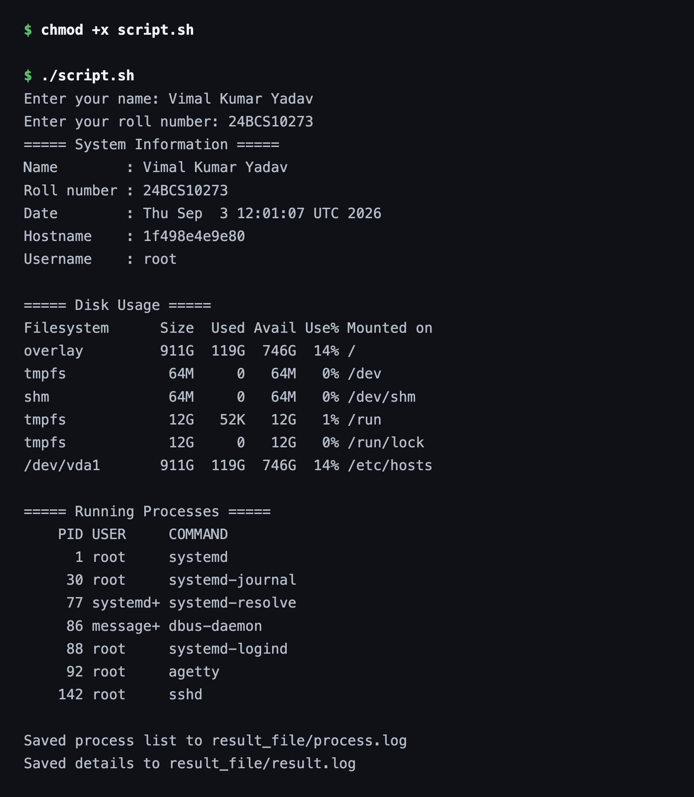
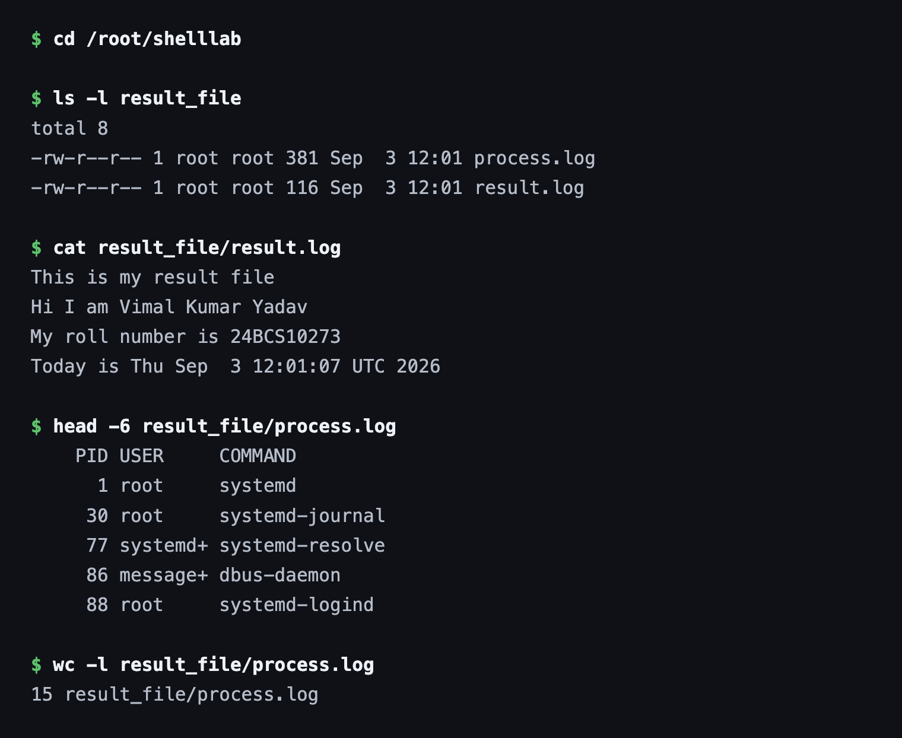

# Session 3 — Shell Scripting

**Name:** Vimal Kumar Yadav
**Enrollment Number:** 24BCS10273

---

## Task: System Information Script

Create a shell script that:

- Prints the current date.
- Prints the hostname.
- Prints the username.
- Prints the disk usage.
- Prints the running processes.
- Uses variables to store and use data.
- Takes user input using `read -p`.
- Creates a directory using `mkdir`.
- Creates a file using `touch`.
- Stores the running processes information in the file using `>` output redirection.

### Where each requirement is met

| Requirement | In the script |
|---|---|
| Current date | `current_date=$(date)` |
| Hostname | `host_name=$(hostname)` |
| Username | `user_name=$(whoami)` |
| Disk usage | `disk_usage=$(df -h)` |
| Running processes | `processes=$(ps -e -o pid,user,comm)` |
| Variables | all five above, plus `$name` and `$roll_no` |
| `read -p` | the two prompts for name and roll number |
| `mkdir` | `mkdir -p result_file` |
| `touch` | `touch result.log process.log` |
| `>` redirection | `echo "$processes" > process.log` |

## script.sh

```bash
#!/bin/bash

read -p "Enter your name: " name
read -p "Enter your roll number: " roll_no

current_date=$(date)
host_name=$(hostname)
user_name=$(whoami)
disk_usage=$(df -h)
processes=$(ps -e -o pid,user,comm)

mkdir -p result_file
cd result_file
touch result.log process.log

echo "===== System Information ====="
echo "Name        : $name"
echo "Roll number : $roll_no"
echo "Date        : $current_date"
echo "Hostname    : $host_name"
echo "Username    : $user_name"

echo ""
echo "===== Disk Usage ====="
echo "$disk_usage"

echo ""
echo "===== Running Processes ====="
echo "$processes" | head -8

echo "$processes" > process.log

echo "This is my result file" > result.log
echo "Hi I am $name" >> result.log
echo "My roll number is $roll_no" >> result.log
echo "Today is $current_date" >> result.log

echo ""
echo "Saved process list to result_file/process.log"
echo "Saved details to result_file/result.log"
```

## Output

Making the script executable and running it, entering the name and roll number at the prompts:

```text
$ chmod +x script.sh

$ ./script.sh
Enter your name: Vimal Kumar Yadav
Enter your roll number: 24BCS10273
===== System Information =====
Name        : Vimal Kumar Yadav
Roll number : 24BCS10273
Date        : Thu Sep  3 12:01:07 UTC 2026
Hostname    : 1f498e4e9e80
Username    : root

===== Disk Usage =====
Filesystem      Size  Used Avail Use% Mounted on
overlay         911G  119G  746G  14% /
tmpfs            64M     0   64M   0% /dev
shm              64M     0   64M   0% /dev/shm
tmpfs            12G   52K   12G   1% /run
tmpfs            12G     0   12G   0% /run/lock
/dev/vda1       911G  119G  746G  14% /etc/hosts

===== Running Processes =====
    PID USER     COMMAND
      1 root     systemd
     30 root     systemd-journal
     77 systemd+ systemd-resolve
     86 message+ dbus-daemon
     88 root     systemd-logind
     92 root     agetty
    142 root     sshd

Saved process list to result_file/process.log
Saved details to result_file/result.log
```



### Verifying the files the script created

```text
$ ls -l result_file
total 8
-rw-r--r-- 1 root root 381 Sep  3 12:01 process.log
-rw-r--r-- 1 root root 116 Sep  3 12:01 result.log

$ cat result_file/result.log
This is my result file
Hi I am Vimal Kumar Yadav
My roll number is 24BCS10273
Today is Thu Sep  3 12:01:07 UTC 2026

$ head -6 result_file/process.log
    PID USER     COMMAND
      1 root     systemd
     30 root     systemd-journal
     77 systemd+ systemd-resolve
     86 message+ dbus-daemon
     88 root     systemd-logind

$ wc -l result_file/process.log
15 result_file/process.log
```



## Explanation

The two redirection operators do different jobs, and the script uses both deliberately:

- `>` **overwrites**. `echo "$processes" > process.log` replaces the file's contents each run,
  so `process.log` always holds one clean snapshot rather than growing every time.
- `>>` **appends**. `result.log` is started with `>` on the first line and then built up with
  `>>` on the following three, which is why all four lines end up in the file instead of only
  the last one.

The command substitutions `$(date)`, `$(hostname)` and so on run once at the top and are stored
in variables. That matters for `current_date` — it is captured a single time, so the timestamp
printed on screen and the one written into `result.log` are identical (`12:01:07` in both above).
Calling `date` separately in each place could produce two different values.

`mkdir -p` is used rather than plain `mkdir` so re-running the script does not fail with
"File exists", and `touch` creates the two log files up front so they exist even if a later
write is skipped.
