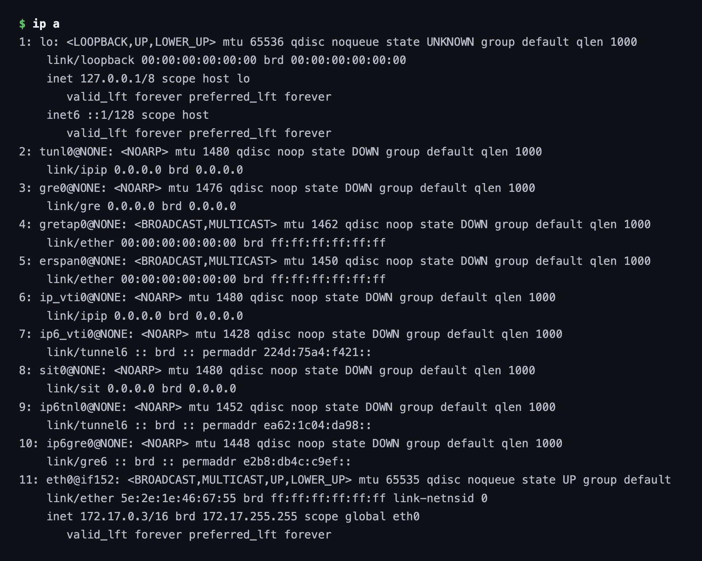
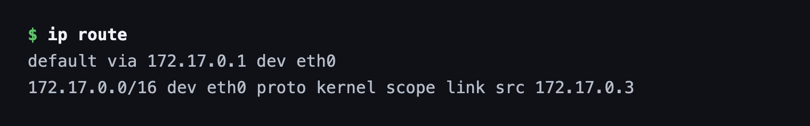
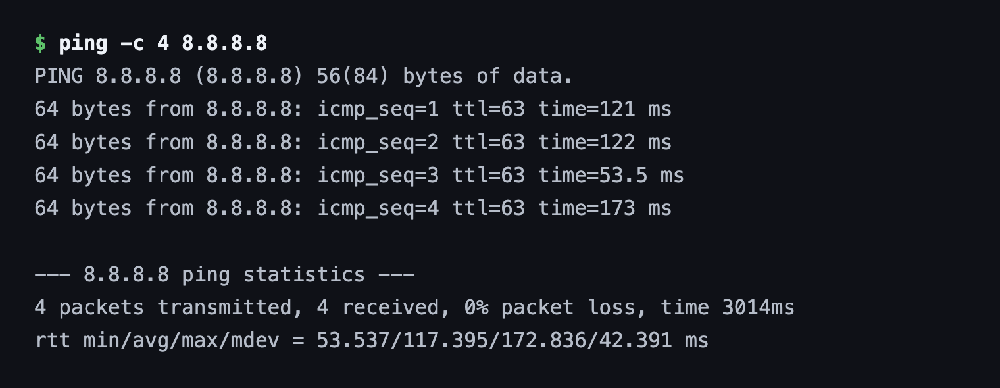
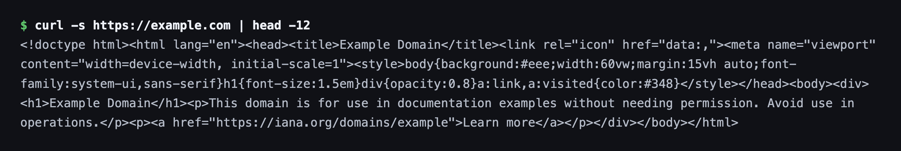
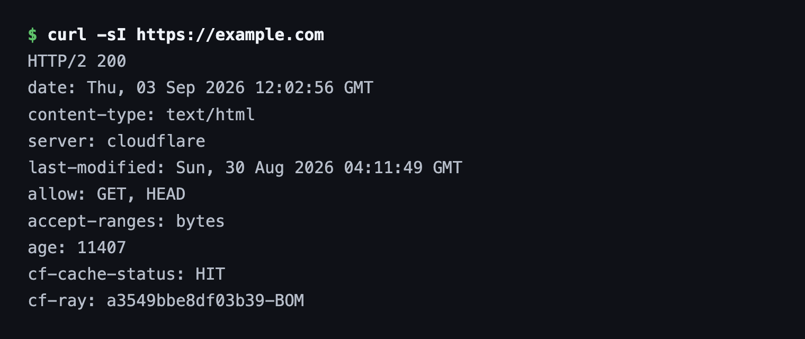
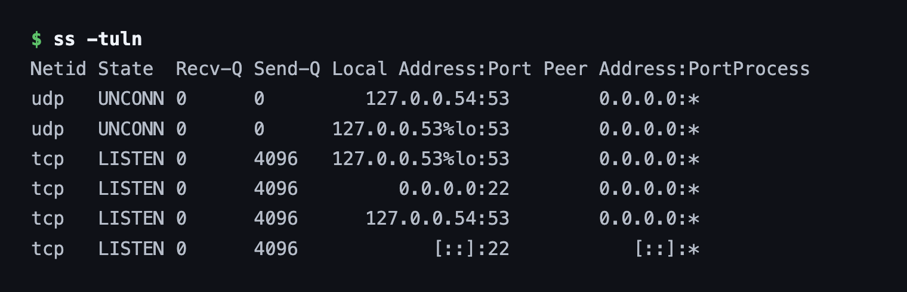
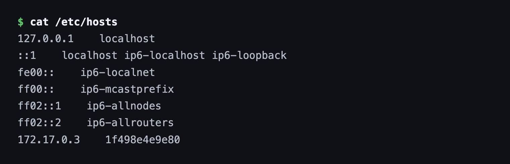
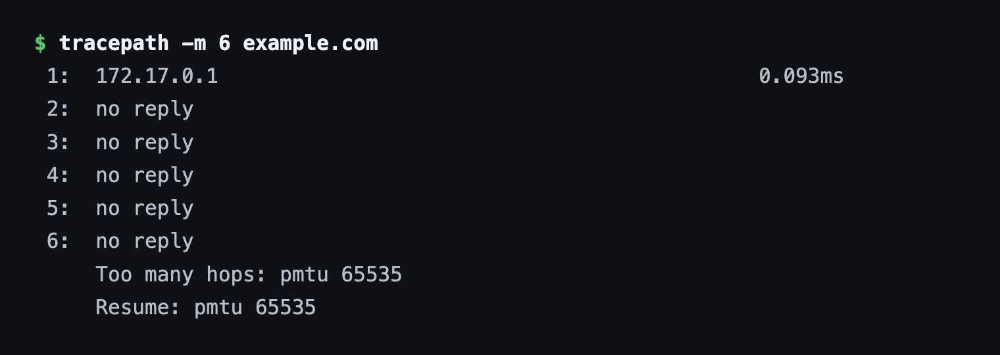
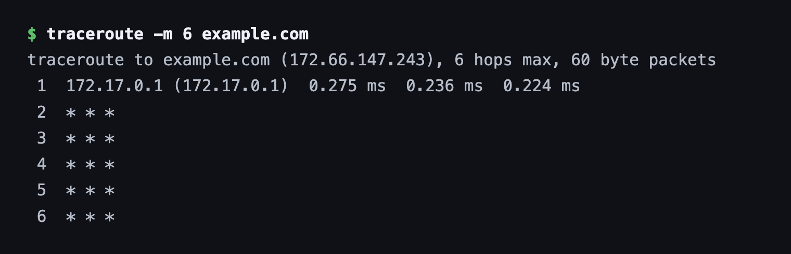
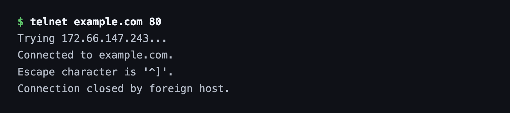

# Session 4 — Networking Fundamentals

**Name:** Vimal Kumar Yadav
**Enrollment Number:** 24BCS10273

## Task

- Practise the networking commands from the course repository.
- Create a Markdown file, run each command and record the output.
- Add a short explanation of what each command does.

Each command below was run on Ubuntu 24.04 and every code block is the real output.

---

## 1. hostname

### Command

```bash
hostname
```

### Output

```text
1f498e4e9e80
```

### Explanation

Prints the machine's name on the network. Every host has one, and it is what shows up in log
lines, shell prompts and DNS lookups. On this machine the name is the container ID, since the
hostname was assigned automatically rather than set by hand.


---

## 2. whoami

### Command

```bash
whoami
```

### Output

```text
root
```

### Explanation

Prints the effective username of whoever is running the shell. Worth checking before running
anything destructive — `root` means no permission checks will stop you. It reports the
*effective* user, so inside `sudo` it prints `root` even though the login user is someone else.


---

## 3. ip a

### Command

```bash
ip a
```

### Output

```text
1: lo: <LOOPBACK,UP,LOWER_UP> mtu 65536 qdisc noqueue state UNKNOWN group default qlen 1000
    link/loopback 00:00:00:00:00:00 brd 00:00:00:00:00:00
    inet 127.0.0.1/8 scope host lo
       valid_lft forever preferred_lft forever
...
23: eth0@if24: <BROADCAST,MULTICAST,UP,LOWER_UP> mtu 1500 qdisc noqueue state UP
    inet 172.17.0.3/16 brd 172.17.255.255 scope global eth0
```

### Explanation

Lists every network interface with its IP addresses, MAC address, MTU and state. `lo` is the
loopback interface that carries `127.0.0.1`, and `eth0` is the real interface — here holding
`172.17.0.3/16`. The `/16` is the prefix length: the first 16 bits are the network portion, so
this host sits on `172.17.0.0/16`.

The flags in angle brackets matter when troubleshooting — `UP,LOWER_UP` means the interface is
both administratively enabled and has a live carrier, while `DOWN` on the tunnel interfaces
means they exist but are unused.



---

## 4. hostname -I

### Command

```bash
hostname -I
```

### Output

```text
172.17.0.3
```

### Explanation

Prints just the IP addresses, with no interface names or extra formatting. `ip a` is what you
read; `hostname -I` is what you use in a script, because the output is a single clean line that
is trivial to capture into a variable.


---

## 5. ip route

### Command

```bash
ip route
```

### Output

```text
default via 172.17.0.1 dev eth0
172.17.0.0/16 dev eth0 proto kernel scope link src 172.17.0.3
```

### Explanation

Shows the kernel's routing table — how the machine decides where to send a packet.

The second line is the local network: anything in `172.17.0.0/16` is on the same link and is
sent directly out of `eth0`. The `default` line is the fallback for everything else — packets
for any other address go to the gateway `172.17.0.1`. If the default route is missing, the
machine can reach its own subnet but nothing on the internet, which is one of the first things
to check when connectivity breaks.



---

## 6. ping

### Command

```bash
ping -c 4 8.8.8.8
```

### Output

```text
PING 8.8.8.8 (8.8.8.8) 56(84) bytes of data.
64 bytes from 8.8.8.8: icmp_seq=1 ttl=63 time=121 ms
64 bytes from 8.8.8.8: icmp_seq=2 ttl=63 time=122 ms
64 bytes from 8.8.8.8: icmp_seq=3 ttl=63 time=53.5 ms
64 bytes from 8.8.8.8: icmp_seq=4 ttl=63 time=173 ms

--- 8.8.8.8 ping statistics ---
4 packets transmitted, 4 received, 0% packet loss, time 3014ms
rtt min/avg/max/mdev = 53.537/117.395/172.836/42.391 ms
```

### Explanation

Sends ICMP echo requests and waits for replies, which tests reachability and measures
round-trip latency. `-c 4` stops after four packets instead of running until interrupted.

`0% packet loss` is the headline: the host is reachable and nothing was dropped. `time=` is the
round trip in milliseconds, and `ttl=63` is the remaining time-to-live — it started at 64 and
was decremented once per router, so the reply crossed one hop. Testing an IP rather than a
hostname deliberately takes DNS out of the picture.



---

## 7. nslookup

### Command

```bash
nslookup example.com
```

### Output

```text
Server:		192.168.65.7
Address:	192.168.65.7#53

Non-authoritative answer:
Name:	example.com
Address: 172.66.147.243
Name:	example.com
Address: 104.20.23.154
Name:	example.com
Address: 2606:4700:10::ac42:93f3
```

### Explanation

Resolves a name to its IP addresses. `Server:` is the DNS resolver that answered — useful when
you need to know *which* resolver gave a stale answer.

"Non-authoritative" means the answer came from a cache rather than from the domain's own
nameservers, which is normal. This domain returns several addresses, both IPv4 (A records) and
IPv6 (AAAA records), so clients can pick whichever they support.


---

## 8. curl

### Command

```bash
curl -s https://example.com | head -12
```

### Output

```text
<!doctype html><html lang="en"><head><title>Example Domain</title>...
<h1>Example Domain</h1><p>This domain is for use in documentation examples without
needing permission. Avoid use in operations.</p>
```

### Explanation

Fetches a URL and writes the response body to stdout. Unlike `ping`, this exercises the whole
stack — DNS, TCP, TLS and HTTP — so a successful `curl` proves far more than a successful ping.
`-s` suppresses the progress meter, which matters when piping the output somewhere.



---

## 9. curl -I

### Command

```bash
curl -sI https://example.com
```

### Output

```text
HTTP/2 200
date: Thu, 03 Sep 2026 12:02:56 GMT
content-type: text/html
server: cloudflare
last-modified: Sun, 30 Aug 2026 04:11:49 GMT
allow: GET, HEAD
accept-ranges: bytes
age: 11407
cf-cache-status: HIT
```

### Explanation

`-I` sends a `HEAD` request, so only the response headers come back and the body is skipped.
This is the quickest way to check whether a URL is alive and what it would return.

`HTTP/2 200` is the status — `200 OK` means success, where `404` would mean not found and `500`
a server error. The other headers are informative too: `server: cloudflare` shows the request
was answered by a CDN, and `cf-cache-status: HIT` shows it was served from that CDN's cache
rather than the origin.



---

## 10. ss

### Command

```bash
ss -tuln
```

### Output

```text
Netid State  Recv-Q Send-Q Local Address:Port Peer Address:Port
udp   UNCONN 0      0         127.0.0.54:53        0.0.0.0:*
tcp   LISTEN 0      4096   127.0.0.53%lo:53        0.0.0.0:*
tcp   LISTEN 0      4096         0.0.0.0:22        0.0.0.0:*
tcp   LISTEN 0      4096      127.0.0.54:53        0.0.0.0:*
tcp   LISTEN 0      4096            [::]:22           [::]:*
```

### Explanation

Shows sockets, and is the modern replacement for `netstat`. The flags combine as:

- `-t` TCP sockets
- `-u` UDP sockets
- `-l` only sockets in the listening state
- `-n` numeric — show port `22` rather than resolving it to `ssh`

The listening address is the important column. `0.0.0.0:22` means sshd accepts connections on
every interface, whereas `127.0.0.53%lo:53` means the DNS stub resolver only accepts them on
loopback and is unreachable from other machines. This is the command to reach for when
answering "is anything actually listening on that port?".



---

## 11. /etc/hosts

### Command

```bash
cat /etc/hosts
```

### Output

```text
127.0.0.1	localhost
::1	localhost ip6-localhost ip6-loopback
fe00::	ip6-localnet
ff00::	ip6-mcastprefix
ff02::1	ip6-allnodes
ff02::2	ip6-allrouters
172.17.0.3	1f498e4e9e80
```

### Explanation

A static, local name-to-IP mapping file. It is consulted **before** DNS, so an entry here wins
over whatever the DNS server would have returned — handy for pointing a hostname at a test
server, and equally a good thing to check when a name resolves to something unexpected.

The last line is why the machine can resolve its own hostname without any DNS record existing
for it.



---

## 12. tracepath

### Command

```bash
tracepath -m 6 example.com
```

### Output

```text
 1:  172.17.0.1                                            0.093ms
 2:  no reply
 3:  no reply
 4:  no reply
 5:  no reply
 6:  no reply
     Too many hops: pmtu 65535
```

### Explanation

Traces the path to a destination hop by hop and discovers the path MTU along the way. Unlike
`traceroute` it needs no root privileges, which is its main advantage.

Only the first hop replied — the container's gateway at `172.17.0.1`. `no reply` afterwards does
not mean the route is broken; `curl` and `ping` both succeed. Intermediate routers simply are
not obliged to send back the ICMP messages that make traceroute work, and most cloud and ISP
routers are configured not to.



---

## 13. traceroute

### Command

```bash
traceroute -m 6 example.com
```

### Output

```text
traceroute to example.com (172.66.147.243), 6 hops max, 60 byte packets
 1  172.17.0.1 (172.17.0.1)  0.275 ms  0.236 ms  0.224 ms
 2  * * *
 3  * * *
 4  * * *
 5  * * *
 6  * * *
```

### Explanation

Does the same job as `tracepath` — mapping the routers between here and the destination — by
sending packets with increasing TTL values and noting which router reports each expiry. Three
probes are sent per hop, which is why each line shows three timings.

`* * *` means no reply within the timeout for any of the three probes, matching what `tracepath`
found. It is the expected result when routers are configured to drop or rate-limit ICMP, and it
is not by itself evidence of a fault. `-m 6` caps the search at 6 hops instead of the default 30.



---

## 14. telnet

### Command

```bash
telnet example.com 80
```

### Output

```text
Trying 172.66.147.243...
Connected to example.com.
Escape character is '^]'.
Connection closed by foreign host.
```

### Explanation

Opens a raw TCP connection to a host and port. Nobody uses it as a remote login tool any more —
it is unencrypted — but it remains a quick way to answer "is this port open and accepting
connections?".

`Connected to example.com` is the answer: the TCP handshake completed, so port 80 is reachable
and something is listening. The server then closed the connection because no HTTP request was
sent. A firewalled or closed port would instead hang, or fail with `Connection refused`.

`nc -vz example.com 80` does the same check more safely and is usually preferred in scripts.


