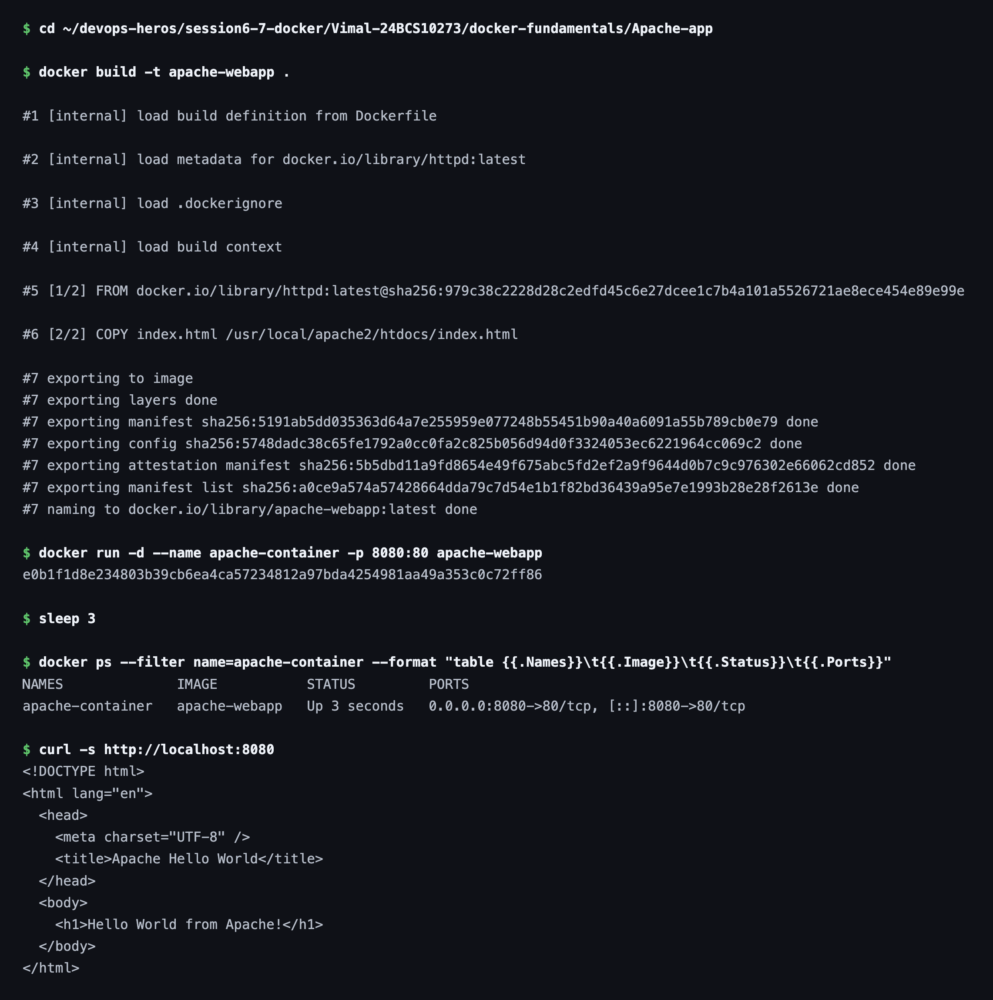

# Apache Web App

Hello World web application built on the official `httpd` image serving a static page from its document root.

## Image


## Dockerfile

```dockerfile
FROM httpd:latest

COPY index.html /usr/local/apache2/htdocs/index.html

EXPOSE 80
```

## Commands

Build the image from the Dockerfile:

```bash
docker build -t apache-webapp .
```

Run the container and map host port `8080` to container port `80`:

```bash
docker run -d --name apache-container -p 8080:80 apache-webapp
```

### Terminal Output


