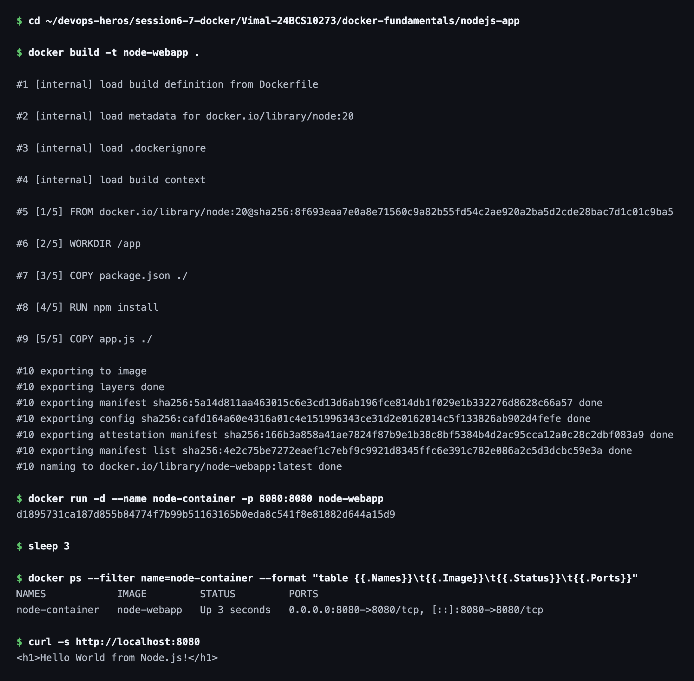

# Session 6 — Docker Fundamentals

**Name:** Vimal Kumar Yadav
**Enrollment Number:** 24BCS10273

## Task: Hello World Applications

Build a simple Hello World web application with Docker for each of the following, giving each
its own folder, its own application code and its own Dockerfile:

- Node.js application
- Python application
- Java application
- Apache web server
- React application
- Nginx application

For every one of them the image has to be built, a container run from it, and the Hello World
page confirmed in a browser.

Each app below has its own folder containing the source, the `Dockerfile` and a nested
`README.md`. Every app publishes on host port `8080`, so they were built and run one at a
time. The screenshots are from those runs.

| Folder | Base image | Image tag | Container | Port mapping |
|---|---|---|---|---|
| [`nodejs-app`](nodejs-app/) | `node:20` | `node-webapp` | `node-container` | `8080:8080` |
| [`python-app`](python-app/) | `python:3.12` | `python-webapp` | `python-container` | `8080:8080` |
| [`java-app`](java-app/) | `eclipse-temurin:21-jdk` | `java-webapp` | `java-container` | `8080:8080` |
| [`Apache-app`](Apache-app/) | `httpd:latest` | `apache-webapp` | `apache-container` | `8080:80` |
| [`React-app`](React-app/) | `node:20` → `nginx:latest` | `react-webapp` | `react-containers` | `8080:80` |
| [`nginx-app`](nginx-app/) | `nginx:latest` | `nginx-webapp` | `nginx-webapp-container` | `8080:80` |

---

## 1. nodejs-app

### Files

`app.js` (Express server), `package.json`, `Dockerfile`

### Dockerfile

```dockerfile
FROM node:20

WORKDIR /app

COPY package.json ./
RUN npm install

COPY app.js ./

EXPOSE 8080

CMD ["npm", "start"]
```

### Commands

```bash
docker build -t node-webapp .
docker run -d --name node-container -p 8080:8080 node-webapp
curl -s http://localhost:8080
```

### Output

```text
NAMES            IMAGE         STATUS         PORTS
node-container   node-webapp   Up 3 seconds   0.0.0.0:8080->8080/tcp, [::]:8080->8080/tcp

$ curl -s http://localhost:8080
<h1>Hello World from Node.js!</h1>
```




---

## 2. python-app

### Files

`app.py` (Flask), `requirements.txt`, `Dockerfile`

### Dockerfile

```dockerfile
FROM python:3.12

WORKDIR /app

COPY requirements.txt ./
RUN pip install --no-cache-dir -r requirements.txt

COPY app.py ./

EXPOSE 8080

CMD ["python", "app.py"]
```

Flask is bound to `0.0.0.0` rather than the default `127.0.0.1`. If it listened only on
loopback it would be reachable inside the container but not through the published port.

### Commands

```bash
docker build -t python-webapp .
docker run -d --name python-container -p 8080:8080 python-webapp
curl -s http://localhost:8080
```

### Output

```text
NAMES              IMAGE           STATUS         PORTS
python-container   python-webapp   Up 3 seconds   0.0.0.0:8080->8080/tcp, [::]:8080->8080/tcp

$ curl -s http://localhost:8080
<h1>Hello World from Python!</h1>
```


---

## 3. java-app

### Files

`Main.java` (uses the JDK's built-in HTTP server), `Dockerfile`

### Dockerfile

```dockerfile
FROM eclipse-temurin:21-jdk

WORKDIR /app

COPY Main.java ./
RUN javac Main.java

EXPOSE 8080

CMD ["java", "Main"]
```

The compile happens inside the image with `javac`, so no JDK is needed on the host machine at
all — which was the case here.

### Commands

```bash
docker build -t java-webapp .
docker run -d --name java-container -p 8080:8080 java-webapp
curl -s http://localhost:8080
```

### Output

```text
NAMES            IMAGE         STATUS         PORTS
java-container   java-webapp   Up 3 seconds   0.0.0.0:8080->8080/tcp, [::]:8080->8080/tcp

$ curl -s http://localhost:8080
<h1>Hello World from Java!</h1>
```


---

## 4. Apache-app

### Files

`index.html`, `Dockerfile`

### Dockerfile

```dockerfile
FROM httpd:latest

COPY index.html /usr/local/apache2/htdocs/index.html

EXPOSE 80
```

Apache serves from `/usr/local/apache2/htdocs`, so copying the page there is all that is
needed — the base image already starts `httpd` itself.

### Commands

```bash
docker build -t apache-webapp .
docker run -d --name apache-container -p 8080:80 apache-webapp
curl -s http://localhost:8080
```

Note the mapping is `8080:80` here, because Apache listens on port `80` inside the container.

### Output

```text
NAMES              IMAGE           STATUS         PORTS
apache-container   apache-webapp   Up 3 seconds   0.0.0.0:8080->80/tcp, [::]:8080->80/tcp

$ curl -s http://localhost:8080
<h1>Hello World from Apache!</h1>
```


---

## 5. React-app

### Files

`src/App.jsx`, `src/main.jsx`, `index.html`, `vite.config.js`, `package.json`, `Dockerfile`

### Dockerfile

```dockerfile
FROM node:20 AS build

WORKDIR /app

COPY package.json ./
RUN npm install

COPY . .
RUN npm run build

FROM nginx:latest

COPY --from=build /app/dist /usr/share/nginx/html

EXPOSE 80

CMD ["nginx", "-g", "daemon off;"]
```

This one is a two-stage build. The first stage installs the dependencies and runs
`npm run build`; the second stage keeps only the compiled `dist/` output and serves it with
nginx. Node and `node_modules` never make it into the final image.

### Commands

```bash
docker build -t react-webapp .
docker run -d --name react-containers -p 8080:80 react-webapp
curl -s http://localhost:8080
```

### Output

```text
NAMES              IMAGE          STATUS         PORTS
react-containers   react-webapp   Up 3 seconds   0.0.0.0:8080->80/tcp, [::]:8080->80/tcp

$ curl -s http://localhost:8080
<!DOCTYPE html>
<html lang="en">
  <head>
    <meta charset="UTF-8" />
    <title>React Hello World</title>
    <script type="module" crossorigin src="/assets/index-Bfut0cVT.js"></script>
  </head>
  <body>
    <div id="root"></div>
  </body>
</html>
```

Unlike the other five, `curl` does not show the Hello World text here. React renders into
`<div id="root">` from JavaScript, so the served HTML is only the shell — the text appears
once the bundle runs. The browser screenshot below is the actual proof for this app.


---

## 6. nginx-app

### Files

`index.html`, `Dockerfile`

This task has two parts — run the official image first, then build a custom one.

### Dockerfile

```dockerfile
FROM nginx:latest

COPY index.html /usr/share/nginx/html/index.html

EXPOSE 80
```

### Commands

Run the official image straight from Docker Hub:

```bash
docker pull nginx
docker run -d --name nginx-app -p 8080:80 nginx
```

Then build and run the custom image, which replaces the default page with my own:

```bash
docker build -t nginx-webapp .
docker run -d --name nginx-webapp-container -p 8080:80 nginx-webapp:latest
```

### Output

```text
$ curl -s http://localhost:8080          # official image
<title>Welcome to nginx!</title>

NAMES                    IMAGE          STATUS         PORTS
nginx-webapp-container   nginx-webapp   Up 3 seconds   0.0.0.0:8080->80/tcp, [::]:8080->80/tcp

$ curl -s http://localhost:8080          # custom image
<h1>Hello World from Nginx!</h1>
```


Official image — the default nginx welcome page:


Custom image — the same URL now serves my own page:


