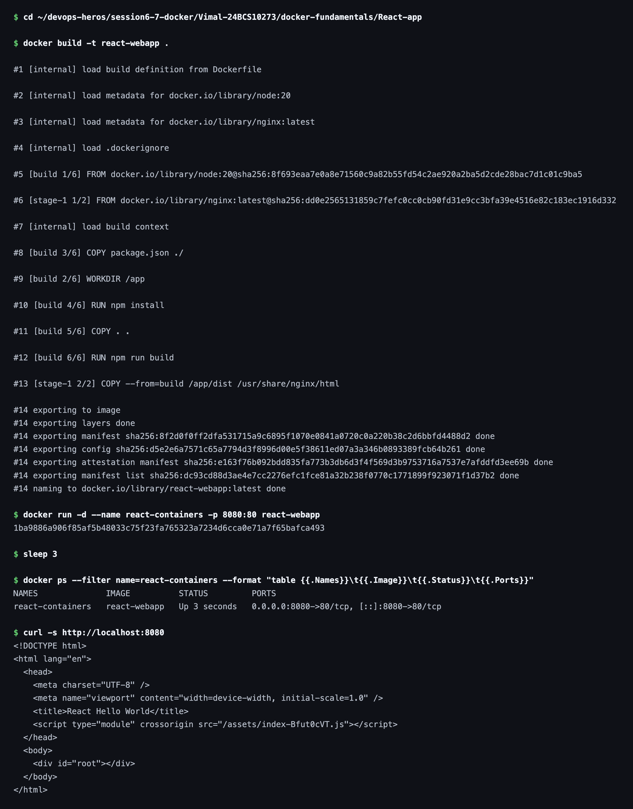

# React Web App

Hello World web application built on a Vite production build copied into nginx by a two-stage Dockerfile.

## Image


## Dockerfile

```dockerfile
FROM node:20 AS build

WORKDIR /app

COPY package.json ./
RUN npm install

COPY . .
RUN npm run build

FROM nginx:latest

COPY --from=build /app/dist /usr/share/nginx/html

EXPOSE 80

CMD ["nginx", "-g", "daemon off;"]
```

## Commands

Build the image from the Dockerfile:

```bash
docker build -t react-webapp .
```

Run the container and map host port `8080` to container port `80`:

```bash
docker run -d --name react-containers -p 8080:80 react-webapp
```

### Terminal Output


