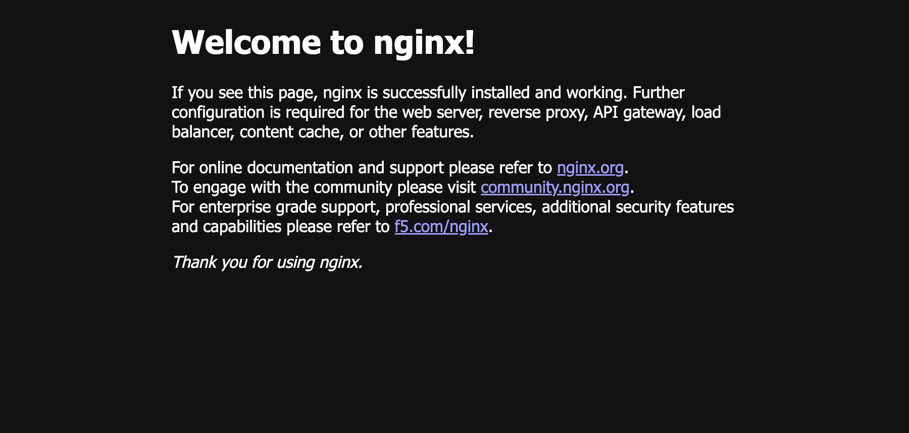
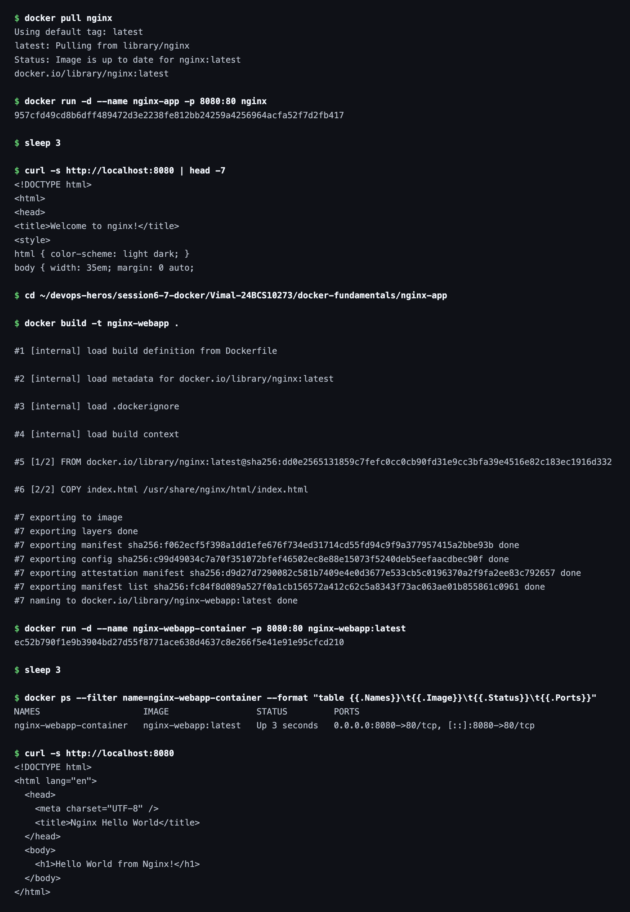

# Nginx Web App

This folder covers both halves of the nginx task: running the official image straight from
Docker Hub, and building a custom image that serves my own page.

## Image

### Running the Official Nginx Image



### Running the Custom Nginx Image


## Dockerfile

```dockerfile
FROM nginx:latest

COPY index.html /usr/share/nginx/html/index.html

EXPOSE 80
```

## Commands

### 1. Run the Official Image

Pull the image from Docker Hub and run it, mapping host port `8080` to container port `80`:

```bash
docker pull nginx
docker run -d --name nginx-app -p 8080:80 nginx
```

This serves the default nginx welcome page — nothing of mine is in the image yet.

### 2. Build and Run the Custom Image

Build an image that copies my `index.html` over the default page, then run it:

```bash
docker build -t nginx-webapp .
docker run -d --name nginx-webapp-container -p 8080:80 nginx-webapp:latest
```

Now the same URL serves my own page instead of the nginx default.

#### Terminal Output


