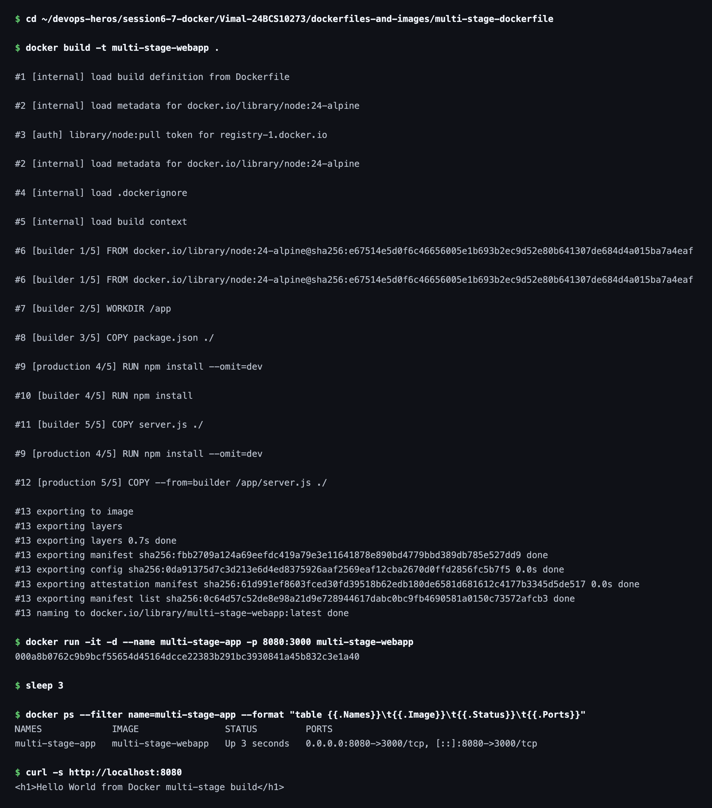
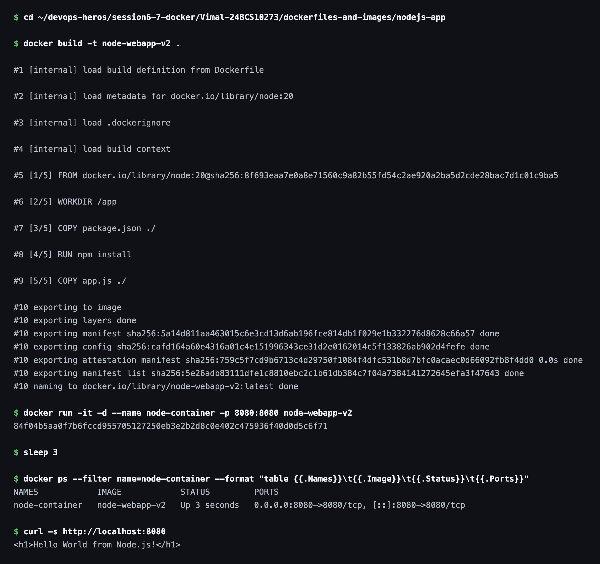

# Session 7 — Dockerfiles & Images (Multi-Stage Build)

**Name:** Vimal Kumar Yadav
**Enrollment Number:** 24BCS10273

---

## Task 1: Run Multi-Stage Dockerfile

- Build the Docker image using the multi-stage Dockerfile.
- Run a container from the image.
- Access the application running inside the container.
- Verify it displays `Hello World from Docker multi-stage build`.
- Verify the running container using `docker ps`.
- Confirm the application is reachable on port `8080`.

### Dockerfile

```dockerfile
FROM node:24-alpine AS builder

WORKDIR /app

COPY package.json ./
RUN npm install

COPY server.js ./

FROM node:24-alpine AS production

WORKDIR /app

COPY package.json ./
RUN npm install --omit=dev

COPY --from=builder /app/server.js ./

EXPOSE 3000

CMD ["npm", "start"]
```

The build has two stages. `builder` installs the full dependency tree, including anything
needed only at build time. `production` starts from a clean `node:24-alpine`, installs only
runtime dependencies with `--omit=dev`, and copies just `server.js` across from the first
stage with `COPY --from=builder`. Nothing else from `builder` ends up in the final image.

### Commands

The application listens on port `3000` inside the container, so it is published on host port
`8080` as the task requires:

```bash
docker build -t multi-stage-webapp .
docker run -it -d --name multi-stage-app -p 8080:3000 multi-stage-webapp
docker ps
curl -s http://localhost:8080
```

### Output

```text
$ docker run -it -d --name multi-stage-app -p 8080:3000 multi-stage-webapp
000a8b0762c9b9bcf55654d45164dcce22383b291bc3930841a45b832c3e1a40

$ curl -s http://localhost:8080
<h1>Hello World from Docker multi-stage build</h1>
```




---

## Task 2: Documentation

**Name:** Vimal Kumar Yadav
**Enrollment Number:** 24BCS10273

### Application running successfully

The page served at `http://localhost:8080` shows the required text:


### `docker ps` showing the running container on port 8080

```text
NAMES             IMAGE                STATUS         PORTS
multi-stage-app   multi-stage-webapp   Up 3 seconds   0.0.0.0:8080->3000/tcp, [::]:8080->3000/tcp
```


The `PORTS` column confirms the mapping: host `8080` forwards to container port `3000`, which
is where the Express server is listening.

### Why the multi-stage build is worth it

Comparing the final image against the plain single-stage Node image I built in session 6 shows
the difference clearly:

```text
$ docker images
REPOSITORY           TAG      SIZE
multi-stage-webapp   latest   249MB
node-webapp          latest   1.58GB
```

Both serve a one-route Express app. The multi-stage image is roughly **6× smaller**, because
the build toolchain and dev dependencies stay behind in the `builder` stage, and the runtime
stage is based on Alpine rather than the full Debian-based `node:20`.

---

## Task 3: Docker Application Deployment

Deploy at least 3 different types of applications using Docker. I deployed Node.js, Python
and Java, each with its own folder, Dockerfile, image and container.

| Folder | Base image | Image tag | Container | Port mapping |
|---|---|---|---|---|
| [`nodejs-app`](nodejs-app/) | `node:20` | `node-webapp-v2` | `node-container` | `8080:8080` |
| [`python-app`](python-app/) | `python:3.12` | `python-webapp-v2` | `python-container` | `8080:8080` |
| [`java-app`](java-app/) | `eclipse-temurin:21-jdk` | `java-webapp-v2` | `java-container` | `8080:8080` |

All three publish on host port `8080`, so they were built and run one at a time.

### 1. nodejs-app

**Files:** `app.js`, `package.json`, `Dockerfile`

```bash
docker build -t node-webapp-v2 .
docker run -it -d --name node-container -p 8080:8080 node-webapp-v2
```

```text
NAMES            IMAGE            STATUS         PORTS
node-container   node-webapp-v2   Up 3 seconds   0.0.0.0:8080->8080/tcp, [::]:8080->8080/tcp

$ curl -s http://localhost:8080
<h1>Hello World from Node.js!</h1>
```




### 2. python-app

**Files:** `app.py`, `requirements.txt`, `Dockerfile`

```bash
docker build -t python-webapp-v2 .
docker run -it -d --name python-container -p 8080:8080 python-webapp-v2
```

```text
NAMES              IMAGE              STATUS         PORTS
python-container   python-webapp-v2   Up 3 seconds   0.0.0.0:8080->8080/tcp, [::]:8080->8080/tcp

$ curl -s http://localhost:8080
<h1>Hello World from Python!</h1>
```


### 3. java-app

**Files:** `Main.java`, `Dockerfile`

```bash
docker build -t java-webapp-v2 .
docker run -it -d --name java-container -p 8080:8080 java-webapp-v2
```

```text
NAMES            IMAGE            STATUS         PORTS
java-container   java-webapp-v2   Up 3 seconds   0.0.0.0:8080->8080/tcp, [::]:8080->8080/tcp

$ curl -s http://localhost:8080
<h1>Hello World from Java!</h1>
```


