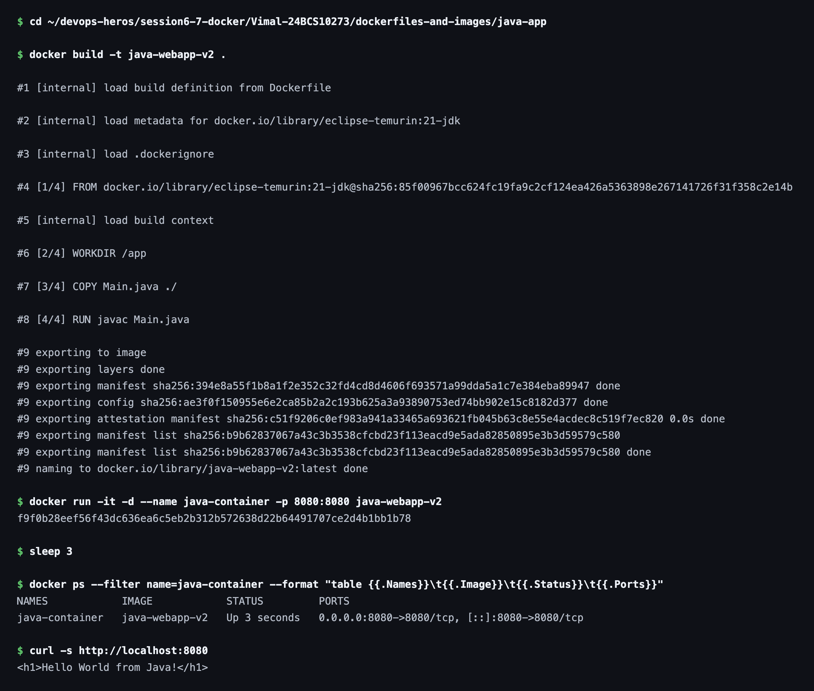

# Java Web App

Redeployed for Task 3 of this session, from its own image and container.

## Image


## Dockerfile

```dockerfile
FROM eclipse-temurin:21-jdk

WORKDIR /app

COPY Main.java ./
RUN javac Main.java

EXPOSE 8080

CMD ["java", "Main"]
```

## Commands

Build the image from the Dockerfile:

```bash
docker build -t java-webapp-v2 .
```

Run the container and map host port `8080` to container port `8080`:

```bash
docker run -it -d --name java-container -p 8080:8080 java-webapp-v2
```

### Terminal Output


