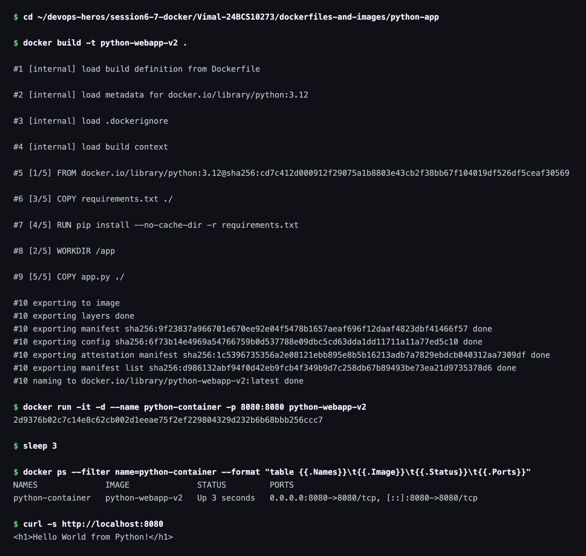

# Python Web App

Redeployed for Task 3 of this session, from its own image and container.

## Image


## Dockerfile

```dockerfile
FROM python:3.12

WORKDIR /app

COPY requirements.txt ./
RUN pip install --no-cache-dir -r requirements.txt

COPY app.py ./

EXPOSE 8080

CMD ["python", "app.py"]
```

## Commands

Build the image from the Dockerfile:

```bash
docker build -t python-webapp-v2 .
```

Run the container and map host port `8080` to container port `8080`:

```bash
docker run -it -d --name python-container -p 8080:8080 python-webapp-v2
```

### Terminal Output


