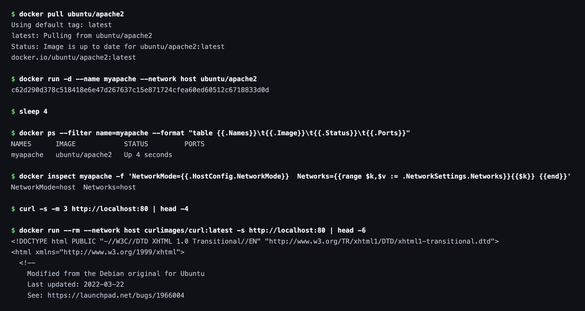
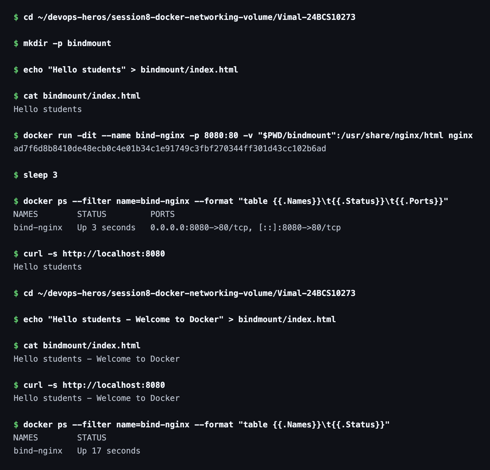
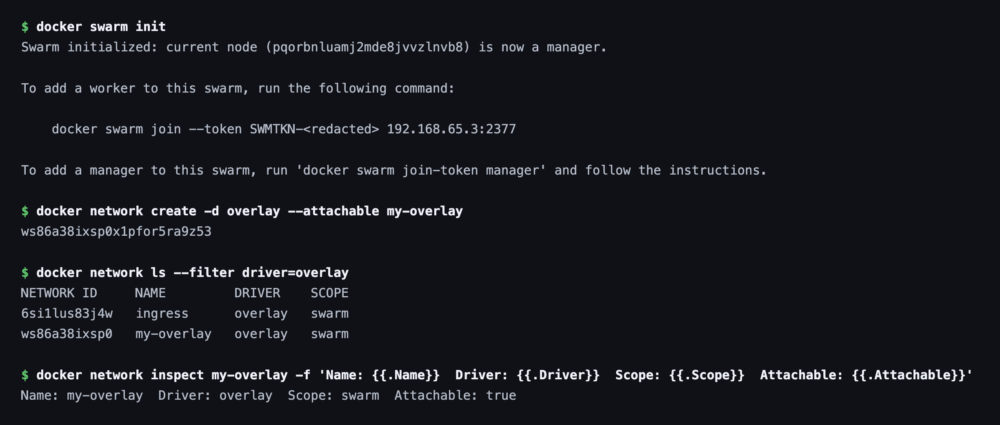

# Session 8 — Docker Networking & Volumes

**Name:** Vimal Kumar Yadav
**Enrollment Number:** 24BCS10273

All four tasks were run on Docker Engine 29.6.2 (Docker Desktop, macOS). Every code block
below is the real output from that run.

---

## Task 1: Docker Container Networking

- Create 3 containers: Frontend, Backend, Database.
- Use Nginx or Alpine for the frontend and backend.
- Use the MySQL image for the database.
- Create 3 different Docker networks.
- Add the backend container to 2 networks.
- Check connectivity between the containers.

### Commands

Create the three networks:

```bash
docker network create frontend-net
docker network create backend-net
docker network create database-net
docker network ls
```

Start each container on its own network:

```bash
docker run -dit --name frontend --network frontend-net nginx
docker run -dit --name backend  --network backend-net  alpine
docker run -dit --name database --network database-net -e MYSQL_ROOT_PASSWORD=root mysql:8.0
docker ps
```

### Output

```text
NAMES      IMAGE       STATUS
database   mysql:8.0   Up Less than a second
backend    alpine      Up Less than a second
frontend   nginx       Up 1 second
```


### Commands

Attach `backend` to the other two networks so it sits on all three, then check what it got:

```bash
docker network connect frontend-net backend
docker network connect database-net backend
docker inspect -f '{{range $net, $conf := .NetworkSettings.Networks}}{{$net}} -> {{$conf.IPAddress}}{{println}}{{end}}' backend
docker exec backend ping -c 3 frontend
docker exec backend ping -c 3 database
```

### Output

The backend now holds one IP address on each of the three networks:

```text
backend-net  -> 172.20.0.2
database-net -> 172.21.0.3
frontend-net -> 172.19.0.3
```

And it can reach both of the other containers by name:

```text
$ docker exec backend ping -c 3 frontend
PING frontend (172.19.0.2): 56 data bytes
64 bytes from 172.19.0.2: seq=0 ttl=64 time=0.826 ms
--- frontend ping statistics ---
3 packets transmitted, 3 packets received, 0% packet loss

$ docker exec backend ping -c 3 database
PING database (172.21.0.2): 56 data bytes
64 bytes from 172.21.0.2: seq=0 ttl=64 time=0.872 ms
--- database ping statistics ---
3 packets transmitted, 3 packets received, 0% packet loss
```


### Explanation

On a user-defined bridge network Docker runs an embedded DNS server, so containers can address
each other by container name instead of by IP. That is why `ping frontend` works from the
backend without anything being hardcoded.

A container can be attached to several networks at once, and it gets a separate interface and
IP on each. That is what makes the backend able to talk to both the frontend and the database.

The isolation is real, though — being on a network is what grants access, and `frontend` and
`database` share no network:

```text
$ docker network inspect frontend-net -f '...'
frontend-net (bridge) contains: frontend backend

$ docker network inspect database-net -f '...'
database-net (bridge) contains: database backend

$ docker exec backend getent hosts database
172.21.0.2        database  database

$ docker exec frontend getent hosts database
                                    <- no output: the name does not resolve
```

From `backend` the name `database` resolves; from `frontend` it does not resolve at all. The
backend is the only thing bridging the two sides, which is exactly the point of splitting a
three-tier application across separate networks.


---

## Task 2: Host Network

- Pull the Apache2 image from Docker Hub.
- Create an Apache2 container using the host network.
- Access the Apache website directly on port 80.

### Commands

```bash
docker pull ubuntu/apache2
docker run -d --name myapache --network host ubuntu/apache2
docker ps
docker inspect myapache -f 'NetworkMode={{.HostConfig.NetworkMode}}'
curl -s http://localhost:80
```

### Output

```text
NAMES      IMAGE            STATUS         PORTS
myapache   ubuntu/apache2   Up 4 seconds

$ docker inspect myapache -f 'NetworkMode={{.HostConfig.NetworkMode}}  Networks=...'
NetworkMode=host  Networks=host
```

Note the empty `PORTS` column. With `--network host` there is no port mapping at all, because
there is no separate container network namespace to map out of — the container binds port 80
directly on the host.

On this machine Docker Desktop runs the engine inside a Linux VM, so "the host" is that VM and
not macOS. Curling from macOS therefore returns nothing, while a second container placed on the
same host network reaches Apache immediately:

```text
$ curl -s -m 3 http://localhost:80 | head -4
                                    <- no output from macOS

$ docker run --rm --network host curlimages/curl:latest -s http://localhost:80 | head -6
<!DOCTYPE html PUBLIC "-//W3C//DTD XHTML 1.0 Transitional//EN" ...>
<html xmlns="http://www.w3.org/1999/xhtml">
  <!--
    Modified from the Debian original for Ubuntu
```

Both containers share the VM's network namespace, so the second one sees Apache on
`localhost:80` with no publishing involved. On a native Linux host, `curl http://localhost:80`
from the terminal would have worked directly.



---

## Task 3: Bind Mount

- Create a folder on the local machine.
- Create an `index.html` file with `Hello students` as the content.
- Bind mount the folder to an Nginx container.
- Access the Nginx website and verify the content.
- Modify `index.html`.
- Verify the change is reflected without restarting the container.

### Commands

```bash
mkdir -p bindmount
echo "Hello students" > bindmount/index.html
docker run -dit --name bind-nginx -p 8080:80 -v "$PWD/bindmount":/usr/share/nginx/html nginx
curl -s http://localhost:8080
```

Then edit the file on the host — without touching the container:

```bash
echo "Hello students - Welcome to Docker" > bindmount/index.html
curl -s http://localhost:8080
docker ps --filter name=bind-nginx
```

### Output

```text
$ curl -s http://localhost:8080
Hello students

  ... after editing the file on the host ...

$ curl -s http://localhost:8080
Hello students - Welcome to Docker

NAMES        STATUS
bind-nginx   Up 23 seconds
```

The container was never restarted — its uptime simply keeps counting.



Before the edit:


After the edit, same container, no restart:


### Explanation

A bind mount maps a directory on the host straight into the container. Nginx is not serving a
copy of `index.html` — it is reading the same file on disk, so an edit on the host is visible
on the very next request.

This is the difference from `COPY` in a Dockerfile. `COPY` bakes the file into the image at
build time, and changing it afterwards means rebuilding the image and recreating the container.
A bind mount keeps the file outside the image entirely, which is what makes it useful for local
development.

---

## Task 4: Overlay Network

- Research Docker overlay networks.
- Understand their use cases.
- Understand how overlay networks work across multiple Docker hosts.

### What is an overlay network?

An overlay network is a virtual network that spans **multiple Docker hosts**. The bridge
networks used in Task 1 exist only inside one machine — two containers on separate hosts cannot
reach each other over a bridge. An overlay network sits on top of the physical network and lets
containers on different hosts communicate as if they shared a single LAN.

### How does it work?

Docker encapsulates each container packet inside a **VXLAN** packet, sends it across the real
network to the host holding the destination container, and unwraps it there. The containers
only ever see the virtual network, so neither of them needs to know the other's host.

This requires a cluster, which is why an overlay network can only be created once the engine is
part of a swarm — the swarm's control plane distributes the network definition and keeps the
service discovery records in sync across nodes.

### Commands

```bash
docker swarm init
docker network create -d overlay --attachable my-overlay
docker network ls --filter driver=overlay
```

### Output

```text
$ docker swarm init
Swarm initialized: current node (pqorbnluamj2mde8jvvzlnvb8) is now a manager.

$ docker network ls --filter driver=overlay
NETWORK ID     NAME         DRIVER    SCOPE
6si1lus83j4w   ingress      overlay   swarm
ws86a38ixsp0   my-overlay   overlay   swarm

$ docker network inspect my-overlay -f '...'
Name: my-overlay  Driver: overlay  Scope: swarm  Attachable: true
```

The `SCOPE` column is the giveaway. The bridge networks from Task 1 are scoped `local` — they
stop at this machine. Both overlay networks are scoped `swarm`, meaning their definition is
shared with every node in the cluster. `ingress` is created automatically by `swarm init` and is
what routes external traffic to published service ports.



### Use cases

- Running a service across several Docker hosts in a swarm, where replicas move between nodes.
- Microservices that need to talk to each other by name regardless of which host they land on.
- Splitting frontend, backend and database across different machines while keeping the same
  network isolation model as Task 1.
- Scaling a service horizontally, where new replicas must join the same network automatically.
