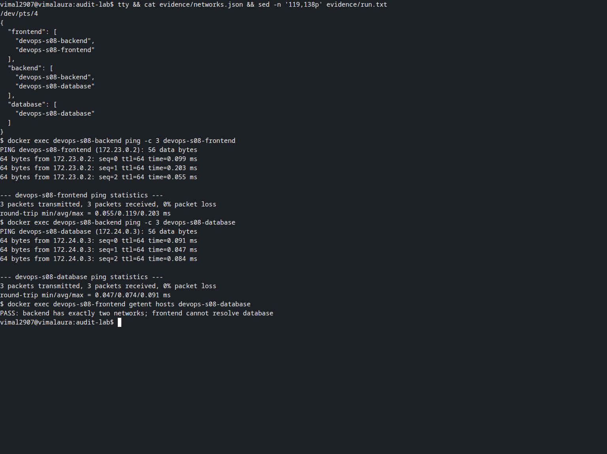
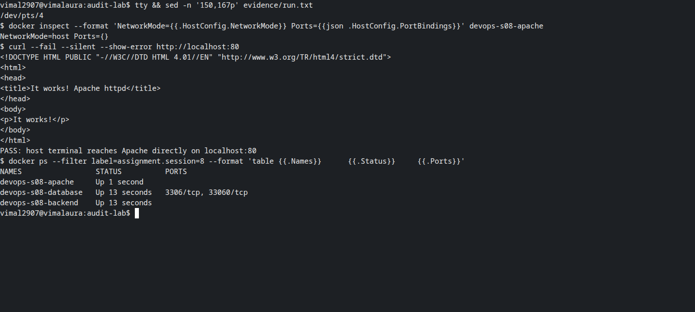
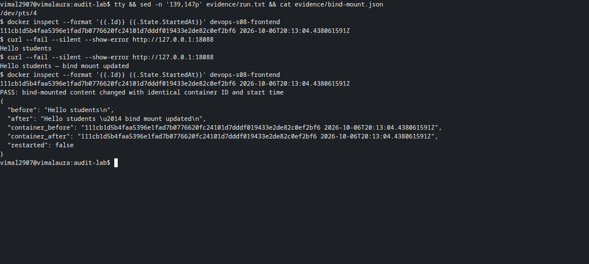
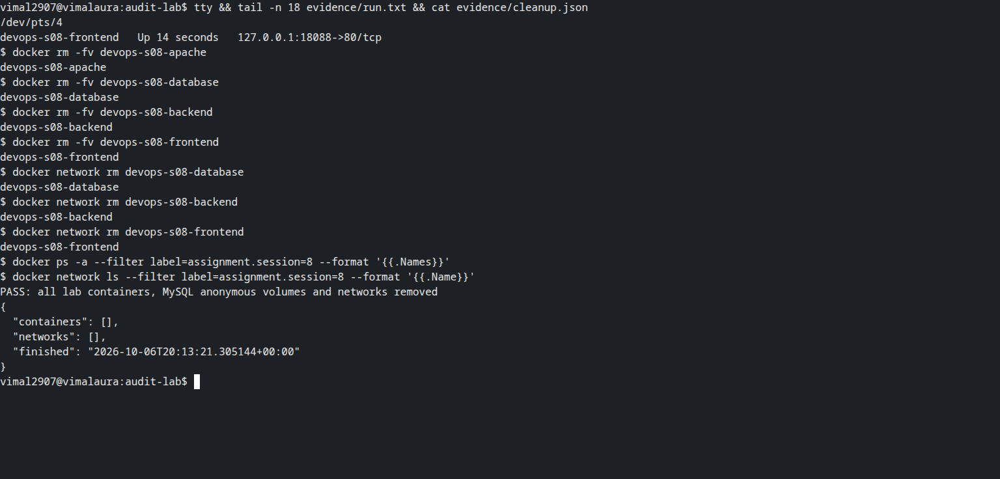

# Session 8 — Networking verification on native Linux

**Vimal Kumar Yadav — 24BCS10273**

This run corrects the earlier three-network backend topology and verifies host networking
directly from a native Linux terminal. Docker Engine 29.8.1 ran the actual containers.
The full command transcript is [evidence/run.txt](evidence/run.txt). Screenshots capture
real Bash PTYs displaying these preserved logs and JSON records with visible read commands.

## Three networks, exactly two on the backend

| Container | Image | Networks |
| --- | --- | --- |
| Frontend | Nginx stable Alpine | `devops-s08-frontend`, `devops-s08-backend` |
| Backend | Alpine 3.24 | `devops-s08-backend`, `devops-s08-database` |
| Database | MySQL 8.4 | `devops-s08-database` |

All three bridge networks are used. The backend resolved and pinged frontend and database,
receiving all three replies from each. Frontend and database share no network; the frontend's
database DNS lookup returned no result. These checks demonstrate network reachability, not a
database application query.



## Host networking on port 80

The official Apache httpd image uses `--network host` and listens on `127.0.0.1:80` in the host
network namespace. Inspection reports `NetworkMode=host` and empty port bindings. The Linux
host's own `curl http://localhost:80` returns the Apache “It works!” page.



## Bind mount without restarting

The frontend serves a host directory mounted read-only at `/usr/share/nginx/html`. The first
host request returns `Hello students`; editing the host file changes it to
`Hello students — bind mount updated`. Container ID and `StartedAt` are identical before and
after. A read-only mount prevents container writes while allowing the host to edit its file.



## Reproduction and cleanup

```bash
python3 run.py > evidence/run.txt 2>&1
```

The script pins all four image digests and requires unused container/network names and ports
80 and 18088. MySQL receives a random password through a temporary mounted file; the password
is never printed or committed. A `finally` block removes the created containers, their anonymous
volumes and the three networks. The temporary directory is also removed.



The [original overlay-network research](../README.md#task-4-overlay-network) remains applicable:
overlay networks connect containers across participating Docker hosts, commonly in a Swarm.
This bridge-network exercise is not a multi-host overlay deployment.
