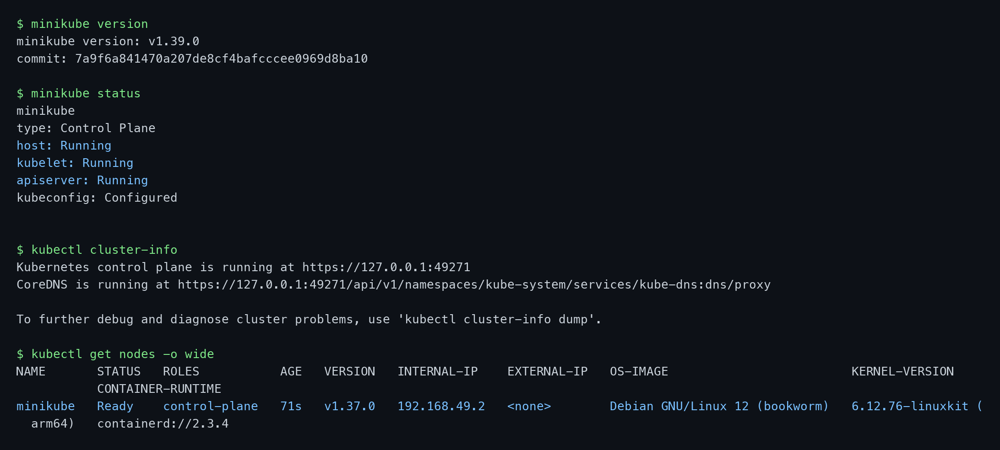
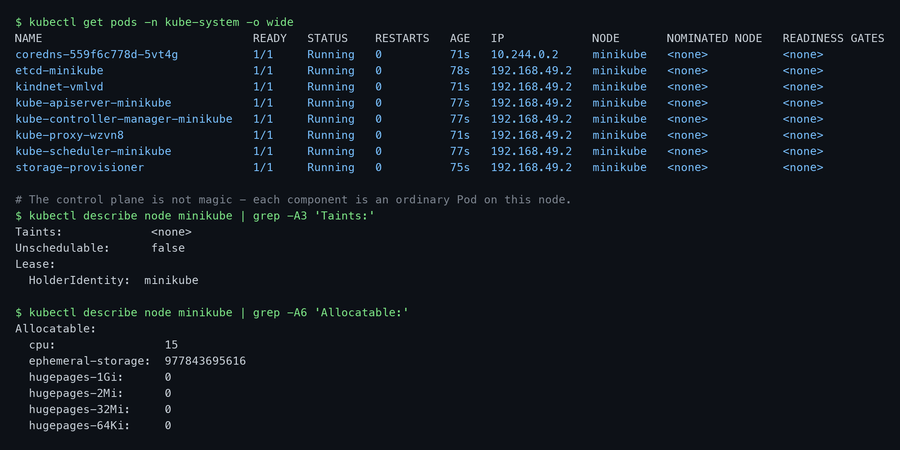
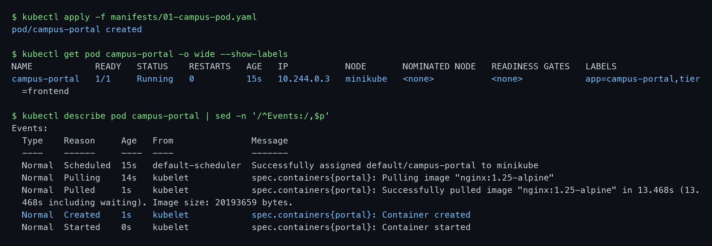
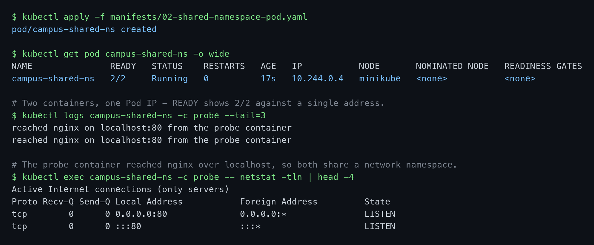
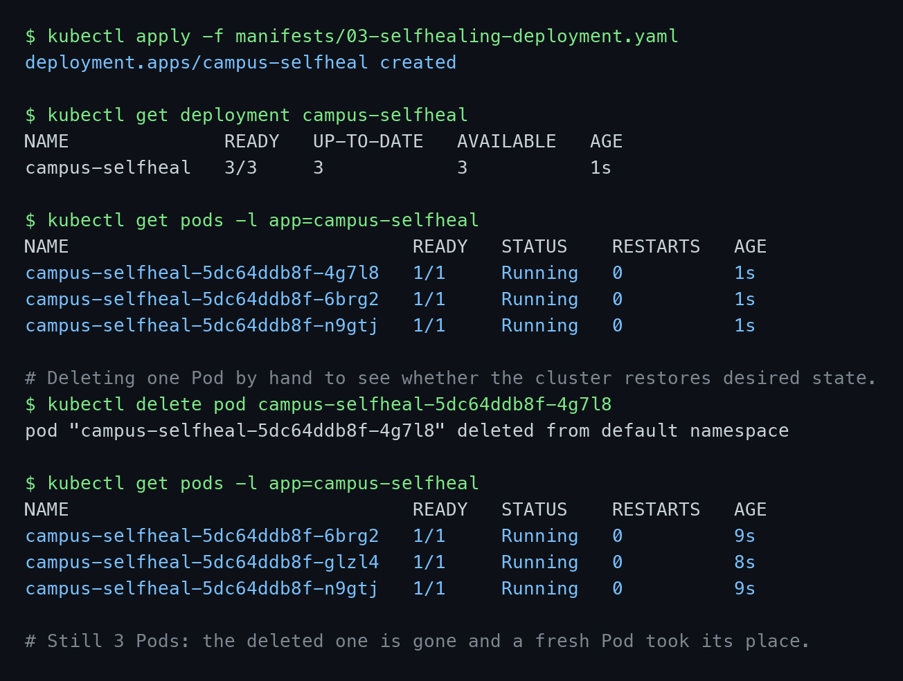
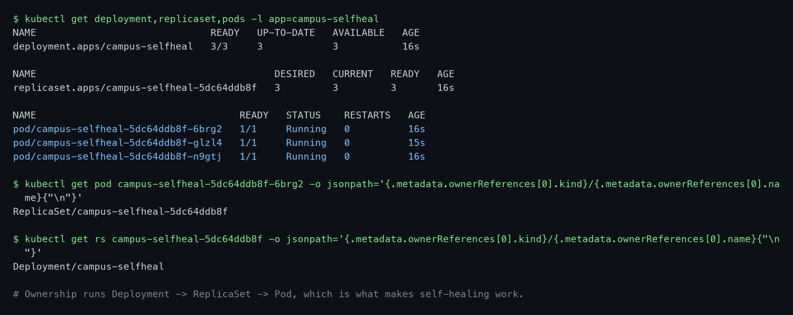

# Session 9 — Kubernetes Fundamentals

**Name:** Vimal Kumar Yadav
**Enrollment Number:** 24BCS10273

Everything below was run on a local Minikube cluster — minikube v1.39.0, Kubernetes v1.37.0,
containerd 2.3.4, docker driver, on macOS (Apple silicon). Every code block is the real output from
that run, and the screenshots are of the same session.

---

## Task 1: Orchestration and the Limits of Docker Swarm

- Explain why container orchestration is needed once containers outgrow a single host.
- Describe Docker Swarm's architecture.
- Identify the problems that pushed the industry towards Kubernetes.

### Explanation

Docker builds and runs individual containers. That is enough on one machine, but it says nothing
about what happens when a container dies at 3am, when traffic triples, or when an image needs to be
replaced without dropping requests. Those are the jobs of an orchestrator: scheduling containers
across machines, restarting them when they fail, scaling them, wiring up networking and storage, and
rolling out new versions safely.

The tooling ladder runs Docker → Compose → Swarm → Kubernetes. The dividing line is not a container
count, it is *hosts*: Compose orchestrates many containers on one machine, while Swarm and Kubernetes
span a cluster.

**Docker Swarm's architecture.** A swarm is a group of Docker hosts acting as one cluster:

| Piece | Role |
|---|---|
| Manager node | Holds cluster state, schedules services, handles orchestration. Uses the Raft consensus algorithm, so an odd number (3 or 5) is recommended. |
| Worker node | Runs the tasks the managers assign. |
| Service | The desired state of an application — image, replica count, ports, networks. |
| Task | One running container; the atom a service is made of. |
| Overlay network | Lets containers on different hosts talk to each other. |
| Routing mesh | Any node accepts traffic on a published port and forwards it to a node actually running the container. |

**Where Swarm runs out of road.** Swarm scales replicas only when a human says so — there is no
autoscaling on CPU or memory. Its health checking restarts containers but has no readiness, liveness
or startup probes, so it cannot tell "the process is alive" from "the process is ready for traffic".
Storage support is thin, with no real dynamic provisioning. Networking has no native Ingress, so
HTTP routing has to be solved outside the cluster. It offers rolling updates and nothing else — no
blue-green, no canary. On top of that the ecosystem is small and development slowed sharply after
Docker's change of focus.

Kubernetes answers each of those directly: a declarative desired state held in etcd and continuously
reconciled, self-healing, three kinds of autoscaler, three kinds of probe, Services and Ingress and
pluggable CNI, PersistentVolumes with dynamic provisioning, several deployment strategies, and a very
large ecosystem. That is the trade — Kubernetes is markedly more complex to learn, and it is worth it
once the failure modes above start costing real downtime.

---

## Task 2: Bring Up a Local Cluster with Minikube

- Install Minikube and start a single-node cluster.
- Confirm the cluster is running and that `kubectl` is pointed at it.

### Commands

```bash
brew install minikube
minikube start --cpus=4 --memory=6144 --driver=docker
```

Then verify:

```bash
minikube version
minikube status
kubectl cluster-info
kubectl get nodes -o wide
```

### Output

```text
$ minikube status
minikube
type: Control Plane
host: Running
kubelet: Running
apiserver: Running
kubeconfig: Configured

$ kubectl cluster-info
Kubernetes control plane is running at https://127.0.0.1:49271
CoreDNS is running at https://127.0.0.1:49271/api/v1/namespaces/kube-system/services/kube-dns:dns/proxy

$ kubectl get nodes -o wide
NAME       STATUS   ROLES           AGE   VERSION   INTERNAL-IP    EXTERNAL-IP   OS-IMAGE                         CONTAINER-RUNTIME
minikube   Ready    control-plane   71s   v1.37.0   192.168.49.2   <none>        Debian GNU/Linux 12 (bookworm)   containerd://2.3.4
```



### Explanation

Minikube runs the whole cluster inside one Docker container that acts as a node — that is why the
node is called `minikube`, its internal IP `192.168.49.2` sits on a Docker network, and the OS image
is Debian rather than macOS. The container runtime is containerd, not Docker; since dockershim was
removed in Kubernetes v1.24 the kubelet talks to containerd directly through the CRI.

`minikube start` also writes the kubeconfig entry and switches the current context, which is why
`kubectl` works immediately with no further setup.

---

## Task 3: Observe the Control Plane and Node Components

- Identify the control plane components on a running cluster.
- Identify the node components.
- Inspect the node's taints and allocatable resources.

### Commands

```bash
kubectl get pods -n kube-system -o wide
kubectl describe node minikube | grep -A3 'Taints:'
kubectl describe node minikube | grep -A6 'Allocatable:'
```

### Output

```text
$ kubectl get pods -n kube-system -o wide
NAME                               READY   STATUS    RESTARTS   AGE   IP             NODE
coredns-559f6c778d-5vt4g           1/1     Running   0          71s   10.244.0.2     minikube
etcd-minikube                      1/1     Running   0          78s   192.168.49.2   minikube
kindnet-vmlvd                      1/1     Running   0          71s   192.168.49.2   minikube
kube-apiserver-minikube            1/1     Running   0          77s   192.168.49.2   minikube
kube-controller-manager-minikube   1/1     Running   0          77s   192.168.49.2   minikube
kube-proxy-wzvn8                   1/1     Running   0          71s   192.168.49.2   minikube
kube-scheduler-minikube            1/1     Running   0          77s   192.168.49.2   minikube
storage-provisioner                1/1     Running   0          75s   192.168.49.2   minikube

$ kubectl describe node minikube | grep -A3 'Taints:'
Taints:             <none>
Unschedulable:      false
```



### Explanation

Every control plane component is an ordinary Pod on this node:

| Component | Job |
|---|---|
| `kube-apiserver` | The cluster's front door. Every request — `kubectl`, the dashboard, internal controllers — is validated and authorised here. Nothing writes to etcd directly. |
| `etcd` | Distributed key-value store holding the entire cluster state. The single source of truth. |
| `kube-scheduler` | Watches for Pods with no node assigned and picks one, based on resource requests, affinity, taints and tolerations. |
| `kube-controller-manager` | Runs the controllers (Node, ReplicaSet, Deployment, Endpoint, Job…). Each compares actual state to desired state and closes the gap. |
| `cloud-controller-manager` | Talks to a cloud provider for load balancers, volumes and node lifecycle. Absent here — there is no cloud behind Minikube. |

And the node components:

| Component | Job |
|---|---|
| `kubelet` | The per-node agent. Takes Pod specs from the API server, drives the container runtime, reports health back. It runs as a host process, not a Pod, which is why it does not appear above. |
| `kube-proxy` | Maintains the node's network rules so Service traffic reaches the right Pods. |
| `kindnet` | The CNI plugin on Minikube. It — not kube-proxy — assigns Pod IPs and enforces NetworkPolicies. |
| containerd | The runtime that actually starts containers, via the CRI. |

Two details are worth calling out.

`Taints: <none>` is specific to Minikube. A production control-plane node carries
`node-role.kubernetes.io/control-plane:NoSchedule` so ordinary workloads stay off it. Minikube removes
that taint, because on a single-node cluster nothing could ever be scheduled otherwise.

CoreDNS has a Pod IP from the `10.244.0.0/16` pod network, while every other component shows
`192.168.49.2` — the node's own IP. Those components run with `hostNetwork: true`, sharing the node's
network namespace, which is what lets the kubelet reach the API server before cluster networking is
up.

---

## Task 4: Run a Pod, and a Multi-Container Pod

- Create a Pod from a YAML manifest.
- Inspect how it was scheduled and started.
- Create a Pod with two containers and prove they share a network namespace.

### Commands

```bash
kubectl apply -f manifests/01-campus-pod.yaml
kubectl get pod campus-portal -o wide --show-labels
kubectl describe pod campus-portal | sed -n '/^Events:/,$p'
```

### Output

```text
$ kubectl get pod campus-portal -o wide --show-labels
NAME            READY   STATUS    RESTARTS   AGE   IP           NODE       LABELS
campus-portal   1/1     Running   0          15s   10.244.0.3   minikube   app=campus-portal,tier=frontend

$ kubectl describe pod campus-portal | sed -n '/^Events:/,$p'
Events:
  Type    Reason     Age   From               Message
  ----    ------     ----  ----               -------
  Normal  Scheduled  15s   default-scheduler  Successfully assigned default/campus-portal to minikube
  Normal  Pulling    14s   kubelet            spec.containers{portal}: Pulling image "nginx:1.25-alpine"
  Normal  Pulled     1s    kubelet            spec.containers{portal}: Successfully pulled image "nginx:1.25-alpine" in 13.468s
  Normal  Created    1s    kubelet            spec.containers{portal}: Container created
  Normal  Started    0s    kubelet            spec.containers{portal}: Container started
```



The event list is the theory made visible. `Scheduled … From: default-scheduler` is the scheduler
choosing a node; every line after it comes `From: kubelet`, which pulled the image and started the
container. Two different components, in the expected order.

### Commands

Now a Pod with two containers:

```bash
kubectl apply -f manifests/02-shared-namespace-pod.yaml
kubectl get pod campus-shared-ns -o wide
kubectl logs campus-shared-ns -c probe --tail=3
kubectl exec campus-shared-ns -c probe -- netstat -tln | head -4
```

### Output

```text
$ kubectl get pod campus-shared-ns -o wide
NAME               READY   STATUS    RESTARTS   AGE   IP           NODE
campus-shared-ns   2/2     Running   0          17s   10.244.0.4   minikube

$ kubectl logs campus-shared-ns -c probe --tail=3
reached nginx on localhost:80 from the probe container
reached nginx on localhost:80 from the probe container

$ kubectl exec campus-shared-ns -c probe -- netstat -tln | head -4
Active Internet connections (only servers)
Proto Recv-Q Send-Q Local Address           Foreign Address         State
tcp        0      0 0.0.0.0:80              0.0.0.0:*               LISTEN
tcp        0      0 :::80                   :::*                    LISTEN
```



### Explanation

`READY 2/2` against a single `IP` is the whole point of a Pod: it is not "a container", it is a group
of containers sharing a network namespace, storage volumes and a lifecycle.

The `netstat` output is the strongest evidence. It was run **inside the busybox container**, which is
not running any web server — yet it reports port 80 in `LISTEN`. It can see nginx's socket because
both containers share one network stack. That is also why the sidecar's `wget http://localhost:80`
succeeds; in two separate Pods, `localhost` would be each container's own loopback and the request
would be refused.

This is the mechanism behind the sidecar pattern — log shippers, proxies and metrics exporters all
rely on reaching the main container over `localhost`.

---

## Task 5: Desired State versus Actual State

- Create a Deployment with 3 replicas.
- Delete a Pod by hand and observe what the cluster does.
- Trace the ownership chain that makes it happen.

### Commands

```bash
kubectl apply -f manifests/03-selfhealing-deployment.yaml
kubectl get pods -l app=campus-selfheal
kubectl delete pod campus-selfheal-5dc64ddb8f-4g7l8
kubectl get pods -l app=campus-selfheal
```

### Output

```text
$ kubectl get pods -l app=campus-selfheal
NAME                               READY   STATUS    RESTARTS   AGE
campus-selfheal-5dc64ddb8f-4g7l8   1/1     Running   0          1s
campus-selfheal-5dc64ddb8f-6brg2   1/1     Running   0          1s
campus-selfheal-5dc64ddb8f-n9gtj   1/1     Running   0          1s

$ kubectl delete pod campus-selfheal-5dc64ddb8f-4g7l8
pod "campus-selfheal-5dc64ddb8f-4g7l8" deleted from default namespace

$ kubectl get pods -l app=campus-selfheal
NAME                               READY   STATUS    RESTARTS   AGE
campus-selfheal-5dc64ddb8f-6brg2   1/1     Running   0          9s
campus-selfheal-5dc64ddb8f-glzl4   1/1     Running   0          8s   <- new Pod
campus-selfheal-5dc64ddb8f-n9gtj   1/1     Running   0          9s
```



### Commands

Where that behaviour comes from:

```bash
kubectl get deployment,replicaset,pods -l app=campus-selfheal
kubectl get pod <pod> -o jsonpath='{.metadata.ownerReferences[0].kind}/{.metadata.ownerReferences[0].name}'
kubectl get rs <rs> -o jsonpath='{.metadata.ownerReferences[0].kind}/{.metadata.ownerReferences[0].name}'
```

### Output

```text
$ kubectl get pod campus-selfheal-5dc64ddb8f-6brg2 -o jsonpath='...'
ReplicaSet/campus-selfheal-5dc64ddb8f

$ kubectl get rs campus-selfheal-5dc64ddb8f -o jsonpath='...'
Deployment/campus-selfheal
```



### Explanation

Nothing restarted the deleted Pod — `RESTARTS` stays `0` and the replacement has a **different name**,
`glzl4` where `4g7l8` used to be. The old Pod is gone for good; a new one was created.

The `ownerReferences` show why. The Pod is owned by a ReplicaSet, which is owned by a Deployment. The
ReplicaSet controller's entire job is a loop: compare the number of Pods matching its selector against
`spec.replicas`, and if they differ, create or delete Pods until they match. Deleting a Pod dropped
the count to 2 against a desired 3, so it made one.

This is the declarative model in one observation. The manifest never said "create a Pod called
`glzl4`" — it said "there should be three Pods that look like this", and a controller is permanently
responsible for making reality match. The same loop covers a crashed process, a failed node, or a
`kubectl scale`.

The full request path, visible across Tasks 3–5:

1. `kubectl apply` sends the manifest to the **kube-apiserver**.
2. The API server validates it and writes the desired state to **etcd**.
3. The **controller-manager** notices the new Deployment and creates a ReplicaSet, which creates Pods.
4. The **scheduler** sees Pods with no node and assigns them.
5. The **kubelet** on that node pulls images and starts containers through **containerd**.
6. **kube-proxy** and the CNI make the Pods reachable.

---

## Summary

| Concept | Demonstrated by |
|---|---|
| Why orchestration | Task 1 — Swarm's gaps in autoscaling, probes, storage, routing |
| Cluster bring-up | Task 2 — `minikube start`, one container acting as a node |
| Control plane | Task 3 — etcd, apiserver, scheduler, controller-manager as Pods |
| Node components | Task 3 — kubelet as a host process, kube-proxy and kindnet as Pods |
| Minikube's taint removal | Task 3 — `Taints: <none>` on a control-plane node |
| Pod as a shared namespace | Task 4 — `netstat` inside the sidecar showing nginx's port 80 |
| Declarative reconciliation | Task 5 — deleted Pod replaced under a new name, `RESTARTS 0` |
| Ownership chain | Task 5 — `ownerReferences` from Pod to ReplicaSet to Deployment |

### A note on this environment

On the docker driver the kubelet reports the **host's** capacity rather than the container's cgroup
limits. This cluster was started with `--cpus=4 --memory=6144`, and Docker does enforce those on the
`minikube` container, but the node advertises `cpu: 15` and `memory: 24571164Ki`. Scheduling
decisions are made against the advertised figures, which matters in Session 10 when a Pod is made
deliberately unschedulable — the request has to exceed the host's RAM, not the 6 GiB the VM was given.

### Cleanup

```bash
kubectl delete -f manifests/
```
