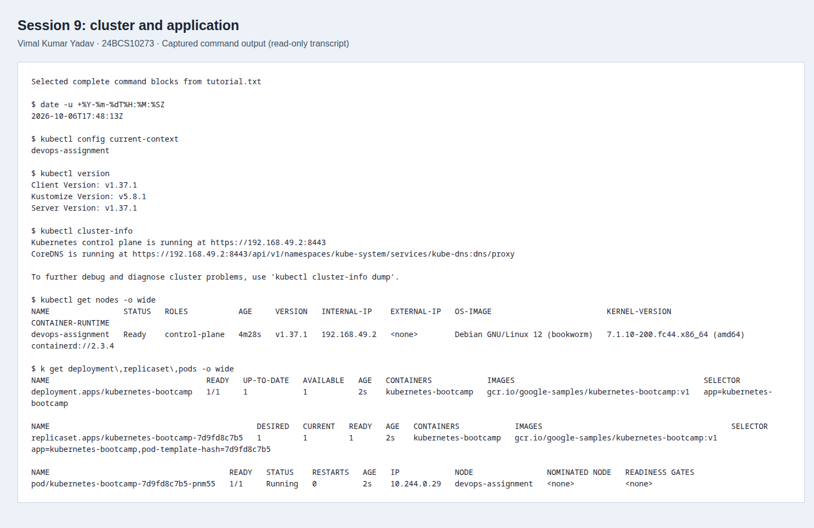
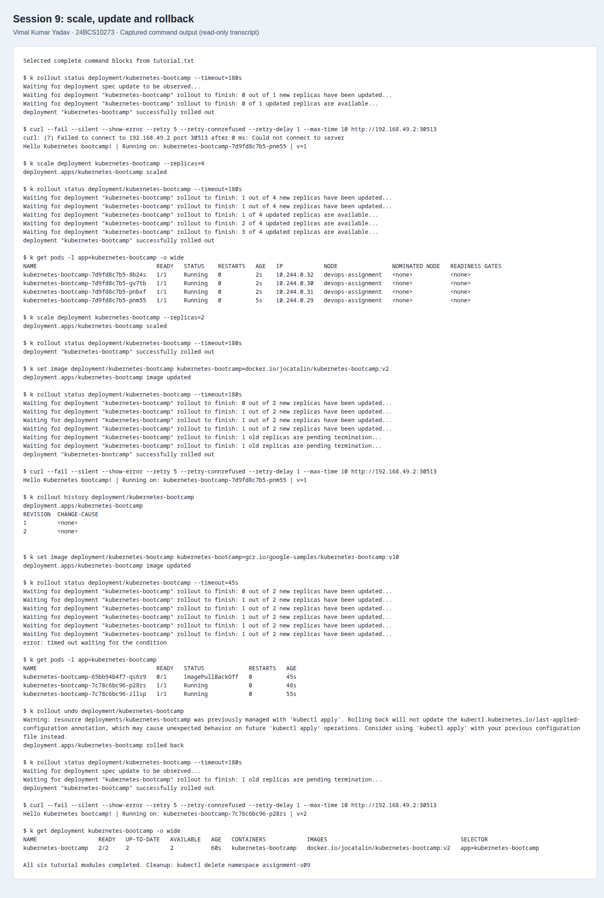
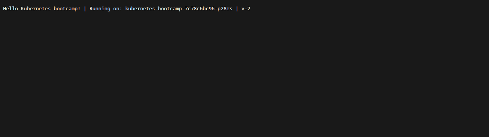

# Kubernetes Basics: six-module walkthrough

**Vimal Kumar Yadav · 24BCS10273**

This completes the [Kubernetes Basics tutorial](https://kubernetes.io/docs/tutorials/kubernetes-basics/)
alongside the architecture, shared Pod namespace and self-healing exercises in the
[original submission](../README.md). This is a separate Linux run on 6 October
2026: Minikube 1.39.0, Kubernetes/kubectl 1.37.1, containerd 2.3.4, Docker driver,
four allocated CPUs and 4096 MiB. The older screenshots remain evidence of their
original macOS run.

## Reproduce

Install Minikube and kubectl using their official instructions. The local run used
an isolated kubeconfig and Minikube home, then:

```bash
minikube start -p devops-assignment --driver=docker --cpus=4 --memory=4096 \
  --kubernetes-version=v1.37.1 --container-runtime=containerd
bash run.sh
```

The script creates `assignment-s09`, records commands and output in
[evidence/tutorial.txt](evidence/tutorial.txt), and stops if a required step fails.
Use a fresh namespace for a complete rerun; cleanup is shown below. It uses Linux
NodePort access to the Docker node IP. On systems where that IP is not routable,
use `minikube service -p devops-assignment -n assignment-s09 kubernetes-bootcamp --url`
or a port-forward and document the changed access path.

The tutorial images are upstream classroom examples, not production application
images. The v1 image is in `gcr.io/google-samples`; the official tutorial uses
`docker.io/jocatalin/kubernetes-bootcamp:v2` for its update. Changing the v1
registry's tag to v2 does not work: that tag was absent when checked.

## Requirement-to-evidence map

| Module | Commands exercised | What the result demonstrates |
| --- | --- | --- |
| 1. Create a cluster | `cluster-info`, `get nodes`, `get pods -n kube-system` | Ready control-plane node and visible control-plane/DNS components |
| 2. Deploy an app | `apply -f deployment.yaml`, `rollout status`, `get deployment,replicaset,pods` | The Deployment creates a ReplicaSet and a ready application Pod |
| 3. Explore the app | `describe pod`, `logs`, `exec -- env` | Scheduling, image/runtime information, application logs and container environment |
| 4. Expose the app | `apply -f service.yaml`, `get service`, `get endpointslices`, `curl` | A stable NodePort Service reaches the ready v1 application |
| 5. Scale the app | `scale --replicas=4`, then `--replicas=2` | Replica count changes while the Service selector remains the same |
| 6. Update the app | `set image`, `rollout status/history`, deliberately missing v10, `rollout undo` | A new image rolls out; a failed image update is diagnosed and rolled back |

`run.sh` defines `k` as `kubectl -n assignment-s09`; commands in the transcript use
that alias. The initial manifest sets `maxUnavailable: 0` and `maxSurge: 1`, so an
unready replacement does not remove the available replicas. This does not by
itself prove zero request failures during every possible rollout.

Service creation and EndpointSlice creation can precede kube-proxy rule
propagation. The first HTTP attempt in this lab was briefly refused; bounded
connection retries then succeeded. The script records those retries instead of
treating object creation as immediate network readiness.

Likewise, the first request immediately after the v2 rollout still reached a
terminating v1 Pod. After endpoint propagation, the recorded post-rollback request
returned `v=2`, and the Deployment showed both replicas ready on the v2 image.
The deliberately nonexistent v10 image stayed in ImagePullBackOff while the two
v2 replicas remained available; `rollout undo` removed that failed revision.

## Screenshots

These are Playwright/CDP screenshots of excerpts from the saved command output;
the unabridged transcript is linked above. The application screenshot is a direct
browser request to the NodePort URL.





## Cleanup

```bash
kubectl delete namespace assignment-s09
# After finishing all assignment labs:
minikube stop -p devops-assignment
```

References: [Minikube installation](https://minikube.sigs.k8s.io/docs/start/),
[rolling update tutorial](https://kubernetes.io/docs/tutorials/kubernetes-basics/update/update-intro/).
